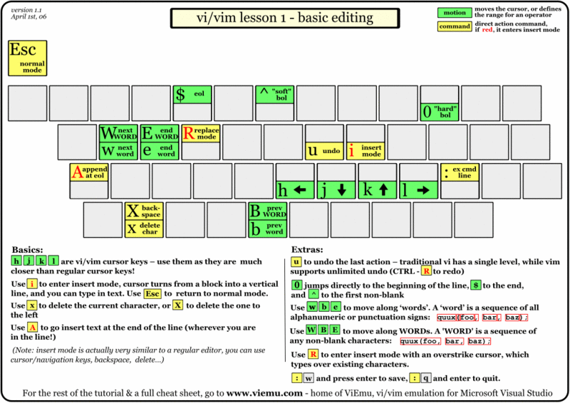

# 心态请放正

## 首先认清楚我们这个班的定位(0基础)
闻道有先后, 术业有专攻, 我们对linux的认识水平自然有高有低.<br>
因此在座的同学,有之前还没有接触linux的"小白",<br>
也有可能有大神级别的同学,过来只是混个证的,水平自然在我之上,如我哪里讲得有偏差, 请您指出, 让我收获知识的同时,也避免继续误人子弟.<br>
因此为了避免给零基础的同学太大压力, 与教务方面协商的结果是0基础开始来玩,有基础的, 或大神级请给点耐心.^_^

## 对于重听的同学
可能会让你们有点失望,怎么又双叕是你这张老脸...<br>
我可以厚顔无耻地说, 这可能也是缘分....<br>
正如刚才我所说的, 我们的起点是不一样的,之前与你们一起学习并顺利通过考试的同学,<br>
说不定也是上上期重听的呢.<br>
又或者别人来之前就工作多年, 来这边只是总结下所学知识,顺便不小心就考了个证,仅此而己<br>
再或者说, 上期来时同为小白,但现在别人拿证了, 可能别人偷偷比你更用功,投入的时间比你多得多,而装着什么都没干的样子吧<br>

什么,,都不是..明明就是比你懒,只是顔值比你高,就通过了...好吧...我编不下去了...<br>

我记得我是这样安慰我自己的, 实话实说红帽这套教程124,这书的作为linux的基础入门,还是相对合理,如果一开始就学这个理论上是少走了不少弯路,<br>
希望我这个课程也像那些非线性斜事的电影一样,(那种一开始看不懂, 有点烧脑的),你二刷时, 也有新的收获...<br>

差点忘了, 可以的话,,不要剧透,,,虽然我尽可能求变,,,可是教学大纲摆在那的...<br>
当然也希望这次是我们最后一起学习这个课程.(有点小感伤...)

------------------无敌分割线-----------------
# 关于REHL7,还是RHEL8
是的,,当我们还讨论着7比6变化了很多很多的时候, 8就已出来,,,<br>
那估计8的相关认证也不会晚了,,<br>
的确,这个世界就是这样逼着我们前行......<br>
but,,,但是,收到红帽(我们一般称原厂)消息, 最快也要年底,或明年初才会变成8,(因为教材翻译需要时间...这种翻译质量还这么慢..唉...吐槽一下
可以的话, 我们平时看中文也要看一下英文的教材...不然有时会不知所云)
也就是最近这段时间还是7.....所以.........你懂的...(自己想像)


# 红帽的logo变化了
是的,,,,logo变 得"不要脸"了<br>
 [红帽公司换了 Logo](https://www.qdaily.com/articles/63705.html)

# 教学环境介绍
(看是否需要先略过, 暂时先略过)
- desktop
- server
- classroom

|Machine name|IP addresses|Role|
|:---|:---|:---|
|desktopX.example.com|172.25.X.10| Student "client" computer|
|serverX.example.com|172.25.X.11| Student "server" computer|
|classroom.example.com|172.25.254.254 |Classroom utility server|


rht-vmctl Commands

|Action|Command|
|---|----|
|Start server machine |rht-vmctl start server|
|View " physical console" to login and work with server machine |rht-vmctl view server|
|Reset server machine to its previous state and restart virtual machine| rht-vmctl reset server|

rht-vmctl view 这个有点慢,, 真正考试的话, 可以用`ssh -X student@172.25.0.10`登陆后直接把需要的图型界面弄出来, 理论上会快一点点.
# 除了教材之外的补充读物
## administrator guide
rhel7有自己的产品文档,如有时看考试教材真是看不下去可以看看官方的`系统管理员指南`作为补充
- [网页版](https://access.redhat.com/documentation/en-us/red_hat_enterprise_linux/7/html/system_administrators_guide/index)
- [pdf](https://access.redhat.com/documentation/en-us/red_hat_enterprise_linux/7/pdf/system_administrators_guide/Red_Hat_Enterprise_Linux-7-System_Administrators_Guide-en-US.pdf)

## [其它](https://access.redhat.com/documentation/en-us/red_hat_enterprise_linux/7/)
这个链接是一个总的索引, 如系统管理看完后,仍有余力, 可从
- `Networking Guide`, 
- `Kernel Administration Guide`,
- `Performance Tuning Guide`
- ...
各方面都有,估计一时看不完(反正我是没看完), 倒是可以在日常工作中可以作为资料查阅一下

# shell
## Where is a shell，there is a way!
上面这句话大体意思是"哪里有shell, 哪里就有方法""\
<br>
很多时候,看似极为复杂的一系列操作, 例如用鼠标点击依次点击几个按钮,再键入相应信息, 并最终保存.
<br>最终还是在shell中就一条命令就搞定了.

好吧,又到了说文解字的时候了, shell字面意义是外壳的意思, 之所以有外壳,是因为对于操作系统内核来说的.
<br>
我们看下面命令
查看系统内核
```bash
k@t530:~$ uname -r
4.15.0-45-generic
```
平时我们用到的`ubuntu`,`redhad`,`suse`, `kali`, `arch`, `gentoo`等都是基于内核再加上一系列的外围软件,而成的发行版本.
如我现在所用的就是ubuntu
```bash
k@t530:~$ cat /etc/issue
Ubuntu 18.04.1 LTS \n \l
```

现在所用的shell就是bash

```bash
k@t530:~$ echo $SHELL
/bin/bash
k@t530:~$ 
```

## 常用命令演示
此处需要演于一些常用命令如ls等,

```bash
 k@t530:~$ ls
 bin  'Calibre Library'   code   Desktop   Documents   Downloads   ide   local   Music   nohup.out   Pictures   Public   PycharmProjects   Templates   tmp   ubuntu   Videos
k@t530:~$ cd code
k@t530:~/code$ ls
c
k@t530:~/code$ pwd
/home/k/code
k@t530:~/code$ cd ..
k@t530:~$ pwd
/home/k
```
也可以故意演于一些错误的输入

```bash
k@t530:~$ lasdfklajdsf
lasdfklajdsf: command not found
```
## 提示符的一些说明

### $#区别身份
其中之前的`k@t530:~/code$`有几部分组成
一般用户以 `$` 结尾
而root用户(特权用户) 以#号结尾
如下面所示最后一行所示

```bash
k@t530:~/code$ su - 
Password: 
root@t530:~# 
```

如果再详细地查看,无论是`$`或`#`都只是`环境变量` `PS1`的一部分,
如刚才的例子,
```bash
root@t530:~# echo $PS1
\[\e]0;\u@\h: \w\a\]${debian_chroot:+($debian_chroot)}\u@\h:\w\$
```
更多的说明可参考[https://linux.cn/article-8711-1.html](https://linux.cn/article-8711-1.html)

??环境变量是否需要解释一下??

### 最小权力原则
看来说来说去都绕开不历史, 在很久很久以前..由于PC还没有普及.所以一台机器是同时被多个人使用的,
<br>
而作为大多数人,一般来说只是普通用户,只有系统管理员才有特权的root用户
<br>
当然, 还是能那话,权力越大, 能对系统产生的破坏也就越大,
<br>现在机器资源相对比之前多了不少,
<br>但理论上作为一个及格的系统管理员, 平时操作时, 也建议尽可能少地避免使用root, 
<br>尽可能遵守`最小权力原则`这样的运维才会更安全, 
<br>也是精细化运维的一个体现.
<br> 当然凡事也有一个例外, 就是sudo,如不想转到根, 有时也偶然用到相应权限, 就在那些需要用到的命令前加入sudo,当然前提你是有用sudo的资格(/etc/sudoers)

??是否可以联想下`最小系统法`??

### 红色的提示符
所以有些线上的系统就把root的提示符颜色设为红色以作警示


## 关于登陆说明
说明装一点, 就是一个鉴权,也就是,证明你是你,还是那个历史的说法, 
<br>在很久很久以前, 我们没有(或者说不能普及)指纹,虹膜,声纹,步态等一系列关于你的生物特征值,去证明你是你.
于是就采用了用户名加密码这种土办法去证明你是你....
此时可以演示一下用shell的登陆操作.(结合RH124 p13的practice)

### passwd
- 由于要用到用户名及密码,就涉及到上面这个改用户名密码的命令, 
- 也涉及到密码强度, 密码有效期等一系列知识点.
- 可参考(p15 讲一下/etc/passwd文件, 有空也可以讲讲shadow,加密等)

### 此处可以视具体情况看是否需要展开 

## 登出
有入有出才是正常的
平时我们登出(或叫退出)
一般键入
`exit`
或按`ctrl+d`即可
当然,一般来说也可以设置一个多久空闲没所事事,就踢出的操作.
好久以前, 实习的时候, 就试过不然登入,之后没有正期登出,最后系统会话爆了,登不了,,好像是一个叫`SCO`的系统,
太久远了, 当时我只是一个普通用户, 原因就更不可考了.

### w,who等命令可以看一下有谁还在系统上面


## 加快我们的操作

### 结合P16计一下补全
- 命令补全
- 选项补全
- 参数补全

此处如有空, 可以计一下一个命令由命令本体, 选项(option), 参数(argument)等几项构成,(p3)
顺序其实最好固定, 那样有利于在运维时,遇到紧急状况时, 减少出错的机率.

当然,再有空也可以补一下对于选项加一个减号, 还是两个减号的风格之争.
(建议, 平时建入, 能省则省,写脚本的, 如一些不太常用的, 就用全名, 增强可读性)

### 结合P17计一下历史命令的使用
- history可以查看之前键入过的命令, 查完后可以用!接序号去加快执行,
- vi(set -o vi) 用/可以把之前用过的命令匹配搜出来, 也可以加入操作, 用j,k这样也可以上下找用过的上一条命令
- emacs(defulat)(set -o emacs) 用 crtl+r来匹配之前用过的命令, ctrl+n, ctrl+p去上下找用过的命令
- 当然,也可以用上下箭头去找上下的命令,(有时tty的设置会使这种办法失效)
- 对于用!!重复上一条命令
演于
```bash
k@t530:~/code$ ls
c
k@t530:~/code$ !!
ls
c
```
对于由于是普通用户执行了需要特权才能执行的命令, 可以用`sudo !!`
```bash
cat: /etc/shadow: Permission denied
k@t530:~/code$ sudo !!
sudo cat /etc/shadow
[sudo] password for k: 
daemon:*:17737:0:99999:7:::
bin:*:17737:0:99999:7:::
...
gdm:*:17737:0:99999:7:::
...
libvirt-qemu:!:17942:0:99999:7:::
libvirt-dnsmasq:!:17942:0:99999:7:::
k@t530:~/code$ 
```

# adust the sequence

# add the `screen`

演示screen不同人员同屏操作
- 如一些对环境不排它的, 可以多个学员同时登到我的机器上, 我这边多开几个窗, 不同学员对号入坐, 我这边也方便一一跟踪.
- 到后期一系列排它性操作, 如给系统挂盘等操作等, 则让学员开screen 窗,我用screen -x登到学员机器上进行同步操作.
- 类似的分屏多终端模拟软件有`tmux`,及另外一些集成的.

# add the vim 

## 教材中涉及vim的相关章节

总的来说, 三本教材涉及到vim的章节不多, 就本着够用原则, 
- 124,ch4中先简要介绍了一下vim怎样打开文件, 基本移动, 退出,也就是一些最基本的vim生存技能.
- 134,ch3中倒是就作为系统管理员平时一大使用场景中进行了归纳出一系列的操作.

理论上应可以一起教学

- 其中124 ch4 中让我们读完vimtotur中的第一课各小节即可, 但我想如果大家对英文读起来比较吃力的话, 可以把书中的命令加个参数`zh`

```
vimtotur zh
===============================================================================
=      欢     迎     阅     读   《 V I M  教  程 》   ——      版本 1.7       =
===============================================================================

     Vim 是一个具有很多命令的功能非常强大的编辑器。限于篇幅，在本教程当中
     就不详细介绍了。本教程的设计目标是讲述一些必要的基本命令，而掌握好这
     些命令，您就能够很容易地将 Vim 当作一个通用编辑器来使用了。

     完成本教程的内容大约需要25-30分钟，取决于您训练的时间。

     注意：
     每一节的命令操作将会更改本文。推荐您复制本文的一个副本，然后在副本上
     进行训练(如果您是通过"vimtutor"来启动教程的，那么本文就已经是副本了)。

     切记一点：本教程的设计思路是在使用中进行学习的。也就是说，您需要通过
     执行命令来学习它们本身的正确用法。如果您只是阅读而不操作，那么您可能
     会很快遗忘这些命令的！

     好了，现在请确定您的Shift-Lock(大小写锁定键)还没有按下，然后按键盘上
     的字母键 j 足够多次来移动光标，直到第一节的内容能够完全充满屏幕。

~~~~~~~~~~~~~~~~~~~~~~~~~~~~~~~~~~~~~~~~~~~~~~~~~~~~~~~~~~~~~~~~~~~~~~~~~~~~~~
                        第一讲第一节：移动光标


             ** 要移动光标，请依照说明分别按下 h、j、k、l 键。 **

             ^
             k              提示： h 的键位于左边，每次按下就会向左移动。
       < h       l >               l 的键位于右边，每次按下就会向右移动。
             j                     j 键看起来很象一支尖端方向朝下的箭头。
             v

...

```
就可以在中文版中进行vim练习, 希望能有所降低学习曲线,,,什么?又让你错失了学习英文的机会?
好吧.你也可以在vim的命令行模式中键入help让你一次学过够...

```
help.txt        For Vim version 7.4.  Last change: 2012 Dec 06

                        VIM - main help file
                                                                         k
      Move around:  Use the cursor keys, or "h" to go left,            h   l
                    "j" to go down, "k" to go up, "l" to go right.       j
Close this window:  Use ":q<Enter>".
   Get out of Vim:  Use ":qa!<Enter>" (careful, all changes are lost!).

Jump to a subject:  Position the cursor on a tag (e.g. bars) and hit CTRL-].
   With the mouse:  ":set mouse=a" to enable the mouse (in xterm or GUI).
                    Double-click the left mouse button on a tag, e.g. bars.
        Jump back:  Type CTRL-T or CTRL-O (repeat to go further back).

Get specific help:  It is possible to go directly to whatever you want help
                    on, by giving an argument to the :help command.
                    It is possible to further specify the context:
                                                        help-context
                          WHAT                  PREPEND    EXAMPLE
                      Normal mode command      (nothing)   :help x
                      Visual mode command         v_       :help v_u
                      Insert mode command         i_       :help i_<Esc>
                      Command-line command        :        :help :quit
                      Command-line editing        c_       :help c_<Del>
                      Vim command argument        -        :help -r
                      Option                      '        :help 'textwidth'
help.txt [Help][RO]                 
-----------
~
~
~
~
~
:h
```
## 键位图
有句话说过, 一个表格胜过千字, 一个图胜过N个表格,,,,于是在当令的读图时代, 有也不少人喜欢直接看图读话
下面这个是`键位图`


但是如果你觉得一次学太多太有压力了, 那么也可以看一下这个`简明版`,,是不是会好一点,,,先把基本的学会了吧<br>
[vi / vim 简明学习指南](https://segmentfault.com/a/1190000000435283)


## vim控

其实很多会成瘾的东西一开始还是会让人稍稍不适,,如烟, 辣, 咖啡等, vim由于学习曲线较高(比起window的notepad记事本来说), 
所以也可能会让你一开始有点无所适从, 如一但习惯了, 可能就会成控, 我就是一个
- chorome 
- envice
- 各编辑器的vim插件


