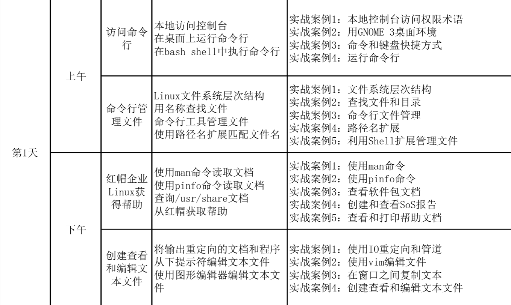
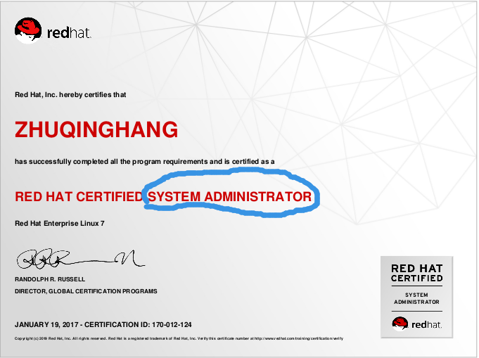
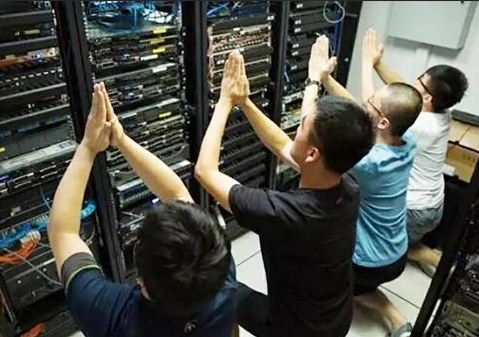
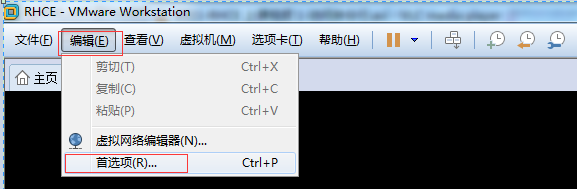
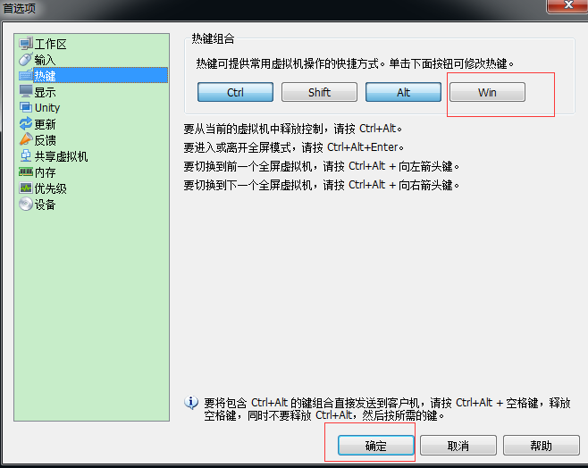
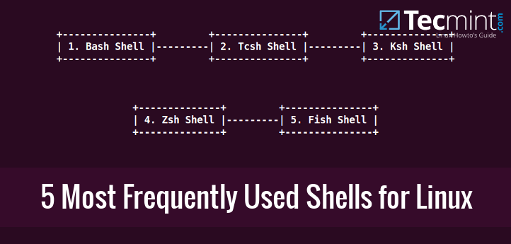

# 1.plan




# 2.访问命令行

## 本地访问控制台(Accessing the Command Line Using the Local Console)
### 拿什么来管理您,我的OS
早上的考试, 内容在RH124,RH134, 说人话,就是大家手上的第一二册, 两本书. 
<br>
如果大家不小心通过了,会有一张RHCSA的证书
<br>

<br>
惨啦, 一不小心暴露了姓名,反正自我绍也忘了,正好,
<br>我叫朱XX,在IT这行中混了十多年,大家可以叫我老朱.
毕竟在IT界中,,见面就给你贴个工程师,叫X工的, 我被叫`朱工`时,在粤语里会让人联想到到"公猪",之类..不太好.<br>
so, just call me 老朱, pls.
<br>
RHCSA是(Red Hat Certified System Administrator), 也就是系统管理员.

<br>
那么我们凭什么去管理系统呢?不能每次都这样子吧.(现在再看来也挺佛系的)
<br>


<br>
我们需要的不仅仅是双手高举过头,
<br>
而更需要的是双手好好地去键盘上,熟练地,有时甚至是机械地去键入一个个运维指令,去管理系统.
<br>


唉..这个图没有选好, 请不要关注前面的屏幕,,,
<br>
我们这个教室不是在教大家写代码, 教大家 javascript21天从入门到放弃
<br>
后面那个对焦不准的才是敲命令的...
<br>所以..那招用力按鼠标左键可能在我们这边不太好使.
<br>
`好吧..我就是来教大家敲命令的^_^`

### hello world
什么叫传统,就是大家差不多都这么做的事情,
<br>
例如电影开拍,开机时, 要上个烧猪拜上几拜.
<br>又例如, IT界中什么什么大都从`hello world`开始,
<br>据说一退休码农在家中学书法,一开始就用毛笔写了1024个楷书的`hello world`.

<br>
因此我们也不能免俗,不用敲1024个,一个即可.

#### echo hello world
```bash
[kiosk@foundation0 ~]$ echo "hello world"
hello world
[kiosk@foundation0 ~]$

```

> 思考题<br>
此处可以给大家留个思考题, 上面这里用双引号及用单引号有没有区别, 在这种命令环境中单双引号有什么区别?

同时为了纪念这个这么有仪式感的时刻,我又迫不及地打个卡

```bash
[kiosk@foundation0 ~]$ date
Wed Feb 20 08:25:18 CST 2019
```

#### usage中括号及尖括号等说明
可是我的英文不太好, 上面的时间看得不太明白.

于是想换个输出的格式, 但人老了,,记性比英文更差, 于是就要求助了

> note:下面的输出有所选择地输出.

```bash
[kiosk@foundation0 ~]$ date --help
Usage: date [OPTION]... [+FORMAT]
  or:  date [-u|--utc|--universal] [MMDDhhmm[[CC]YY][.ss]]
Display the current time in the given FORMAT, or set the system date.
...$a)
FORMAT controls the output.  Interpreted sequences are:
...
  %d   day of month (e.g., 01)
...
  %m   month (01..12)
...
  %T   time; same as %H:%M:%S
...
  %Y   year
....

Examples:
Convert seconds since the epoch (1970-01-01 UTC) to a date
  $ date --date='@2147483647'
  ...

For complete documentation, run: info coreutils 'date invocation'

```

上面usage中,一般国际惯例是, 
- []中是可选择的,,,可加可不加, 虽然有时加了与不加差异挺大的查看之后,把命令调整为
- <>中的文本表示变量数据,  如<filename>表示此处插入您要使用的文件名.
```bash
[kiosk@foundation0 ~]$ date '+%Y%m%d %T'
20190220 08:28:50
[kiosk@foundation0 ~]$

```
这样看我就比较清楚时间了.


#### 变成root修改时间
上面时间的格式是合我意了, 但好像时间不太正确
<br>
(可能是虚拟机没有设置好, 或者时区没设好, 关于`时区的设置`, 可以参看后继课程)
<br>修改时间, 不是随随便便的人也能改的, 要改也只有随便起来不是人的root可以修改.
<br>用下面命令切换到root用户,关于`用户`这个概念后继再详细讲解,暂时你可以理解就一个个马甲好了.

```bash
[kiosk@foundation0 ~]$ su -
Password:
Last login: Wed Feb 20 08:52:59 CST 2019 on pts/1
[root@foundation0 ~]#
[root@foundation0 ~]#
```
最后的提示符从原来的一般用户的`$`变成了root的`#`, 这个是比较大的区别,
另外也可以从提示符中看到有差别
```bash
[root@foundation0 ~]# echo $PS1
[\u@\h \W]\$
```
上面环境变量PS1就表示这个提示符由\u用户名, \h主机名 \W当前工作目录 组成
<br>
什么?是环境变量?什么是主机名?当前工作目录又是什么鬼???好吧...后面细说现在只能这么说.

<br>
总之就是当你是root时, 会尽可能地让你感到你不再是随随便便的人了..于是给你换个提示符,
<br>
生产上有些机器不光只换提示符的最后一位, 也会随之把提示符的颜色也改成了红色,以示警戒.

<br>
好吧既然是root了, 就改个时间吧, 改快一分左右


TODO: 修改时间的方法好像还有其它的, 可以再找找其它的写法
```bash
[root@foundation0 ~]# date
Wed Feb 20 01:01:15 CST 2019
[root@foundation0 ~]# date 0220010319
Wed Feb 20 01:03:00 CST 2019
[root@foundation0 ~]# date
Wed Feb 20 01:03:01 CST 2019
```
### 命令的三大组成部分
相信大家到现在已对命令有一些认识了.
那么我们对命令行的组成, 分解一下,大体由下面三部分组成.

- 要运行的命令

- 选项

- 参数


<br>

下面以`ls -l /tmp`为例子进行说明
<br>
ls就是要运行的命令,  -l 为选项, 选项的存在是为了微调命令的具体行为模式, 当然, 有时选项可能不止一个,
而下面这时, 往往把选项分开写与合起来写是等价的,如

```bash
[kiosk@foundation0 ~]$ ls -lrt /tmp
total 4
drwx------. 3 root  root    16 Mar 15  2016 systemd-private-OubRNT
drwx------. 3 root  root    16 Mar 15  2016 systemd-private-FT78eE
drwx------. 3 root  root    16 Mar 15  2016 systemd-private-YS6BdK
drwx------. 3 root  root    16 Mar 15  2016 systemd-private-vr3kVr
drwx------. 3 root  root    16 Nov  1  2016 systemd-private-TeeKb2
drwx------. 3 root  root    16 Nov  1  2016 systemd-private-FdCa0Z
drwx------. 3 root  root    16 Nov  1  2016 systemd-private-5hPaeh
drwx------. 3 root  root    16 Nov  1  2016 systemd-private-9zHuNx
drwxr-xr-x. 3 root  root    33 Feb 19 06:04 mytmp
drwx------. 2 root  root  4096 Feb 19 06:10 vmware-root
drwx------. 2 kiosk kiosk   24 Feb 19 07:29 ssh-nFeAOz1Qy3
drwx------. 2 kiosk kiosk   23 Feb 19 10:16 ssh-lbbMsdg5OE
drwx------. 3 root  root    16 Feb 21 07:05 systemd-private-qpwaAz
drwx------. 3 root  root    16 Feb 21 07:05 systemd-private-tLzIhP
drwx------. 3 root  root    16 Feb 21 07:05 systemd-private-Zx7gVA
drwx------. 2 kiosk kiosk   23 Feb 21 07:06 ssh-aeISVxyM1Mq5
drwx------. 3 root  root    16 Feb 21 07:06 systemd-private-vTORO3
[kiosk@foundation0 ~]$ ls -l -r -t /tmp
total 4
drwx------. 3 root  root    16 Mar 15  2016 systemd-private-OubRNT
drwx------. 3 root  root    16 Mar 15  2016 systemd-private-FT78eE
drwx------. 3 root  root    16 Mar 15  2016 systemd-private-YS6BdK
drwx------. 3 root  root    16 Mar 15  2016 systemd-private-vr3kVr
drwx------. 3 root  root    16 Nov  1  2016 systemd-private-TeeKb2
drwx------. 3 root  root    16 Nov  1  2016 systemd-private-FdCa0Z
drwx------. 3 root  root    16 Nov  1  2016 systemd-private-5hPaeh
drwx------. 3 root  root    16 Nov  1  2016 systemd-private-9zHuNx
drwxr-xr-x. 3 root  root    33 Feb 19 06:04 mytmp
drwx------. 2 root  root  4096 Feb 19 06:10 vmware-root
drwx------. 2 kiosk kiosk   24 Feb 19 07:29 ssh-nFeAOz1Qy3
drwx------. 2 kiosk kiosk   23 Feb 19 10:16 ssh-lbbMsdg5OE
drwx------. 3 root  root    16 Feb 21 07:05 systemd-private-qpwaAz
drwx------. 3 root  root    16 Feb 21 07:05 systemd-private-tLzIhP
drwx------. 3 root  root    16 Feb 21 07:05 systemd-private-Zx7gVA
drwx------. 2 kiosk kiosk   23 Feb 21 07:06 ssh-aeISVxyM1Mq5
drwx------. 3 root  root    16 Feb 21 07:06 systemd-private-vTORO3
[kiosk@foundation0 ~]$

``` 
(但要注意, 个别情况下面,选项有顺序要求,与后面所接参数也有关系.)

` /tmp` 为参数,往往是命令作用的目录, 像本例就是要对/tmp目录的文件按时间倒序的长格式排列.

### RH124 P5的 practise需要演示一下

#### shell
就shell的概念可以解释地下, shell在英文字面是外壳的意思, 这个外壳是相对于内核(kernel)而言的

我们看下面命令
查看系统内核
```bash
[kiosk@foundation0 ~]$ uname -r
3.10.0-229.el7.x86_64
```
平时我们用到的`ubuntu`,`redhad`,`suse`, `kali`, `arch`, `gentoo`等都是基于内核再加上一系列的外围软件,而成的发行版本.
```bash
[kiosk@foundation0 ~]$  cat /etc/redhat-release
Red Hat Enterprise Linux Server release 7.1 (Maipo)
```

现在所用的shell就是bash
```bash
[kiosk@foundation0 ~]$ echo $SHELL
/bin/bash
```

其中虚拟控制台与终端的概念我们接下来讲述.

````
user
----
shell
------
systemcall
------
kernel
---
HW

````

```
另一个例子就是
su -  zhangsan
有-是带个shell的, 会执行一系列的配置,
而没有-的话也就是
su  zhangsan的话, 只是一个身会的切换(id命令会显示变了, 可是很多配置其实是没有跟着切过去的)

```
```
大家可以试一下
即然shell只是这么一个外围打杂的, 那么是不是很不重要,,,让龙套领饭盒了,那么操作系统还能不能起来呢?大家可以试一下
rm -f /bin/bash
试一下, 看系统能否正常启动

```

## 在桌面上运行命令行(Accessing the Command Line Using the Desktop)

### Gnome

>GNOME
From Wikipedia, the free encyclopedia<br>
GNOME (/(ɡ)noʊm/)[8][9] is a free and open-source desktop environment for Unix-like[10] operating systems.
GNOME was originally an acronym for GNU Network Object Model Environment, but the acronym was dropped because it no longer reflected the vision of the GNOME project.[11]

### 登陆演示
由于VM默认用户kiosk默认是免密登陆的, 因此我们需要在foundation0 logout一下才能继续演下去.

之后就是切换到点击用户名(kiosk),输入密码(redhat)(此处先略过实验环境的介绍),
<br>
还可以点击一下 sign in旁边的小齿轮去选择,gnome, gnome classic, custom 几种模式, 默认是相对简结的classic

### 登陆成功后,演示界面各部分
- 从左上角扫到右上角, 一一介绍即可.
- 打开几个窗口, 之后可以像windows那样用alt+tab进行窗口之间的切换, 按super(win)键可以看到另外的样子.

### 工作区的演示
刚才按win键时, 大家可以看到右下角有几个差不多样子的窗口,那个就是工作区, (workspace1-4)
据说现在windows10也加上了(我这个土人不太清楚,未用过)
#### 切换工作区(alt+ctrl 加上下箭头)
#### 把当前窗口移动到上(下)工作区(alt+ctrl 加上下箭头)


### 在桌面空白处打开终端
在桌面的空白处利用右键菜单可以打开终端, 又可以再愉快地键入命令行了...

> 要强调一下, 考试也是用这个终端的所以这里也重点讲一下一些操作的小技巧

- 按着(super+左箭头)之后可以向左靠边,或向右靠边,(同理向右), 也可以上下试试
- 在终端中copy文字,(选择,后按中键)
- 可以ctrl+shift+t可以在同一个终端中开多个tab,之后按alt+1,2,3,4..在各个窗中切换

### 六个虚拟控制台
- Ctrl+Alt+F1 图形控制台
- Ctrl+Alt+F2 字符控制台
- Ctrl+Alt+F3 字符控制台
- Ctrl+Alt+F4 字符控制台
- Ctrl+Alt+F5 字符控制台
- Ctrl+Alt+F6 字符控制台


#### 修改vmware默认切换热键
此处需要注意,由于我们一般教学环境是用vmware装foundation,而vmware默认是用ctrl+alt作为从虚拟机切换到宿主系统中去,
<br>
因此我们需要进行修改对vmware进行修改<br>
<br>



### 演示关机
### 通过桌面上的几个图标介绍后台的几个机器
### 刚好打开了desktop后, 做RH124 P11的练习

## 在bash shell中执行命令行(Executing Commands Using the Bash Shell)

下面的命令行在putty(也就是通过window宿主机),这样比较方便从外面复制命令,利于加快学习速度
<br>
(因为vmware tools没有装, 不能在外面直接复制到foundation0中)

### 查看shell
之前我们说的shell是一个概念, 一个泛称,,落实具体就有既定的一个shell

```bash
[kiosk@foundation0 ~]$ echo $SHELL
/bin/bash
```
bash是一个常用的shell, 我们考试环境也是用这个

当然, 据说流行的shell还有一些


#### 用;把两个命令写在一行
拿过才的hello world后打时间的例子, 有人会吐槽说,打的时间与写的hello world有一两秒的差别了.
那么我们其实可以用;把两条独立的命令打在一行中, 让shell很一条接一条地串行解释.

```bash

[kiosk@foundation0 ~]$ echo 'hello world';date '+%Y%m%d %T'
hello world
20190221 08:11:48
```

#### linux不像windows那样都有文件扩展名
在linux中的文件没有强制要求一定要带扩展名,也就是不一定要abc.cfg,所以刚切到linux时,可能会有点不适应.
有一个相对较折中的方案, 就是用file去判断文件类型.而不是像windows那样, 一定的扩展名打开对应一定的程序.
而linux有时如果是指定一个文件需要用某个特定的程序去打开, 可以用`Shebang`,
也就是平时我们看到脚本第一行往往是`#!/bin/sh`,就是告诉你,
 <br>
 这个文本文件, 可以用 /bin/sh这个文件去对该文件进行解释, 也算是一种关联吧.
 
用file可以查看不同类似的文件, 
````bash
[kiosk@foundation0 ~]$ file /bin/ls
/bin/ls: ELF 64-bit LSB executable, x86-64, version 1 (SYSV), dynamically linked (uses shared libs), for GNU/Linux 2.6.32, BuildID[sha1]=0x7dc964034aa8ec7327b3992e3239a0f50789a3dd, stripped
[kiosk@foundation0 ~]$ file /etc/passwd
/etc/passwd: ASCII text
````

#### passwd
该命令在上一个实例中就做过了, 暂时不重复

#### head tail wc
默认两个命令都是-n 10
```bash
[kiosk@foundation0 ~]$ head /etc/passwd
root:x:0:0:root:/root:/bin/bash
bin:x:1:1:bin:/bin:/sbin/nologin
daemon:x:2:2:daemon:/sbin:/sbin/nologin
adm:x:3:4:adm:/var/adm:/sbin/nologin
lp:x:4:7:lp:/var/spool/lpd:/sbin/nologin
sync:x:5:0:sync:/sbin:/bin/sync
shutdown:x:6:0:shutdown:/sbin:/sbin/shutdown
halt:x:7:0:halt:/sbin:/sbin/halt
mail:x:8:12:mail:/var/spool/mail:/sbin/nologin
operator:x:11:0:operator:/root:/sbin/nologin
[kiosk@foundation0 ~]$ head -n /etc/passwd
head: /etc/passwd: invalid number of lines
[kiosk@foundation0 ~]$ head -n 10 /etc/passwd
root:x:0:0:root:/root:/bin/bash
bin:x:1:1:bin:/bin:/sbin/nologin
daemon:x:2:2:daemon:/sbin:/sbin/nologin
adm:x:3:4:adm:/var/adm:/sbin/nologin
lp:x:4:7:lp:/var/spool/lpd:/sbin/nologin
sync:x:5:0:sync:/sbin:/bin/sync
shutdown:x:6:0:shutdown:/sbin:/sbin/shutdown
halt:x:7:0:halt:/sbin:/sbin/halt
mail:x:8:12:mail:/var/spool/mail:/sbin/nologin
operator:x:11:0:operator:/root:/sbin/nologin
[kiosk@foundation0 ~]$ head -n 10 /etc/passwd|wc
     10      10     385
[kiosk@foundation0 ~]$ head -n /etc/passwd|wc
head: /etc/passwd: invalid number of lines
      0       0       0
[kiosk@foundation0 ~]$ head -n 10 /etc/passwd|wc
     10      10     385
[kiosk@foundation0 ~]$ head -n 10 /etc/passwd|wc -l
10
[kiosk@foundation0 ~]$ head /etc/passwd|wc -l
10
```

tail 这个命令可以演示一下把一些字藏在一张图片中去...

### 命令行加速三板斧

#### 补全

复习一下命令行组成的三部分,
- 要运行的命令行
- 选项
- 参数

据说前两项要以装了bash这个shell就可以补出来, 
<br>
而第三个参数的补全需要装下面这个软件才能实现, 但我们手上的系统好像装机后默认就装了
```
ftp vs. lftp
后者支持补全
```

```bash
[kiosk@foundation0 ~]$ yum list|grep bash-comple
bash-completion.noarch                 1:2.1-6.el7                 @anaconda/7.1
```

补全说明中, 如果能一个tab能补全的就补完了...如果一个tab不行?那么请输入两个tab,,,
当然,如果你补充的项数很多, 可能会导致刷屏, 那么系统还是会很温馨地提示你,会比较多, 是不是要全显示
```bash
[kiosk@foundation0 ~]$ l
Display all 143 possibilities? (y or n)
```

补全功能很好用, 有时习惯了之后, 执行忘字, 下意识地去找tab的....

#### 历史命令
- history可以查看之前键入过的命令, 查完后可以用!接序号去加快执行,
- 当然,也可以用上下箭头去找上下的命令,(有时tty的设置会使这种办法失效)
- 对于用!!重复上一条命令
演于
```bash
k@t530:~/code$ ls
c
k@t530:~/code$ !!
ls
c
```
对于由于是普通用户执行了需要特权才能执行的命令, 可以用`sudo !!`
```bash
cat: /etc/shadow: Permission denied
k@t530:~/code$ sudo !!
sudo cat /etc/shadow
[sudo] password for k: 
daemon:*:17737:0:99999:7:::
bin:*:17737:0:99999:7:::
...
gdm:*:17737:0:99999:7:::
...
libvirt-qemu:!:17942:0:99999:7:::
libvirt-dnsmasq:!:17942:0:99999:7:::
k@t530:~/code$ 
```

下面命令用于清理`history -c` 用以清理历史记录, 
<br>
以免一些密码信息外泄(如svn checkout出来时, 把密码写在了命令行中)

```todo
多个term不会把history追加,而不是overwrite

```

#### 命令行间的快速操作

##### emacs

默认时emacs 的命令行编辑
```bash
[kiosk@foundation0 ~]$ set -o
allexport       off
braceexpand     on
emacs           on
errexit         off
errtrace        off
functrace       off
hashall         on
histexpand      on
history         on
ignoreeof       off
interactive-comments    on
keyword         off
monitor         on
noclobber       off
noexec          off
noglob          off
nolog           off
notify          off
nounset         off
onecmd          off
physical        off
pipefail        off
posix           off
privileged      off
verbose         off
vi              off
xtrace          off
```
|combile key| action     |
|-----------|:------------
|ctrl + a |行头|
|ctrl + e |行尾|
|ctrl + f |右移|
|ctrl + b |左移|
|ctrl + u |删除光标到开头|
|ctrl + k |删除光标到结尾|
|ctrl + k |删除光标到结尾|
|ctrl + r |搜索之前使用过的命令|
|exit + . |复制上一个命令的最后一个参数<br>(这个我自己用得真心的不多, 有点偏,个人觉得)|
|...|....|

这些记快捷键的东西,有时肌内记忆比我们现在死记硬背好多了.

##### vi
我本人还是比较习惯用vi模式进行行编辑
将在后面讲vi时再补充

````bash
set -o vi
````

##### 演示RH124 P17,P18的练习

##### 演示RH124 P19,21的实验 


# 3.命令行管理文件
我们在第一章学习了在shell键命令, 目的是管理系统, 但这个抽像的目标,更具体化一点, 就是通过管理文件实现的.
<br>
在linux(unix)下,有一个概念就是一切皆文件, 详见[Linux理解--‘一切皆文件’](https://www.jianshu.com/p/39668c5436f9)
## linux文件系统层次结构 
- 讲解下几个常用的目录.
- 可参考课本, 过一下, 注意与我们现在windows的CDEFG盘作比较
- 中文版少了一张比较重要的图,要参考回英文版.Figue2.1


## 用名称查找文件

### 绝对路径与相对路径
- 相对路径：从当前目录开始
- 绝对路径：从根开始路径
- .代表当前目录
- ..代表上一级目录
可结合mkdir -p a/b/c/d来讲解

### 有空格的文件名(尽可能少使用,,吐槽一下Program Files)

### 隐藏文件
-a short for all

### 进行练习RH124 P35

## 使用命令行工具管理文件

- cp
- mv
- rm
- mkdir
- cp -r
- mv 
- rm -r
- rmdir

## 路径名扩展
### 注意各种模式与匹配项
### 双引号与单引号的区别,及配合使用可以减少不必要的转义
### 命令替换中应首用$(command)模式,而不是反引号`模式
- 可多重$(command)使用
- `与' 视觉上易搞乱
## 利用shell扩展文件管理
主要是用{},[]来配合扩展出不同的形式
如{1..5}[56]等

扩展可结合之前查C语言 .h .c,相时找到两个文件,可以用
ls -l a.[ch]


# 午休

# 4. 在红帽企业中获取帮助

## 吐槽一下 access.redhat.com
好像没有交服务费的话, 很多服务是不能用的.
man -k passwd 这个例子的输出太多, 容易让人搞不清楚

man -k userpasswd, 这个例子比较好
mandb的运用,有时新装软件, mandb解决这个新装软件man不到的问题


/usr/share/doc下面有一系列的文件是可以作为文档查看的

- INSTALL 安装时看
- README 软件说明
- doc 较多的文件目录


# 5. 创建,查看, 编辑文件

## 重定向 与管道

-             > 生成
-             >> 追加
-            2 > 可以把错误重定向到特定的目录中


把stderr先到stdout再重定向的写法是有顺序要求的. 要先把stdout给定了.

find / -name "*lib*ssh*"   >>stdout 2>&1 OK
find / -name "*lib*ssh*"  2>&1 >>stdout err

再次复习head tail less等命令

tee 命令可以双向输出

[重定向与管道二者区别](https://my.oschina.net/badboy2/blog/478952)

### vim
vimtor zh 先自学lesson1 session1-6就足够应用我们最简单的操作.

由于这个学习是肌肉的记忆, 所以一定要亲自来玩一下.

### gedit
对标windows notepad

