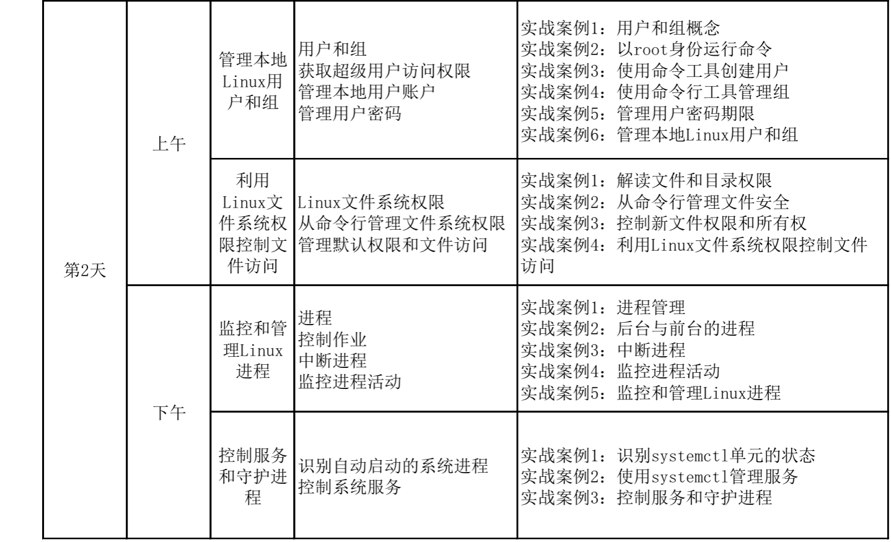
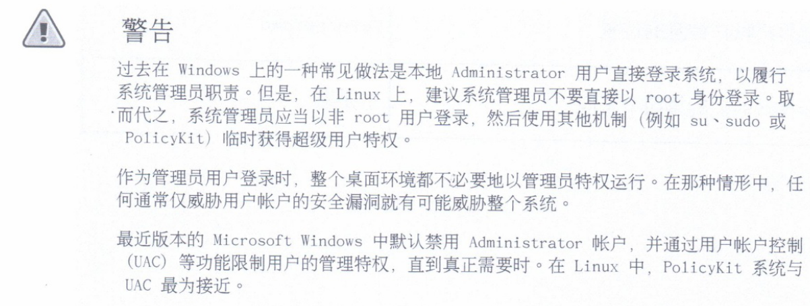
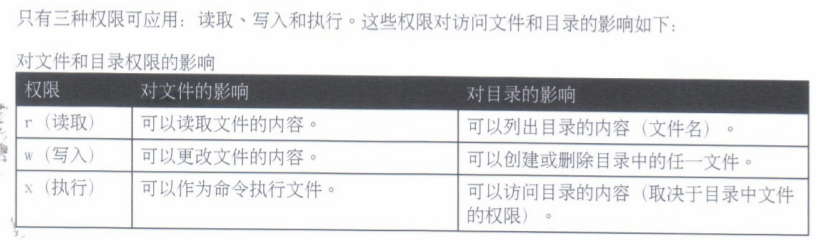
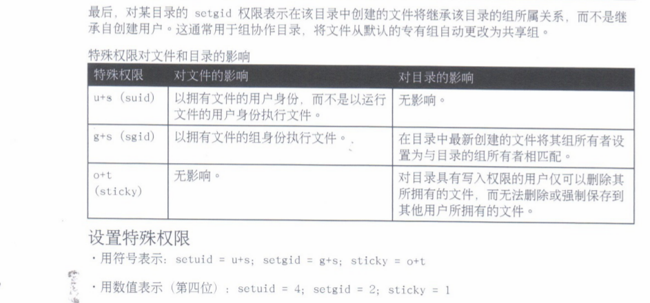
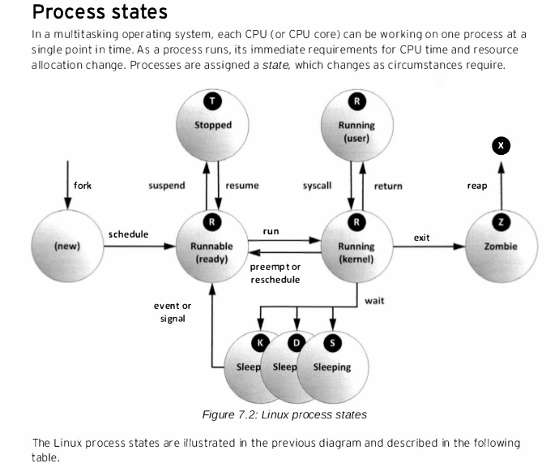
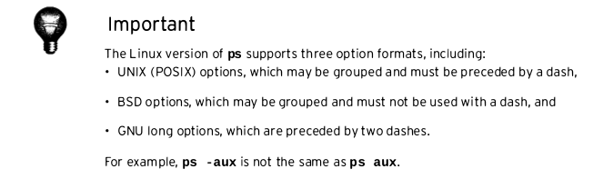
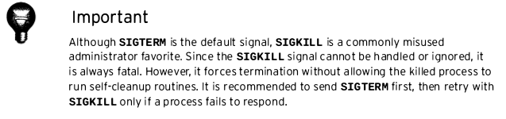
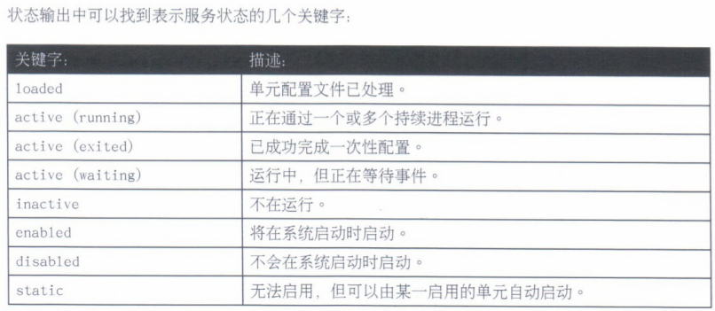
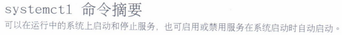
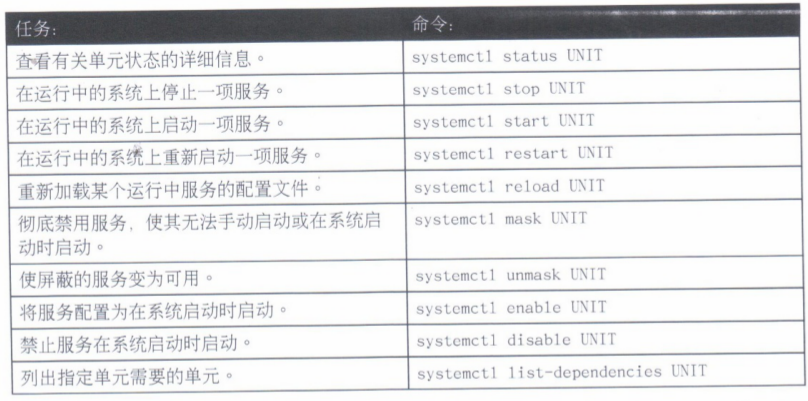

# 1. 昨天思考题讨论
>
> 思考题<br>
此处可以给大家留个思考题, 上面这里用双引号及用单引号有没有区别, 在这种命令环境中单双引号有什么区别?
<br>
>
[linux bash shell中，单引号、 双引号，反引号（``）的区别及各种括号的区别](https://blog.csdn.net/miyatang/article/details/8077123)

>一、单引号和双引号
>首先，单引号和双引号，都是为了解决中间有空格的问题。
>
>因为空格在linux中时作为一个很典型的分隔符，比如string1=this is astring，这样执行就会报错。为了避免这个问题，因此就产生了单引号和双引号。他们的区别在于，单引号将剥夺其中的所有字符的特殊含义，而双引号中的'$'（参数替换）和'`'（命令替换）是例外。所以，两者基本上没有什么区别，除非在内容中遇到了参数替换符$和命令替换符`。
>
>所以下面的结果：
>num=3
>echo ‘$num’
>$num
>echo “$num”
3
所以，如果需要在双引号””里面使用这两种符号，需要用反斜杠转义。


# 2. 管理本地用户组

## 2.1 用户和组

### 查水表的常用几招

- 你是谁?
有下面的两种回答方式
```bash
[student@desktop0 ~]$ whoami
student

[student@desktop0 ~]$ id -un
student
```

- 在哪干活?
```bash
[student@desktop0 ~]$ pwd
/home/student
```
- 手上都在干啥活儿?
```bash
[student@desktop0 ~]$ ps au|grep ^`whoami`
USER       PID %CPU %MEM    VSZ   RSS TTY      STAT START   TIME COMMAND
root       596  0.0  1.3 172156 25592 tty1     Ss+  11:03   0:06 /usr/bin/Xorg :0
root      1580  0.0  0.0 110004   824 ttyS0    Ss+  11:03   0:00 /sbin/agetty --k
student   4173  0.0  0.1 116144  2812 pts/0    Ss   19:44   0:00 -bash
student   4601  0.0  0.0 123356  1320 pts/0    R+   20:03   0:00 ps -au
```

- 家住何方?
```bash
[student@desktop0 ~]$ cd;pwd
/home/student
```

- 你是哪个组织(社团,帮派)的?
```bash
[student@desktop0 ~]$ groups
student wheel
```
- 平时用哪个工具干(zuo)活(an)?
```bash
[student@desktop0 ~]$ echo $SHELL
/bin/bash
```
- 你现在都在

- 算了,别废话,`身份证`拿出来,靠墙趴着..快,别盯着屏幕看,,,还笑,,说的就是你

```bash
[student@desktop0 ~]$ id
uid=1000(student) gid=1000(student) groups=1000(student),10(wheel) context=unconfined_u:unconfined_r:unconfined_t:s0-s0:c0.c1023

```

- 好像与某个在逃人员一致,,,我调一下你的档案好了
```bash
[student@desktop0 ~]$ grep $(whoami) /etc/passwd
student:x:1000:1000:Student User:/home/student:/bin/bash
```
`grep`又是什么鬼??
> grep = g(lobal)re(gex)p(rint)|翻译成中文"全世界按一定的特征找到,并打印出来"
 好像还可以这么译(尘世中找到了特别的你,并把你P出来:)


- 把你团伙的档案也调出来
```bash
[student@desktop0 ~]$ grep $(whoami) /etc/group
wheel:x:10:student
student:x:1000:

```
## 2.2 获取超级用户访问权限 

### root (boss)
随着安卓手机刷机,,root这个词越来越火了....有时连我的表弟也似懂非懂地问我,,学着广告方案
> 今日你root了没?

root掉手机, 手机用wifi万能钥匙得到密码后, 再查看钥匙能开的密码...
[密码放哪里? 一般人我不告诉他,,root就可以看](https://jingyan.baidu.com/article/9c69d48f95d31f13c8024e45.html)
<br>
好吧..手机那事我们就不谈了, (因为太复杂, 不懂)

- 能装孙子的时候别当大爷(装逼一点说, 就是"最小权限原则")


- 对比root与windows的Administrator(用户级)
- wheel与windows的Administrators(组级)

### su  
就是变身的意思
- 注意 su 与 su - 的区别
```bash
[student@desktop0 ~]$ cd Documents/
[student@desktop0 Documents]$ ls
[student@desktop0 Documents]$ su
Password:
[root@desktop0 Documents]# exit
exit
[student@desktop0 Documents]$ su -
Password:
Last login: Sat Feb 23 20:40:05 CST 2019 on pts/0
[root@desktop0 ~]#

```

#### sudo 临时变身(我不做大哥好多年)
分时, 分权

演示一下通过
visudo把student变成更强大(把wheel)(未修改前第一个是放开, 第二个是注释的)
```bash
## Allows people in group wheel to run all commands
#%wheel ALL=(ALL)       ALL

## Same thing without a password
%wheel  ALL=(ALL)       NOPASSWD: ALL
```
#### RH124p111可以看时间,看做不做(optional)

## 2.3 管理本地用户

### useradd
据说useradd通过加不同的参数可以大部分覆盖usermod的功能

### usermod

-d -m 这个参数可以搬家, -g 与-G的区别 还有-a

### userdel
-r 这个参数加入的话, 可以避免了新入来的用户有一系列之前同ID用户的旧文件
```bash
[student@desktop0 ~]$ sudo useradd pp
[student@desktop0 ~]$ ls -l /home
total 4
drwx------.  4 pp           pp             88 Feb 23 21:04 pp
drwx------. 14 student      student      4096 Feb 23 11:08 student
drwx------.  4 usertobelock usertobelock   88 Feb 23 20:46 usertobelock
[student@desktop0 ~]$ userdel pp
-bash: /usr/sbin/userdel: Permission denied
[student@desktop0 ~]$ sudo userdel pp
[student@desktop0 ~]$ useradd qq
-bash: /usr/sbin/useradd: Permission denied
[student@desktop0 ~]$ sudo useradd qq
[student@desktop0 ~]$
[student@desktop0 ~]$ [
-bash: [: missing `]'
[student@desktop0 ~]$ ls -l /home
total 4
drwx------.  4 qq           qq             88 Feb 23 21:04 pp
drwx------.  4 qq           qq             88 Feb 23 21:05 qq
drwx------. 14 student      student      4096 Feb 23 11:08 student
drwx------.  4 usertobelock usertobelock   88 Feb 23 20:46 usertobelock
[student@desktop0 ~]$

```

### passwd 
密码强度要求,设置不能太简单,,,但是root可以无视这规则


### uid range
系统保留的从原来的1-499 变为了1-999
但1-999中还区别的
1-200 静态(可联系车位)
200-999 动态(临停车位)
- 详见/etc/login.defs

## 2.4 管理本地组

### groupadd (开宗立派)
- -r 参数在范围中随机
- 复习usermod -g -G -aG这些参数 


## 2.5 管理用户密码

### /etc/shadow
```bash
[student@desktop0 ~]$ man 5 shadow
[student@desktop0 ~]$ vim -R /etc/shadow
```
讲一下salt这个概念
也可以讲一下非对称密码(单向,不可逆),结合[windows的密码相关](https://wenku.baidu.com/view/7e1d2bc00c22590102029d24.html)进行讨论

### 密码过期
chage
书本上的图还是比较经典的,一次性说明了几个参数的用法

### 访问限制
usermod -l -e 1 username

usermod -s /sbin/nologin student

### rh124p126有练习, 也是可选


# 3. 利用Linux文件系统权限访问

## 3.1 文件系统权限



### 下面演示一下怎样从门都没有到改写档案的过程

- 先用student用户在自己的home下面建立个目录, 并且目录otehr的执行权限去掉. 增加文件也把里面的文件权限去掉
```bash
[student@desktop0 ~]$ cd ;mkdir -p tmp;ls -ld tmp
drwxrwxr-x. 2 student student 6 Feb 23 21:54 tmp
[student@desktop0 ~]$ chmod o-x tmp
[student@desktop0 ~]$ ls -ld tmp
drwxrwxr--. 2 student student 6 Feb 23 21:54 tmp
[student@desktop0 ~]$ cd tmp
[student@desktop0 tmp]$ echo "abc"> file1
[student@desktop0 tmp]$ ls
file1
[student@desktop0 tmp]$ ll
total 4
-rw-rw-r--. 1 student student 4 Feb 23 21:55 file1
[student@desktop0 tmp]$ chmod o-r file1
```
- 另一个用户qq进入 /home/student/tmp结果
```bash
[qq@desktop0 student]$ cd /home/student/tmp
-bash: cd: /home/student/tmp: Permission denied
```
- 此时, student把tmp的目录的others的执行权限放开
```bash
[student@desktop0 ~]$ chmod o+x tm
```
- 之后qq就可以进入了, 能列出该目录的文件, 但是..不能读取
```bash
[qq@desktop0 student]$ cd /home/student/tmp
[qq@desktop0 tmp]$ ll
total 4
-rw-rw----. 1 student student 4 Feb 23 21:55 file1
[qq@desktop0 tmp]$ cat file1
cat: file1: Permission denied
```
- 之后放开读
```bash
[student@desktop0 tmp]$ chmod o+r file1
```
- qq用户能读取了, 但不能写
```bash
[qq@desktop0 tmp]$ cat file1
abc

[qq@desktop0 tmp]$ echo  "efg" >> file1
-bash: file1: Permission denied
```

- 之后再放开写权限
```bash
[student@desktop0 tmp]$ chmod o+w file1
```

- qq就可以写了
```bash
[qq@desktop0 tmp]$ echo  "efg" >> file1
[qq@desktop0 tmp]$

```

### 通过RH124p135的示例进行讲解

## 3.2 通过命令行管理文件系统权限

### 修改文件及目录的权限

chmod 

#### 符号法 
- rwx, 分别作用于ugo 3*3 = 9 bit, 再加上目录位就有10bit
- u+x 用户加入执行
- ug+x, o+r 用户及所属组加入执行, 其它加入读取

#### 数字法
- r 4
- w 2
- x 1

每三位为一组,每组的具体值为三位加起来的和

```bash
chmod 750 tt
```

#### 参数`-R`递归执行

### 改变属主(onwer)
`chown`

```bash
chown student  foo
chown student:student  foo
chown :student  foo
chown -R :student  foo

```

另一个类似的chgrp

### 特殊权限 

#### u+s(suid)
```bash
[student@desktop0 tmp]$ ls -l $(which passwd)
-rwsr-xr-x. 1 root root 27832 Jan 30  2014 /bin/passwd
```

#### g+s(sgid)
要求一个目录加了g+s,那么这个目录里面新建的文件的gid就是这个目录所属的组
```bash
[student@desktop0 tmp]$ mkdir testsgid
[student@desktop0 tmp]$ cd testsgid/
[student@desktop0 testsgid]$ touch a
[student@desktop0 testsgid]$ su -
Password:
Last login: Sat Feb 23 20:50:54 CST 2019 on pts/0
[root@desktop0 ~]# cd /home/student/tmp/testsgid/
[root@desktop0 testsgid]# touch root_touch
[root@desktop0 testsgid]# ll
total 0
-rw-rw-r--. 1 student student 0 Feb 23 22:34 a
-rw-r--r--. 1 root    root    0 Feb 23 22:34 root_touch
[root@desktop0 testsgid]# cd ..
[root@desktop0 tmp]# ll
total 4
-rw-rw-rw-. 1 student student  8 Feb 23 22:12 file1
drwxrwxr-x. 2 student student 31 Feb 23 22:34 testsgid
[root@desktop0 tmp]# chmod g+s testsgid/
[root@desktop0 tmp]# ls -ld testsgid/
drwxrwsr-x. 2 student student 31 Feb 23 22:34 testsgid/
[root@desktop0 tmp]# ls
file1  testsgid
[root@desktop0 tmp]# cd testsgid/
[root@desktop0 testsgid]# touch c
[root@desktop0 testsgid]# ll
total 0
-rw-rw-r--. 1 student student 0 Feb 23 22:34 a
-rw-r--r--. 1 root    student 0 Feb 23 22:35 c
-rw-r--r--. 1 root    root    0 Feb 23 22:34 root_touch
```


#### o+t(sticky)
```bash
[student@desktop0 ~]$ cd /tmp
[student@desktop0 tmp]$ touch teststicky
[student@desktop0 tmp]$ ll teststicky
-rw-rw-r--. 1 student student 0 Feb 23 22:40 teststicky
[student@desktop0 tmp]$ chmod o+w teststicky
[student@desktop0 tmp]$ ll teststicky
-rw-rw-rw-. 1 student student 0 Feb 23 22:40 teststicky
```
此时/tmp已是sticky了, 
```bash
[student@desktop0 tmp]$ ls -dlrt /tmp
drwxrwxrwt. 12 root root 4096 Feb 23 22:41 /tmp
```

所以另一个用户删除该文件也是失败的, 哪怕该目录group与outhers都有写权限.

### 默认文件权限(umask)
- 0002
- 0022
- 前面的0不写的话也是默认是0,也就是`umask 0002`与`umask 2`是一样的
- 若想永久生效需要在相应的配置文件进行修改 `/etc/bashrc` 及 `/etc/profile`
- 另外也可以参写 [linux目录权限修改(以及umask用法)](https://blog.csdn.net/wangpengcsdn1/article/details/63302232)

### RH124p161 solution可选来讲课

# 午休

# 4. 监控及管理windows进程

## 进程

### 什么是进程?
 
- 可执行程序的一个实例
- 围绕进程中有一系列的资源(结合`/proc/<pid>`这个目录去看一下)
- fork 产生父子进程.`pid` `ppid` 必要时`pstree`可以看到进程之间的关系.

### 进程状态


`ps` `top`

ps命令风格差异
<br>



## 控制作业

相关命令
- 查看 jobs
- 到前台 fg 
- 从原来的stop变为running bg
- 从前台运行中ctrl+z可以使其stop

个人觉得作业控制在现在终端相对易得, 我们平时操作可以多几工N个窗口, <br>
加上还有screen等分屏复用的软件后, 作业控制的用处比之前少了,好像考试不考吧(不很确认了).

## 杀进程

### `kill pid`

###`kill -l` 列出各信号

### 三个键盘组合键出来的信息

- suspend (ctrl-z)
- kill (ctrl-c)
- core dump (ctrl-\)

### `killall`

- 通过文件名来杀, 因此也支持杀多个进程

### `pkill` 

- 可能过更多的条件去列出需要杀哪些进程.(command, uid,gid,parent, terminal)

### 找一些进程来杀

#### 通过IP来杀
- w -f  可以看来远程序过来的IP

#### 也可以用pgrep查出来杀 

#### 先礼后兵


## 监控进程活动

### 看负载

```bash
[qq@desktop0 tmp]$ uptime
 23:35:19 up 12:32,  3 users,  load average: 0.00, 0.01, 0.05
```

- top
- .toprc

### 查看CPU个数

`grep "model name" /proc/cpuinfo |wc -l`


# 5. 控制服务和守护进程

## 5.0 d for daemon 

一系列最后一个字母为d的都是守护进程, 如vsftpd,httpd, xinetd...

## 5.1 systemd
- 并行
- 按需守护
- 自动依赖管理
- 利用linux控制组跟踪一些资源

### systemd的各种单元
由下面的各单元组成
```bash
[qq@desktop0 tmp]$ systemctl -t help
Available unit types:
service
socket
target
device
mount
automount
snapshot
timer
swap
path
slice
scope
```
- .socket
- .service
- .path

```bash
[qq@desktop0 tmp]$ systemctl status sshd.service
sshd.service - OpenSSH server daemon
   Loaded: loaded (/usr/lib/systemd/system/sshd.service; enabled)
   Active: active (running) since Sat 2019-02-23 11:03:06 CST; 12h ago
  Process: 1047 ExecStartPre=/usr/sbin/sshd-keygen (code=exited, status=0/SUCCESS)
 Main PID: 1055 (sshd)
   CGroup: /system.slice/sshd.service
           └─1055 /usr/sbin/sshd -D

```
<br>
上面操作, 与旧版的 servcie NAME status对应 

除了status外, 还有命令关键字


### rh124p184 一步步来演示

## 5.2 控制系统服务




## 5.3 学完后可以用systemctl set-default 命令改变启动的状态(从图形界面变成字符界面)


# 6.相关模拟题
应昨天学员相应的问题, 
<br>大家可以先看一下, 尽可能先自己想一下, 再翻翻书, 建议不要直接问, 用题目带动大家查资料,及思考
```bash
4. 创建下面的用户、组和组成员关系： 
名字为adminuser的组 
用户natasha，使用adminuser作为附属组 
用户harry，也使用adminuser作为附属组 
用户sarah，在系统上不能访问可交互的shell，且不是adminuser的成员， 
Natasha，harry，sarah密码都是abc123!@# 

6. 用户natasha必须配置一个cron job ，当地时间每天14：23运行，执行 
/bin/echo hiya

 
7. 创建一个目录/home/admins,使之具体下面的特性: 
/home/admins所属组为adminuser 
这个目录对组adminuser的成员具有可读、可写和可执行，但是不是对其他用户。 
(root可以访问系统上所有的文件和目录) 
在/home/admins 下创建的任何文件所属组自动设置为adminuser 

12. 创建一个用户alex，uid为3400。这个用户的密码为abc!@#123。

14.创建ira用户，然后切换到ira用户，在ira用户家目录下新建一个文件夹aaa，在目录中创建三个文件a1,b1,c1，退出ira用户。
找出所有所有者是ira的文件，并把他们拷贝到/root/findresults目录。 

```

