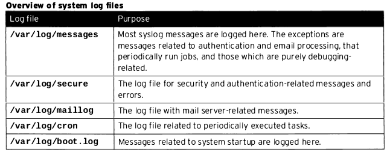
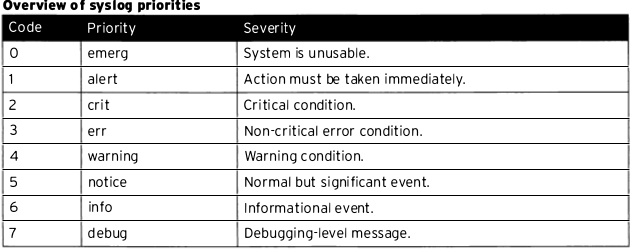
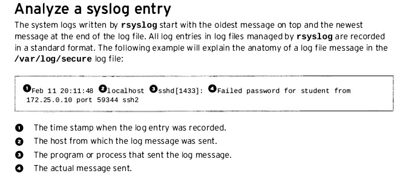
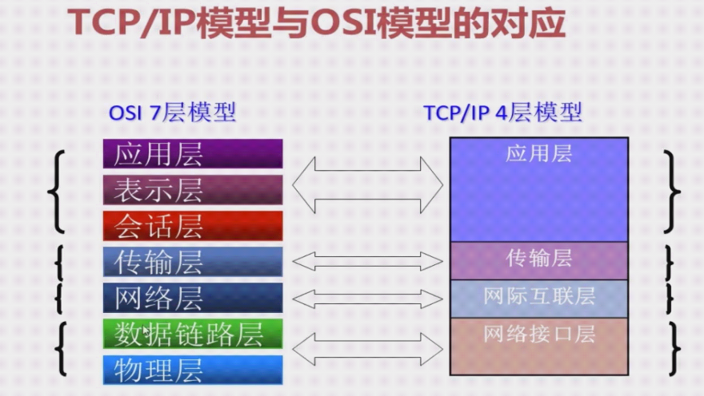
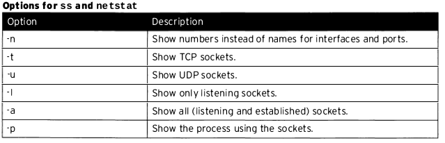
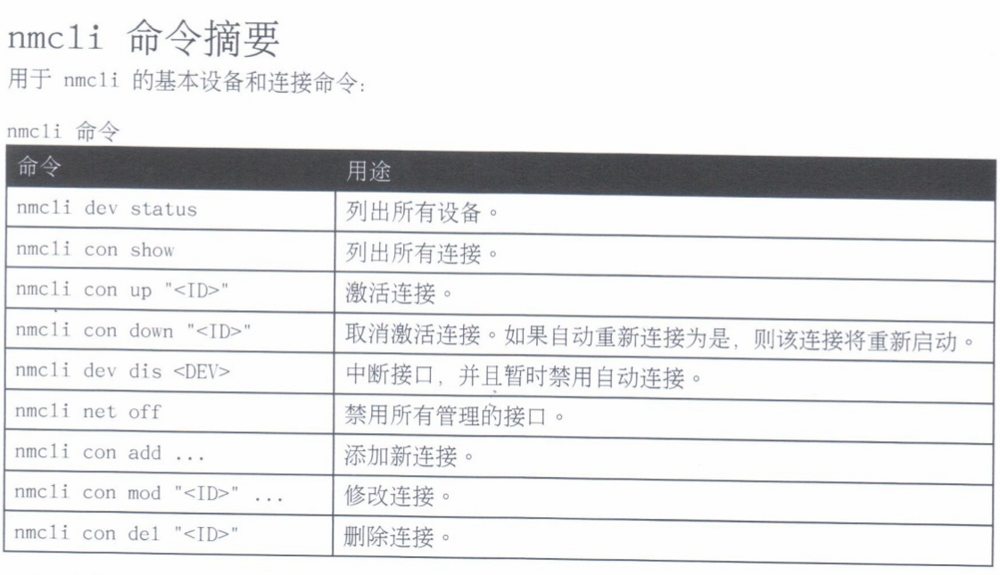
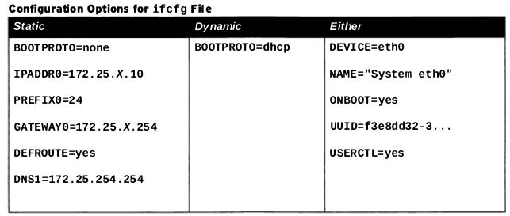

plan


# 1. 配置,加固openSSH服务

## 1.1 通过SSH远程登陆

下面部分内容摘自维基百科[SSH中文相关页面](https://zh.wikipedia.org/wiki/Secure_Shell)

### 名字由来
SSH是(Secure SHell)的缩写.

Secure Shell（安全外壳协议，简称SSH）是一种加密的网络传输协议，可在不安全的网络中为网络服务提供安全的传输环境。<br>
SSH通过在网络中创建安全隧道来实现SSH客户端与服务器之间的连接。虽然任何网络服务都可以通过SSH实现安全传输，SSH最常见的用途是远程登录系统，<br>
人们通常利用SSH来传输命令行界面和远程执行命令。使用频率最高的场合类Unix系统，但是Windows操作系统也能有限度地使用SSH。<br>
2015年，微软宣布将在未来的操作系统中提供原生SSH协议支持.

### 替代品
在设计上，SSH是Telnet和非安全shell的替代品。Telnet和Berkeley rlogin、rsh、rexec等协议采用明文传输，使用不可靠的密码，<br>
容易遭到监听、嗅探和中间人攻击。SSH旨在保证非安全网络环境（例如互联网）中信息加密完整可靠。

### 没有绝对的安全
不过，SSH也被指出有被嗅探甚至解密的漏洞。早在2011年，中国的互联网审查机构已经有能力针对SSH连线的刺探及干扰。<br>
而后爱德华·斯诺登泄露的文件也指出，美国国家安全局有时能够把SSH协议传输的信息解密出来，从而读出SSH会话的传输内容。<br>
2017年7月6日，非营利组织维基解密确认美国中央情报局已经开发出能够在Windows或Linux操作系统中窃取SSH会话的工具。

### 通过ssh远程登陆

有时可能我们的实验环境不是干净的, 因此, 为了得到相一致的效果, 建议我们在实验前先把我们的 desktop, server都重置一下,<br>
如对我们环境 foundation, desktop, server还不太清楚, 可以查看[相关环境搭建的章节](../preparation/preparation.md)<br>

#### 登陆前常见错误
desktop 机器都未启动我们就想去登陆,,一般会出现下面的报错, 我们可以用ping这个检测网络是否连通的命令去验证(当然,如有防火墙把icmp包给丢了就另当别论)
```bash
[kiosk@foundation0 ~]$ ssh student@172.25.0.10
ssh: connect to host 172.25.0.10 port 22: No route to host
[kiosk@foundation0 ~]$ ping 172.25.0.10
PING 172.25.0.10 (172.25.0.10) 56(84) bytes of data.
From 172.25.0.250 icmp_seq=1 Destination Host Unreachable
From 172.25.0.250 icmp_seq=2 Destination Host Unreachable
From 172.25.0.250 icmp_seq=3 Destination Host Unreachable
From 172.25.0.250 icmp_seq=4 Destination Host Unreachable
^C
--- 172.25.0.10 ping statistics ---
6 packets transmitted, 0 received, +4 errors, 100% packet loss, time 5000ms
pipe 4
[kiosk@foundation0 ~]$

```
当然,此时如果查看desktop这虚拟机的状态也是处于Missing中
````bash
[kiosk@foundation0 ~]$ rht-vmctl status desktop
error: failed to connect to the hypervisor
error: no valid connection
error: Failed to connect socket to '/var/run/libvirt/libvirt-sock': No such file or directory
desktop MISSING
````
#### 重置环境
同时把desktop, server给重置了
```bash
[kiosk@foundation0 ~]$ rht-vmctl reset desktop
Are you sure you want to reset desktop? (y/n) y
Powering off desktop.
Resetting desktop.
Creating virtual machine disk overlay for rh124-desktop-vda.qcow2
Creating virtual machine disk overlay for rh124-desktop-vdb.qcow2
Starting desktop.
[kiosk@foundation0 ~]$ rht-vmctl reset server
Are you sure you want to reset server? (y/n) y
Powering off server.
Resetting server.
Creating virtual machine disk overlay for rh124-server-vda.qcow2
Creating virtual machine disk overlay for rh124-server-vdb.qcow2
Starting server.
[kiosk@foundation0 ~]$

```

由于重置后会默认把被重置的机器拉起, 稍等片刻后, 两机器应处于运行状态.
````bash
[kiosk@foundation0 ~]$ ping 172.25.0.10
PING 172.25.0.10 (172.25.0.10) 56(84) bytes of data.
64 bytes from 172.25.0.10: icmp_seq=1 ttl=64 time=1.45 ms
^[k64 bytes from 172.25.0.10: icmp_seq=2 ttl=64 time=0.600 ms
64 bytes from 172.25.0.10: icmp_seq=3 ttl=64 time=1.16 ms
^C
--- 172.25.0.10 ping statistics ---
3 packets transmitted, 3 received, 0% packet loss, time 2002ms
rtt min/avg/max/mdev = 0.600/1.072/1.453/0.354 ms
[kiosk@foundation0 ~]$ ping 172.25.0.11
PING 172.25.0.11 (172.25.0.11) 56(84) bytes of data.
64 bytes from 172.25.0.11: icmp_seq=1 ttl=64 time=1.30 ms
64 bytes from 172.25.0.11: icmp_seq=2 ttl=64 time=2.73 ms
^C
--- 172.25.0.11 ping statistics ---
2 packets transmitted, 2 received, 0% packet loss, time 1002ms
rtt min/avg/max/mdev = 1.303/2.018/2.734/0.716 ms
````

此时我时我们先登陆到desktop中再从desktop用ssh登到server中,(因为之前在foundation中,已进行了一些设置(我们下面会详细说明),
<br>
因此我们直接登陆到了desktop中去了.)


```bash
[kiosk@foundation0 ~]$ ssh student@172.25.0.10
[student@desktop0 ~]$
```

在desktop中我们再正常演示一下平时我们的登陆的情况
注:两机器的用户名与密码均为student
```bash
[student@desktop0 ~]$ ssh student@172.25.0.11
The authenticity of host '172.25.0.11 (172.25.0.11)' can't be established.
ECDSA key fingerprint is eb:24:0e:07:96:26:b1:04:c2:37:0c:78:2d:bc:b0:08.
Are you sure you want to continue connecting (yes/no)? yes
Warning: Permanently added '172.25.0.11' (ECDSA) to the list of known hosts.
student@172.25.0.11's password:
[student@server0 ~]$
```

此时我们可以在新开的另一个终端窗口(下面简称B窗)中foundation登上server,之后用`w -f`命令查看,确认有用户远程登陆到server中去了
```bash
[student@server0 ~]$ w -f
 22:21:48 up 14 min,  3 users,  load average: 0.04, 0.05, 0.08
USER     TTY      FROM             LOGIN@   IDLE   JCPU   PCPU WHAT
student  pts/0    desktop0.example 22:15    2:12   0.03s  0.03s -bash
student  pts/1    172.25.0.250     22:21    4.00s  0.04s  0.01s w -f
```
从FROM中可以看到 pts/0 是从desktop0.example过来的,如果你真的不确认, 
此时我们可以在之前从desktop登陆到server的那个窗口(下面简称A窗)sleep一下
```bash
[student@server0 ~]$ sleep 1000
```

之后再回到从foundation登陆到server的那个窗口, 再次运行`w -f`此时发现之前的-bash命令, 变成了sleep,<br>
 那么对于那个登陆者就是从desktop过来的这个事实就更确认无疑了.
```bash

[student@server0 ~]$ w -f
 22:24:36 up 17 min,  3 users,  load average: 0.00, 0.03, 0.07
USER     TTY      FROM             LOGIN@   IDLE   JCPU   PCPU WHAT
student  pts/0    desktop0.example 22:15   12.00s  0.03s  0.00s sleep 1000
student  pts/1    172.25.0.250     22:21    4.00s  0.05s  0.02s w -f
```

### 远程登陆后运行完命令就退出
之前是登陆后, 就一直在远程机器,进行交换式操作, 但有时我们到远程机器只是需要进行简单的操作,<br>
因此, 我们可以在原来登陆后交互操作的命令后面加入需要在远程操作的命令后就会有新的效果, 如下:

例如, 我们可以在A窗运行,写入desktop到此一游
```bash
[student@desktop0 ~]$ ssh student@172.25.0.11 'echo "desktop had beed here">~/notice'
student@172.25.0.11's password:
```
注意, 'echo "desktop had beed here">~/notice' 作为ssh登陆后的一个整体命令, 需要用单引号引住, 不然至此一游的文件还是在本地.切记


<br>
此时回到B窗确认一下是不是真的有一个叫notice的文件,里面写着到此一游的..
```bash
[student@server0 ~]$ cat notice
desktop had beed here
```
的确如此

### ssh的known_hosts

如果不是第一次登陆到新远端机器中, 就不会有以下提示及应答

```bash 
The authenticity of host '172.25.0.11 (172.25.0.11)' can't be established.
ECDSA key fingerprint is eb:24:0e:07:96:26:b1:04:c2:37:0c:78:2d:bc:b0:08.
Are you sure you want to continue connecting (yes/no)? yes
Warning: Permanently added '172.25.0.11' (ECDSA) to the list of known hosts.
```
那是因为自动第一次ssh登陆到远程机器中后, 客户端(desktop,就会把server的公钥,及远程机器存起来)
如下面 在A窗运行

```bash
[student@desktop0 ~]$ cat .ssh/known_hosts
172.25.0.11 ecdsa-sha2-nistp256 AAAAE2VjZHNhLXNoYTItbmlzdHAyNTYAAAAIbmlzdHAyNTYAAABBBHX+o9KAnlfw2dE7CsmM4hqfv1udM79a5NWC2BuWlmfKSwfYLptPQMJF8bnqaz0EjDlxCxRu/aito+GphPLzp/k=
```

在B窗确认一下server的公钥
```bash
[student@server0 ~]$ cat /etc/ssh/ssh_host_ecdsa_key.pub
ecdsa-sha2-nistp256 AAAAE2VjZHNhLXNoYTItbmlzdHAyNTYAAAAIbmlzdHAyNTYAAABBBHX+o9KAnlfw2dE7CsmM4hqfv1udM79a5NWC2BuWlmfKSwfYLptPQMJF8bnqaz0EjDlxCxRu/aito+GphPLzp/k=
[student@server0 ~]$
```

我们把A窗的中.ssh/known_hosts中相应的记录删去(当然,更极端的话, 就不只是删掉某条记录, 而是整个文件给删去)
再去登陆的话, 之前提示会再次出现, yes后, 登进去, 再退出,再登陆就不会再提示了.


## 1.2 以密钥形式登陆
在上一小节我们演示了, 通过用户名与密码登陆到远程的机器中去.
而ssh其实还是可以通过密钥登陆的.

下面就演示在desktop,生成密钥后,传输密钥后再不用输入密码远程登陆到server

先在desktop生成公钥及私钥.
```bash
[student@desktop0 ~]$ ssh-keygen
Generating public/private rsa key pair.
Enter file in which to save the key (/home/student/.ssh/id_rsa):
Enter passphrase (empty for no passphrase):
Enter same passphrase again:
Your identification has been saved in /home/student/.ssh/id_rsa.
Your public key has been saved in /home/student/.ssh/id_rsa.pub.
The key fingerprint is:
6c:47:97:6c:c4:d4:6d:ec:d7:d5:11:4d:76:ae:d3:c8 student@desktop0.example.com
The key's randomart image is:
+--[ RSA 2048]----+
|           oo. *O|
|           o...oO|
|          . =  o+|
|       . . o . ++|
|        S .   E o|
|       . .     . |
|                 |
|                 |
|                 |
+-----------------+
```
把公钥传到要登陆的服务器中
```bash
[student@desktop0 ~]$ ssh-copy-id -i ~/.ssh/id_rsa.pub student@172.25.0.11
/bin/ssh-copy-id: INFO: attempting to log in with the new key(s), to filter out any that are already installed
/bin/ssh-copy-id: INFO: 1 key(s) remain to be installed -- if you are prompted now it is to install the new keys
student@172.25.0.11's password:

Number of key(s) added: 1

Now try logging into the machine, with:   "ssh 'student@172.25.0.11'"
and check to make sure that only the key(s) you wanted were added.
```


之后就可以免密登陆了
```bash
[student@desktop0 ~]$ ssh student@172.25.0.11
Last login: Mon Feb 25 23:41:57 2019 from desktop0.example.com
[student@server0 ~]$
```

如果我们在生成key的时候,用了密码保存,那么登陆时,需要不用输入student的密码,可是还是要输入保护key的密码,那样还是要交换,要手动输入, 不太方便, 
<br>
但是"安全".

#### 如果私钥用密码进行保护后, 还是需要输入密码, 只不过是另一个密码罢了.
可以这样重复实验
```bash
[student@desktop0 .ssh]$ rm id_rsa id_rsa.pub
```
再重复生成密钥, 此时用密码保护私钥, 那么就算是传输密钥之后, 我们登陆还是会提示
```bash
[student@desktop0 ~]$ ssh student@172.25.0.11
Enter passphrase for key '/home/student/.ssh/id_rsa':
Last failed login: Mon Feb 25 23:40:53 CST 2019 from desktop0.example.com on ssh:notty
There were 2 failed login attempts since the last successful login.
Last login: Mon Feb 25 23:07:41 2019 from desktop0.example.com
[student@server0 ~]$ exit
```

## 1.3 修改sshd相关配置后,限制登陆
注意是
/etc/ssh/sshd_config
不是
/etc/ssh/ssh_config

```bash
[root@server0 ssh]# egrep "^PermitRoot|^Password" sshd_config
PermitRootLogin no
PasswordAuthentication no
```
在B窗
修改 PasswordAuthentication 为no后,
再重启sshd服务
```bash
[root@server0 ssh]# systemctl restart sshd
```

再切回A窗, 发现已不能用密码登陆了
(当然由于之前的student用户已设置了密钥登陆, 因此我们需要临时改立一个新的用户去验证这个事)
```bash
[kk@desktop0 ~]$ ssh student@172.25.0.11
The authenticity of host '172.25.0.11 (172.25.0.11)' can't be established.
ECDSA key fingerprint is eb:24:0e:07:96:26:b1:04:c2:37:0c:78:2d:bc:b0:08.
Are you sure you want to continue connecting (yes/no)? yes
Warning: Permanently added '172.25.0.11' (ECDSA) to the list of known hosts.
Permission denied (publickey,gssapi-keyex,gssapi-with-mic).
[kk@desktop0 ~]$ exit
```

同理, 修改了
PermitRootLogin no
就会让root不能直接ssh登陆.


# 2. 分析,存储日志

## 系统日志架构

各种系统日志


<br>

## 查看系统日志文件


监控安全方面的日志文件
在B窗打开安全方面的日志文件(用 tail -f 打开实时查看变化)

```bash
[root@server0 log]# tail -f /var/log/secure
Feb 25 10:58:21 localhost unix_chkpwd[31087]: password check failed for user (root)
Feb 25 10:58:21 localhost sshd[31085]: pam_unix(sshd:auth): authentication failure; logname= uid=0 euid=0 tty=ssh ruser= rhost=desktop0.example.com  user=root
Feb 25 10:58:21 localhost sshd[31085]: pam_succeed_if(sshd:auth): requirement "uid >= 1000" not met by user "root"
Feb 25 10:58:23 localhost sshd[31085]: Failed password for root from 172.25.0.10 port 36440 ssh2
Feb 25 10:58:45 localhost sshd[31085]: Connection closed by 172.25.0.10 [preauth]
Feb 25 10:59:03 localhost sshd[31083]: Received signal 15; terminating.
Feb 25 10:59:03 localhost sshd[31103]: Server listening on 0.0.0.0 port 22.
Feb 25 10:59:03 localhost sshd[31103]: Server listening on :: port 22.
Feb 25 10:59:07 localhost sshd[31106]: Accepted password for root from 172.25.0.10 port 36441 ssh2
Feb 25 10:59:07 localhost sshd[31106]: pam_unix(sshd:session): session opened for user root by (uid=0)
...

随着A窗root登陆到server,  出错会打出下面的信息, 最后一次为密码正确的登陆


Feb 25 11:10:30 localhost sshd[31106]: Received disconnect from 172.25.0.10: 11: disconnected by user
Feb 25 11:10:30 localhost sshd[31106]: pam_unix(sshd:session): session closed for user root
Feb 25 11:10:38 localhost unix_chkpwd[31350]: password check failed for user (root)
Feb 25 11:10:38 localhost sshd[31348]: pam_unix(sshd:auth): authentication failure; logname= uid=0 euid=0 tty=ssh ruser= rhost=desktop0.example.com  user=root
Feb 25 11:10:38 localhost sshd[31348]: pam_succeed_if(sshd:auth): requirement "uid >= 1000" not met by user "root"
Feb 25 11:10:40 localhost sshd[31348]: Failed password for root from 172.25.0.10 port 36442 ssh2
Feb 25 11:10:46 localhost unix_chkpwd[31351]: password check failed for user (root)
Feb 25 11:10:46 localhost sshd[31348]: pam_succeed_if(sshd:auth): requirement "uid >= 1000" not met by user "root"
Feb 25 11:10:48 localhost sshd[31348]: Failed password for root from 172.25.0.10 port 36442 ssh2
Feb 25 11:10:48 localhost sshd[31348]: Connection closed by 172.25.0.10 [preauth]
Feb 25 11:10:48 localhost sshd[31348]: PAM 1 more authentication failure; logname= uid=0 euid=0 tty=ssh ruser= rhost=desktop0.example.com  user=root
Feb 25 11:10:52 localhost sshd[31360]: Accepted password for root from 172.25.0.10 port 36443 ssh2
Feb 25 11:10:52 localhost sshd[31360]: pam_unix(sshd:session): session opened for user root by (uid=0)
^C
```

### logrotate
当日志过多时, 是超量归类,还是固定几个文件重复写入?
总之可以避免单个日志过大, 或者尽可能避免因日志导致磁盘满了.

### 系统日志相关格式


### 给系统日志发消息
```bash
[root@server0 log]# logger -p local7.notice "test system log"
[root@server0 log]# cd /var/log
[root@server0 log]# grep -r "test system log" *
boot.log:Feb 25 11:35:30 localhost student: test system log
messages:Feb 25 11:35:30 localhost student: test system log

```
用这个命令重新系统日志服务
```bash
[root@server0 log]# systemctl restart rsyslog
````

RH124P220 练习


## 查看systemd日志条目

### 通过journalctl 查找事件

`journalctl` 这样列出太多, 可以加入下面的限制更精确去查看日志.

-n 可看最近十条, -n 5 最后五条, -p err,可以看err级别的日志

```bash
[root@server0 log]# journalctl -n
-- Logs begin at Mon 2019-02-25 22:07:35 CST, end at Tue 2019-02-26 00:40:01 CST.
Feb 26 00:30:01 server0.example.com CROND[31589]: (root) CMD (/usr/lib64/sa/sa1 1
Feb 26 00:32:58 server0.example.com student[31670]: sadfasfj
Feb 26 00:32:59 server0.example.com student[31670]: asdfasdf
Feb 26 00:35:30 server0.example.com student[31690]: test system log
Feb 26 00:38:02 server0.example.com systemd[1]: Stopping System Logging Service..
Feb 26 00:38:02 server0.example.com systemd[1]: Starting System Logging Service..
Feb 26 00:38:02 server0.example.com systemd[1]: Started System Logging Service.
Feb 26 00:40:01 server0.example.com systemd[1]: Starting Session 34 of user root.
Feb 26 00:40:01 server0.example.com systemd[1]: Started Session 34 of user root.
Feb 26 00:40:01 server0.example.com CROND[31775]: (root) CMD (/usr/lib64/sa/sa1 1
[root@server0 log]# journalctl -n 5
-- Logs begin at Mon 2019-02-25 22:07:35 CST, end at Tue 2019-02-26 00:40:01 CST.
Feb 26 00:38:02 server0.example.com systemd[1]: Starting System Logging Service..
Feb 26 00:38:02 server0.example.com systemd[1]: Started System Logging Service.
Feb 26 00:40:01 server0.example.com systemd[1]: Starting Session 34 of user root.
Feb 26 00:40:01 server0.example.com systemd[1]: Started Session 34 of user root.
Feb 26 00:40:01 server0.example.com CROND[31775]: (root) CMD (/usr/lib64/sa/sa1 1
lines 1-6/6 (END)
[root@server0 log]# journalctl -p err
-- Logs begin at Mon 2019-02-25 22:07:35 CST, end at Tue 2019-02-26 00:40:01 CST.
Feb 25 22:07:36 localhost kernel: Failed to access perfctr msr (MSR c1 is 0)
Feb 25 22:07:37 localhost rpcbind[171]: rpcbind terminating on signal. Restart wi
Feb 25 22:07:43 localhost smartd[504]: Problem creating device name scan list
Feb 25 22:07:43 localhost smartd[504]: In the system's table of devices NO device
Feb 25 22:07:49 localhost systemd[1]: Failed to start LSB: Starts the Spacewalk D
Feb 25 22:07:50 localhost libvirtd[1031]: libvirt version: 1.1.1, package: 29.el7
Feb 25 22:07:50 localhost libvirtd[1031]: Module /usr/lib64/libvirt/connection-dr
Feb 25 22:07:53 server0.example.com systemd[1]: Failed to start /etc/rc.d/rc.loca
Feb 25 23:54:06 server0.example.com systemd[1]: Failed to mark scope session-25.s
lines 1-10/10 (END)
```

-f 类似 tail -f 可以实时动态输出

--since --until 作为时间范围查找

也可 
```bash
journalctl _SYSTEMD_UNIT=sshd.service _PID=1182
```
_UID=..
_PID=..
这样更精确地列出

### 永久转存systemd日志
```bash
[root@server0 log]# mkdir  /var/log/journal
[root@server0 log]# chown root:systemd-journal /var/log/journal/
[root@server0 log]# chmod 2755 /var/log/journal
[root@server0 log]# killall -USR1 systemd-journald
[root@server0 log]# ls /var/log/journal/
946cb0e817ea4adb916183df8c4fc817
[root@server0 log]# ls /var/log/journal/946cb0e817ea4adb916183df8c4fc817/
system.journal
[root@server0 log]#

```

### 保存精确的时间

#### 设置本地时间及时区

```bash

[root@server0 log]# timedatectl
      Local time: Tue 2019-02-26 00:52:03 CST
  Universal time: Mon 2019-02-25 16:52:03 UTC
        RTC time: Mon 2019-02-25 16:52:04
        Timezone: Asia/Shanghai (CST, +0800)
     NTP enabled: yes
NTP synchronized: no
 RTC in local TZ: no
      DST active: n/a

```

```bash
[root@server0 log]# timedatectl list-timezones
Africa/Abidjan
Africa/Accra
Africa/Addis_Ababa
Africa/Algiers
Africa/Asmara
Africa/Bamako
Africa/Bangui
Africa/Banjul
...


[root@server0 log]# timedatectl set-timezone Asia/Shanghai
[root@server0 log]# timedatectl set-time 0:55
[root@server0 log]# timedatectl set-ntp true


```

#### 配置和监控chronyd

修改 /etc/chrony.conf
```bash

[root@server0 etc]# head chrony.conf
# Use public servers from the pool.ntp.org project.
# Please consider joining the pool (http://www.pool.ntp.org/join.html).
server classroom.example.com iburst

# Ignore stratum in source selection.
stratumweight 0

# Record the rate at which the system clock gains/losses time.
driftfile /var/lib/chrony/drift

```
重启服务并对时

```bash


[root@server0 etc]# systemctl restart chronyd.service


[root@server0 etc]# chronyc sources -v
210 Number of sources = 1

  .-- Source mode  '^' = server, '=' = peer, '#' = local clock.
 / .- Source state '*' = current synced, '+' = combined , '-' = not combined,
| /   '?' = unreachable, 'x' = time may be in error, '~' = time too variable.
||                                                 .- xxxx [ yyyy ] +/- zzzz
||                                                /   xxxx = adjusted offset,
||         Log2(Polling interval) -.             |    yyyy = measured offset,
||                                  \            |    zzzz = estimated error.
||                                   |           |
MS Name/IP address         Stratum Poll Reach LastRx Last sample
===============================================================================
^* classroom.example.com         8   6    17    30    -21us[ -104us] +/- 1439us
[root@server0 etc]#


```

# 3. 网络管理

## 基本概念

### IPV4

IP地址由32位二进制数组成，为便于使用，常以XXX.XXX.XXX.XXX形式表现，每组XXX代表小于或等于255的10进制数。
<br>
例如维基媒体的一个IP地址是208.80.152.2。地址可分为A、B、C、D、E五大类，其中E类属于特殊保留地址。
IP地址是唯一的。当前IPv4技术可能使用的IP地址最多可有4,294,967,296个（即232）。<br>
骤看可能觉得很难会用尽，但由于早期编码和分配上的问题，使很多区域的编码实际上被空出或不能使用。<br>
加上互联网的普及，使大部分家庭都至少有一部计算机，连同公司的计算机，以及连接网络的各种设备都消耗大量IPv4地址资源。
<br>
随着互联网的快速成长，IPv4的42亿个地址的分配最终于2011年2月3日用尽.
#### 网络分屋



此时可以就四个分层举一下各种分层有哪些应用,如ping的icmp在 网际互联层等.


#### 分为网络部分,主机部分,

### IP地址类型

#### 公有地址

公有地址（Public address）由Inter NIC（Internet Network Information Center因特网信息中心）负责。这些IP地址分配给注册并向Inter NIC提出申请的组织机构。通过它直接访问因特网。

#### 私有地址

私有地址（Private address）属于非注册地址，专门为组织机构内部使用。

以下列出留用的内部私有地址

A类 10.0.0.0--10.255.255.255
B类 172.16.0.0--172.31.255.255
C类 192.168.0.0--192.168.255.255

### IP地址分类
最初设计互联网络时，为了便于寻址以及层次化构造网络，每个IP地址包括两个标识码（ID），即网络ID和主机ID。同一个物理网络上的所有主机都使用同一个网络ID，网络上的一个主机（包括网络上工作站，服务器和路由器等）有一个主机ID与其对应。Internet委员会定义了5种IP地址类型以适合不同容量的网络，即A类~E类。
其中A、B、C3类（如下表格）由InternetNIC在全球范围内统一分配，D、E类为特殊地址。

|类别|最大网络数| IP地址范围| 单个网段最大主机数| 私有IP地址范围 |
|---|----|----|---|----|
|A| 126（2^7-2)| 1.0.0.0-127.255.255.255| 16777214| 10.0.0.0-10.255.255.255|
|B| 16384(2^14)| 128.0.0.0-191.255.255.255| 65534| 172.16.0.0-172.31.255.255|
|C| 2097152(2^21)| 192.0.0.0-223.255.255.255| 254| 192.168.0.0-192.168.255.255|

#### A类IP地址<br>

一个A类IP地址是指， 在IP地址的四段号码中，第一段号码为网络号码，剩下的三段号码为本地计算机的号码。如果用二进制表示IP地址的话，A类IP地址就由1字节的网络地址和3字节主机地址组成，网络地址的最高位必须是“0”。A类IP地址中网络的标识长度为8位，主机标识的长度为24位，A类网络地址数量较少，有126个网络，每个网络可以容纳主机数达1600多万台。<br>
A类IP地址 地址范围1.0.0.0到127.255.255.255   （二进制表示为：00000001 00000000 00000000 00000000 - 01111111 11111111 11111111 11111111）。最后一个是广播地址。<br>
A类IP地址的子网掩码为255.0.0.0，每个网络支持的最大主机数为256的3次方-2=16777214台。<br>
 
 
#### B类IP地址<br>
一个B类IP地址是指，在IP地址的四段号码中，前两段号码为网络号码。如果用二进制表示IP地址的话，B类IP地址就由2字节的网络地址和2字节主机地址组成，网络地址的最高位必须是“10”。B类IP地址中网络的标识长度为16位，主机标识的长度为16位，B类网络地址适用于中等规模的网络，有16384个网络，每个网络所能容纳的计算机数为6万多台。<br>
B类IP地址地址范围128.0.0.0-191.255.255.255   （二进制表示为：10000000 00000000 00000000 00000000----10111111 11111111 11111111 11111111）。 最后一个是广播地址。<br>
B类IP地址的子网掩码为255.255.0.0，每个网络支持的最大主机数为256的2次方-2=65534台。<br>

#### C类IP地址<br>
一个C类IP地址是指，在IP地址的四段号码中，前三段号码为网络号码，剩下的一段号码为本地计算机的号码。如果用二进制表示IP地址的话，C类IP地址就由3字节的网络地址和1字节主机地址组成，网络地址的最高位必须是“110”。C类IP地址中网络的标识长度为24位，主机标识的长度为8位，C类网络地址数量较多，有209万余个网络。适用于小规模的局域网络，每个网络最多只能包含254台计算机。
C类IP地址范围192.0.0.0-223.255.255.255   （二进制表示为: 11000000 00000000 00000000 00000000 - 11011111 11111111 11111111 11111111）。
C类IP地址的子网掩码为255.255.255.0，每个网络支持的最大主机数为256-2=254台<br>

#### D类IP地址
D类IP地址在历史上被叫做多播地址(multicast address)，即组播地址。在以太网中，多播地址命名了一组应该在这个网络中应用接收到一个分组的站点。多播地址的最高位必须是“1110”，范围从224.0.0.0到239.255.255.255。<br>


## 与我们的环境搭建时,结合讲解
可以进一下vm的几种网络方式, 其中有仅主机(我们一开始的环境建议, 另外我把机器桥接后,大家也可以访问了, 另外需要上外网的话可以nat)


### DHCP 与IP冲突

### MAC冲突

### 网络接口的更新
除了传统的 eth0, wlan0外,还有一系列新规则
可以结合课本讲解, 并且在虚拟机中演示.

## 配置网络

### ifconfig

显示ip地址

之前用ifconfig 显示, 
```bash
[student@desktop0 ~]$ ifconfig
eth0: flags=4163<UP,BROADCAST,RUNNING,MULTICAST>  mtu 1500
        inet 172.25.0.10  netmask 255.255.255.0  broadcast 172.25.0.255
        inet6 fe80::5054:ff:fe00:a  prefixlen 64  scopeid 0x20<link>
        ether 52:54:00:00:00:0a  txqueuelen 1000  (Ethernet)
        RX packets 652  bytes 77967 (76.1 KiB)
        RX errors 0  dropped 0  overruns 0  frame 0
        TX packets 465  bytes 114583 (111.8 KiB)
        TX errors 0  dropped 0 overruns 0  carrier 0  collisions 0

lo: flags=73<UP,LOOPBACK,RUNNING>  mtu 65536
        inet 127.0.0.1  netmask 255.0.0.0
        inet6 ::1  prefixlen 128  scopeid 0x10<host>
        loop  txqueuelen 0  (Local Loopback)
        RX packets 12  bytes 976 (976.0 B)
        RX errors 0  dropped 0  overruns 0  frame 0
        TX packets 12  bytes 976 (976.0 B)
        TX errors 0  dropped 0 overruns 0  carrier 0  collisions 0
```
另外也可以用命令
```bash
[student@desktop0 ~]$ ifconfig eth0 172.25.0.9 netmask 255.255.255.0
```
临时更改IP,但重启后失效

现在新的系统可以建议用

### ip addr

显示ip
```bash
[student@desktop0 ~]$ ip addr
1: lo: <LOOPBACK,UP,LOWER_UP> mtu 65536 qdisc noqueue state UNKNOWN
    link/loopback 00:00:00:00:00:00 brd 00:00:00:00:00:00
    inet 127.0.0.1/8 scope host lo
       valid_lft forever preferred_lft forever
    inet6 ::1/128 scope host
       valid_lft forever preferred_lft forever
2: eth0: <BROADCAST,MULTICAST,UP,LOWER_UP> mtu 1500 qdisc pfifo_fast state UP qlen 1000
    link/ether 52:54:00:00:00:0a brd ff:ff:ff:ff:ff:ff
    inet 172.25.0.10/24 brd 172.25.0.255 scope global dynamic eth0
       valid_lft 20300sec preferred_lft 20300sec
    inet6 fe80::5054:ff:fe00:a/64 scope link
       valid_lft forever preferred_lft forever
```

### 显示统计信息
```bash
[student@desktop0 ~]$ ip -s link  show eth0
2: eth0: <BROADCAST,MULTICAST,UP,LOWER_UP> mtu 1500 qdisc pfifo_fast state UP mode DEFAULT qlen 1000
    link/ether 52:54:00:00:00:0a brd ff:ff:ff:ff:ff:ff
    RX: bytes  packets  errors  dropped overrun mcast
    94797      853      0       0       0       0
    TX: bytes  packets  errors  dropped carrier collsns
    127635     571      0       0       0       0
```

### 看路由信息 

```bash
[student@desktop0 ~]$ ip route
default via 172.25.0.254 dev eth0  proto static  metric 1024
172.25.0.0/24 dev eth0  proto kernel  scope link  src 172.25.0.10
172.25.253.254 via 172.25.0.254 dev eth0  proto static  metric 1
```

此时这个命令可以结合书rh124P266中分别走eth0,eth1的两种IP不同的走向.

### ping 测试连通性
-c 3只ping三次
```bash
[student@desktop0 ~]$ ping -c 3 172.25.0.11
PING 172.25.0.11 (172.25.0.11) 56(84) bytes of data.
64 bytes from 172.25.0.11: icmp_seq=1 ttl=64 time=1.52 ms
64 bytes from 172.25.0.11: icmp_seq=2 ttl=64 time=1.23 ms
64 bytes from 172.25.0.11: icmp_seq=3 ttl=64 time=1.19 ms

--- 172.25.0.11 ping statistics ---
3 packets transmitted, 3 received, 0% packet loss, time 2005ms
rtt min/avg/max/mdev = 1.199/1.320/1.526/0.149 ms
```

### tracepath traceroute

查看到一个地方,要经历哪些地方

````bash
[student@desktop0 ~]$ traceroute classroom.example.com
traceroute to classroom.example.com (172.25.254.254), 30 hops max, 60 byte packets
 1  classroom.example.com (172.25.254.254)  1.232 ms !X  0.860 ms !X  0.939 ms !X
[student@desktop0 ~]$ tracepath classroom.example.com
 1:  classroom.example.com                                 1.888ms !H
     Resume: pmtu 65535

````

在windows下也有类似的
```bash
C:\Users\z88>tracert www.baidu.com

通过最多 30 个跃点跟踪
到 www.a.shifen.com [14.215.177.39] 的路由:

  1     2 ms     8 ms     2 ms  XiaoQiang [192.168.31.1]
  2     3 ms     7 ms     1 ms  REALTEK [192.168.1.1]
  3    67 ms    13 ms     *     100.64.0.1
  4     9 ms     6 ms    27 ms  113.98.93.121
  5     7 ms    14 ms     *     183.56.34.53
  6    15 ms    14 ms    21 ms  113.96.4.130
  7    11 ms    13 ms    11 ms  86.96.135.219.broad.fs.gd.dynamic.163data.com.cn [219.135.96.86]
  8    27 ms    10 ms    26 ms  14.29.121.178
  9     *        *        *     请求超时。
 10    10 ms    15 ms    12 ms  14.215.177.39

跟踪完成。
```

### 故障排查及服务处理

[常用端口](https://en.wikipedia.org/wiki/List_of_TCP_and_UDP_port_numbers)
<br>
[0-1023] 为Well-Known ports
1024+ Registered ports

`/etc/services` 列出了一些常用端口分别是哪些服务所占用, 平时我们打开为我们自己的程序启用端口时, 要注意.


<br>
ss 命令可以查看当前端口占用状态,当然也可以用netstat,但不确认netstat都安装了. 据说ss都安了
 
```bash
[student@desktop0 ~]$ ss -ta
State      Recv-Q Send-Q                                                 Local Address:Port                                                     Peer Address:Port
LISTEN     0      100                                                        127.0.0.1:smtp                                                                *:*
LISTEN     0      128                                                                *:sunrpc                                                              *:*
LISTEN     0      128                                                                *:ssh                                                                 *:*
LISTEN     0      128                                                                *:48246                                                               *:*
ESTAB      0      0                                                        172.25.0.10:ssh                                                      172.25.0.250:33561
LISTEN     0      100                                                              ::1:smtp                                                               :::*
LISTEN     0      128                                                               :::33887                                                              :::*
LISTEN     0      128                                                               :::sunrpc                                                             :::*
LISTEN     0      128                                                               :::ssh                                                                :::*
```



另外,也还可以参考
[Red Hat Enterprise Linux Networking Guide for Red Hat Enterprise Linux 7](https://access.redhat.com/documentation/en-us/red_hat_enterprise_linux/7/pdf/networking_guide/Red_Hat_Enterprise_Linux-7-Networking_Guide-en-US.pdf)

### 大家可以做RH124P249练习(检查风络配置)

## 用nmcli 配置网络

### 列出一系列配置网络的方法

- gnome的图型界面的networking manager
- nm-connection-editor (需要gui)
- nmtui
- 直接 修改/etc/sysconfig/network-scripts/下面的相关文件 |考试建议(ipv4部分)
- nmcli


#### nmcli


- nmcli的一系列操作, 可以照书上进行操作
-  man nm-settings


## 编辑相应配置文件修改IP

`/etc/sysconfig/network-scripts/ifcfg-<name>,
`



修改完后,需要relad,down,up
````bash
Error: Object 'reload' is unknown, try 'nmcli help'.
[root@desktop0 ~]# nmcli con reload
[root@desktop0 ~]# nmcli con down "System eth0"
[root@desktop0 ~]# nmcli con up "System eth0"
````
注意, 如果在ssh进行此操作, down后,装会自动断开, 请在虚拟机上打开终端进行相关up的操作.


## 主机名及名字解释

`hostname XXXX ` 可以临时修改主机名, 但不会写相应的配置文件, 因此重启后会失效, 
`hostnamectrl set-hostname XXXX ` 修改会写文件, 重启后还是会生效.

### 配置文件

/etc/hosts
<br>
man hosts
可以支持长短格式.

````bash
nmcli con mod ID +ipv4.dns IP
````
可以修改DNS
其中ID为`nmcli con show`中显示的NAME, 如"System eth0"


如果能在/etc/hosts中匹配, 就完成, 否则还要找
``/etc/resolv.conf``

```bash
[root@desktop0 network-scripts]# cat /etc/resolv.conf
# Generated by NetworkManager
domain example.com
search example.com
nameserver 172.25.254.254
```

## 归档文件,并在系统间复制

### tar
#### 打包
严格来说, 这个只是个打包的程序, 也就是把file1,file2,file3等合并到一个file文件中, 这个file文件并没有比file1+file2+file3的大小变小.

#### 压缩
- z (gzip)
- j (bzip2)
- J (xz)

-v 详细模式

```bash
[root@desktop0 ~]# time tar cf etc.tar /etc
tar: Removing leading `/' from member names

real    0m0.111s
user    0m0.014s
sys     0m0.094s
[root@desktop0 ~]# time tar czf etc.tar.gz /etc
tar: Removing leading `/' from member names

real    0m1.067s
user    0m0.992s
sys     0m0.056s
[root@desktop0 ~]# time tar cjf etc.tar.bz2 /etc
tar: Removing leading `/' from member names

real    0m2.812s
user    0m2.745s
sys     0m0.052s
[root@desktop0 ~]# time tar cJf etc.tar.xz /etc
tar: Removing leading `/' from member names

real    0m13.594s
user    0m13.452s
sys     0m0.103s
[root@desktop0 ~]# ls -lrth etc*
-rw-r--r--. 1 root root  30M Feb 27 00:57 etc.tar
-rw-r--r--. 1 root root 8.4M Feb 27 00:57 etc.tar.gz
-rw-r--r--. 1 root root 7.0M Feb 27 00:57 etc.tar.bz2
-rw-r--r--. 1 root root 5.7M Feb 27 00:57 etc.tar.xz

```
xz压缩得最小, 但所用时间也最久.


-t可以查看 ,如有v的话有点像ls的-l长格式

```bash
[root@desktop0 ~]# tar -tvf etc.tar.gz|head -n 5
drwxr-xr-x root/root         0 2019-02-27 00:20 etc/
-rw-r--r-- root/root       313 2014-05-07 09:22 etc/fstab
-rw------- root/root         0 2014-05-07 09:22 etc/crypttab
lrwxrwxrwx root/root         0 2014-05-07 09:22 etc/mtab -> /proc/self/mounts
drwxr-xr-x root/root         0 2014-05-07 09:27 etc/pki/
[root@desktop0 ~]# tar -tf etc.tar.gz|head -n 5
etc/
etc/fstab
etc/crypttab
etc/mtab
etc/pki/
```

-xf 可以统一用来解压 (gz,bz2,xz会智能识别)

还要可以加入-p参数让权限解压后再压缩前一样

-C 可以在打包时排除一些目录

## scp, sftp

scp 与cp很像, 就只是通过ssh来进行文件cp, 对于目录也一样要加-r

sftp
注意与ftps不一样, 后者是ftp的基础上再加密了(+ssl)

get到本地,

put到他地.

#rsync 

-av 这两个参数经常一起用
命令用来同步两个目录
