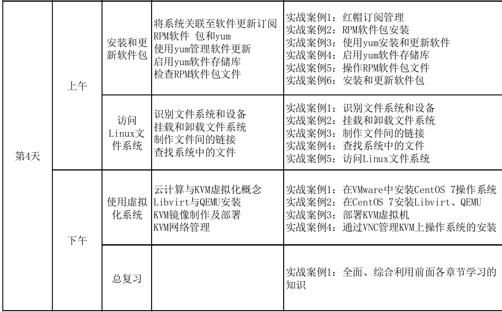
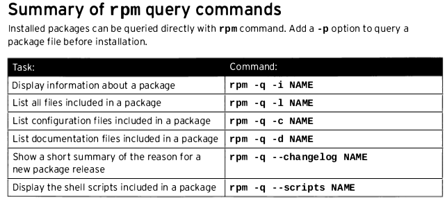
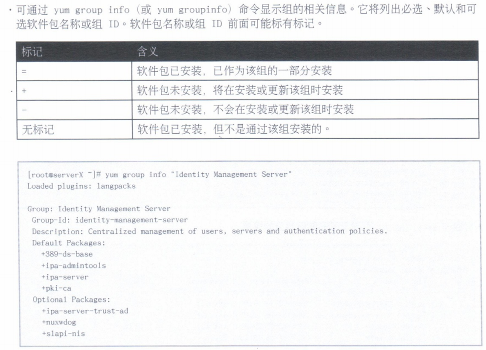
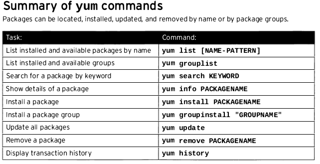

plan
<br>




# 1. 安装和更新软件包

## 红帽订阅管理
()第一小节先略过(考试不考, 平时也不怎用....))
这一章是很重要的,因为我们开启服务,如果能装也装不上,那何谈配置与调优...

红帽卖的技术服务.
某个软件有bug,有漏洞,,,redhat会主导及时更新及推送..

就算买了订阅服务,也可以装开源的.因为毕竟linux是开源的.


## RPM

Redhat Package Management

[rpm_wiki](https://en.wikipedia.org/wiki/RPM_Package_Manager)

二进次包,大部分已配置好, 而不像源码中configure时要进行一系列的配置, 对运维的经验有较高的要求.

一开始是红帽自己的软件发行打包方式, 后来多个其它系统也用到这个包管理系统.AIX,等

RPM 软件包文件名称组合: name-version-release.architecture

但有一个不好的地方, 就是不自动解决依赖问题.


### gpg (gnu private guard) 保证你获得的软件包是合法,正版流出的,(数字签名)

[gpg demo](http://www.ruanyifeng.com/blog/2013/07/gpg.html)

其中可以用
在有了gpg keys的情况下(生成很久...很麻烦)
```bash
gpg --clearsign notic

```
生成notic.asc后
再用
```bash
gpg --verify notic.asc

```
可以进到notic.asc中的数据中进行修改哪怕是一个字, 也能发现不同了.
此时可以结合md5sum进行讲解


>[root@server0 ~]# rpm -ivh vsftpd-3.0.2-9.el7.x86_64.rpm
>warning: vsftpd-3.0.2-9.el7.x86_64.rpm: Header V3 RSA/SHA256 Signature, key ID fd431d51: NOKEY
>Preparing...                          ################################# [100%]
>Updating / installing...
>   1:vsftpd-3.0.2-9.el7               ################################# [100%]
>[root@server0 ~]#	
>升级 -Uvh
>	卸载 -e
>	校验 –V
>[root@server0 ~]# rpm -V openssh-server
>SM5....T.  c /etc/ssh/sshd_config
>	查询
>查软件是否安装
>[root@server0 ~]# rpm -q openssh-server
>openssh-server-6.4p1-8.el7.x86_64
>[root@server0 ~]#
>[root@server0 ~]#
>[root@server0 ~]# rpm -q httpd
>package httpd is not installed
>
>查软件安装了哪些文件
>[root@server0 ~]# rpm -ql openssh-server
>/etc/pam.d/sshd
>/etc/ssh/sshd_config
>/etc/sysconfig/sshd
>/usr/lib/systemd/system/sshd-keygen.service
>/usr/lib/systemd/system/sshd.service
>/usr/lib/systemd/system/sshd.socket
>/usr/lib/systemd/system/sshd@.service
>/usr/lib64/fipscheck/sshd.hmac
>/usr/libexec/openssh/sftp-server
>/usr/sbin/sshd
>/usr/sbin/sshd-keygen
>/usr/share/man/man5/moduli.5.gz
>/usr/share/man/man5/sshd_config.5.gz
>/usr/share/man/man8/sftp-server.8.gz
>/usr/share/man/man8/sshd.8.gz
>/var/empty/sshd
>
>查询配置文件
>[root@server0 ~]# rpm -qc openssh-server
>/etc/pam.d/sshd
>/etc/ssh/sshd_config
>/etc/sysconfig/sshd
>[root@server0 ~]#
>
>查询文档
>[root@server0 ~]# rpm -qd openssh-server
>/usr/share/man/man5/moduli.5.gz
>/usr/share/man/man5/sshd_config.5.gz
>/usr/share/man/man8/sftp-server.8.gz
>/usr/share/man/man8/sshd.8.gz
>
>查询命令属于哪个软件包
>[root@server0 ~]# which ifconfig
>/usr/sbin/ifconfig
>[root@server0 ~]#
>[root@server0 ~]# rpm -qf /usr/sbin/ifconfig
>net-tools-2.0-0.17.20131004git.el7.x86_64
>[root@server0 ~]#
>
>查询所有安装的包
>[root@server0 ~]# rpm –qa
>
>查询软件包相关信息(如果未安装, 真接查文件,需要写全名)
>[root@server0 ~]# rpm -qi openssh-server
>Name        : openssh-server
>Version     : 6.4p1
>Release     : 8.el7
>Architecture: x86_64
>Install Date: Wed 07 May 2014 09:25:31 AM CST
>Group       : System Environment/Daemons
>Size        : 756312
>License     : BSD
>Signature   : RSA/SHA256, Thu 03 Apr 2014 01:07:17 AM CST, Key ID 199e2f91fd431d51
>Source RPM  : openssh-6.4p1-8.el7.src.rpm
>Build Date  : Thu 20 Mar 2014 04:50:12 AM CST
>Build Host  : x86-017.build.eng.bos.redhat.com
>Relocations : (not relocatable)
>Packager    : Red Hat, Inc. <http://bugzilla.redhat.com/bugzilla>
>Vendor      : Red Hat, Inc.
>URL         : http://www.openssh.com/portable.html
>Summary     : An open source SSH server daemon
>Description :
>OpenSSH is a free version of SSH (Secure SHell), a program for logging
>into and executing commands on a remote machine. This package contains
>the secure shell daemon (sshd). The sshd daemon allows SSH clients to
>securely connect to your SSH server.
>
>没有安装的软件包查询：-p
>[root@server0 ~]# rpm -qpi vsftpd-3.0.2-9.el7.x86_64.rpm
>[root@server0 ~]# rpm -qpl vsftpd-3.0.2-9.el7.x86_64.rpm
>[root@server0 ~]# rpm -qpc vsftpd-3.0.2-9.el7.x86_64.rpm
>
>（3）RPM签名验证
红帽提供的软件包都被红帽的私钥签名，为了安全起见，使用红帽的公钥验证软件包是否来自于红帽。
[root@server0 ~]# rpm --import RPM-GPG-KEY-redhat-release
[root@server0 ~]#
[root@server0 ~]# rpm -ivh vsftpd-3.0.2-9.el7.x86_64.rpm
Preparing...                          ################################# [100%]
Updating / installing...
   1:vsftpd-3.0.2-9.el7               ################################# [100%]
[root@server0 ~]#


 rpm -q --changelog httpd|less

### 不安装某个rpm包,但取出其中部分内容

rpm2cpio wonderwidgets - 1.0-4.x86_6.rpm|cpio -id "*txt"


### localinstall 安装已下载到本地的包


### rpm命令汇总


### rpm 查看安装该包实际执行了什么

(有一些*lib*.rpm的包是没有脚本的)
`rpm -qp --scripts <rpmfilename>`

### 关于rpm处理依赖的问题
其实rpm也不是完全不能查找依赖,只不过...只能处理一些比较简单的依赖关系

### 光看不装
在某些特殊环境, 如生产, UAT等, 有时我们装未确认过的rpm包要小心, <br>
此时可以用
``
rpm --script
``

## yum

较好解决依赖问题


### 列出资源

```bash
[root@desktop0 ~]# yum repolist
Loaded plugins: langpacks
rhel_dvd                                                                                                                                       | 4.1 kB  00:00:00
(1/2): rhel_dvd/group_gz                                                                                                                       | 134 kB  00:00:00
(2/2): rhel_dvd/primary_db                                                                                                                     | 3.4 MB  00:00:00
repo id                                                               repo name                                                                                 status
rhel_dvd                                                              Remote classroom copy of dvd                                                              4,305
repolist: 4,305
```

### 按某个条件列出相关的资源包

```bash
[root@desktop0 ~]# yum list yum*
Loaded plugins: langpacks
Installed Packages
yum.noarch                                                                            3.4.3-117.el7                                                          installed
yum-langpacks.noarch                                                                  0.4.2-3.el7                                                            @rhel_dvd
yum-metadata-parser.x86_64                                                            1.1.4-10.el7                                                           installed
yum-rhn-plugin.noarch                                                                 2.0.1-4.el7                                                            installed
yum-utils.noarch                                                                      1.1.31-24.el7                                                          installed
Available Packages
yum.noarch                                                                            3.4.3-118.el7                                                          rhel_dvd
yum-plugin-aliases.noarch                                                             1.1.31-24.el7                                                          rhel_dvd
yum-plugin-changelog.noarch                                                           1.1.31-24.el7                                                          rhel_dvd
yum-plugin-tmprepo.noarch                                                             1.1.31-24.el7                                                          rhel_dvd
yum-plugin-verify.noarch                                                              1.1.31-24.el7                                                          rhel_dvd
yum-plugin-versionlock.noarch                                                         1.1.31-24.el7                                                          rhel_dvd
```
### search all命令会比list更详细

```bash
[root@desktop0 ~]# yum search all ' web server'
Loaded plugins: langpacks
======================================================================== Matched:  web server ========================================================================
freeradius.x86_64 : High-performance and highly configurable free RADIUS server
hsqldb.noarch : HyperSQL Database Engine
libcurl.i686 : A library for getting files from web servers
libcurl.x86_64 : A library for getting files from web servers
mod_revocator.x86_64 : CRL retrieval module for the Apache HTTP server
mod_security.x86_64 : Security module for the Apache HTTP Server
python-paste.noarch : Tools for using a Web Server Gateway Interface stack
```

### 查看某个包的具体信息

```bash
[root@desktop0 ~]# yum info httpd
Loaded plugins: langpacks
Available Packages
Name        : httpd
Arch        : x86_64
Version     : 2.4.6
Release     : 17.el7
Size        : 1.2 M
Repo        : rhel_dvd
Summary     : Apache HTTP Server
URL         : http://httpd.apache.org/
License     : ASL 2.0
Description : The Apache HTTP Server is a powerful, efficient, and extensible
            : web server.
```

### 查看硬盘上某个目录是由哪个软件安装的
```bash
[root@desktop0 ~]# yum provides /var/www/html
Loaded plugins: langpacks
rhel_dvd/filelists_db                                                                                                                          | 3.0 MB  00:00:00
httpd-2.4.6-17.el7.x86_64 : Apache HTTP Server
Repo        : rhel_dvd
Matched from:
Filename    : /var/www/html


1:php-pear-1.9.4-21.el7.noarch : PHP Extension and Application Repository framework
Repo        : rhel_dvd
Matched from:
Filename    : /var/www/html

```


### 查看已安装了的
```bash
 yum list installed|less
 Loaded plugins: langpacks
Installed Packages
GConf2.x86_64                          3.2.6-8.el7                     @rhel_dvd
ModemManager.x86_64                    1.1.0-6.git20130913.el7         @rhel_dvd
ModemManager-glib.x86_64               1.1.0-6.git20130913.el7         installed
NetworkManager.x86_64                  1:0.9.9.1-13.git20140326.4dba720.el7
                                                                       installed
NetworkManager-config-server.x86_64    1:0.9.9.1-13.git20140326.4dba720.el7
                                                                       installed
NetworkManager-glib.x86_64             1:0.9.9.1-13.git20140326.4dba720.el7
                                                                       installed
NetworkManager-libreswan.x86_64        0.9.8.0-5.el7                   @rhel_dvd

...

```

### 资源组(有点像某某套餐的样子)
```bash
[root@desktop0 ~]# yum groups
Loaded plugins: langpacks
Installed environment groups: 1
Available environment groups: 5
Available Groups: 10
Done
[root@desktop0 ~]# yum groups list
Loaded plugins: langpacks
Installed environment groups:
   Server with GUI
Available environment groups:
   Minimal Install
   Infrastructure Server
   File and Print Server
   Basic Web Server
   Virtualization Host
Available Groups:
   Compatibility Libraries
   Console Internet Tools
   Development Tools
   Graphical Administration Tools
   Legacy UNIX Compatibility
   Scientific Support
   Security Tools
   Smart Card Support
   System Administration Tools
   System Management
Done

```


### update
#### kernel update
```bash
[root@desktop0 ~]# yum list kernel
Loaded plugins: langpacks
Installed Packages
kernel.x86_64                                                                 3.10.0-123.el7                                                                 installed
[root@desktop0 ~]# uname -r
3.10.0-123.el7.x86_64
[root@desktop0 ~]# uname -a
Linux desktop0.example.com 3.10.0-123.el7.x86_64 #1 SMP Mon May 5 11:16:57 EDT 2014 x86_64 x86_64 x86_64 GNU/Linux
```

### remove

(注意,在实际工作中, 特别是生产环境,慬用这个选项, 我自己未新历, <br>
但听过有用remove 把一些基础依赖包把remove了, 结果服务器连登陆也失败的例子)

```bash
[root@desktop0 ~]# yum install httpd
Loaded plugins: langpacks
Resolving Dependencies
--> Running transaction check
---> Package httpd.x86_64 0:2.4.6-17.el7 will be installed
--> Processing Dependency: httpd-tools = 2.4.6-17.el7 for package: httpd-2.4.6-17.el7.x86_64
--> Processing Dependency: /etc/mime.types for package: httpd-2.4.6-17.el7.x86_64
--> Processing Dependency: libapr-1.so.0()(64bit) for package: httpd-2.4.6-17.el7.x86_64
--> Processing Dependency: libaprutil-1.so.0()(64bit) for package: httpd-2.4.6-17.el7.x86_64
--> Running transaction check
---> Package apr.x86_64 0:1.4.8-3.el7 will be installed
---> Package apr-util.x86_64 0:1.5.2-6.el7 will be installed
---> Package httpd-tools.x86_64 0:2.4.6-17.el7 will be installed
---> Package mailcap.noarch 0:2.1.41-2.el7 will be installed
--> Finished Dependency Resolution

Dependencies Resolved

======================================================================================================================================================================
 Package                                  Arch                                Version                                     Repository                             Size
======================================================================================================================================================================
Installing:
 httpd                                    x86_64                              2.4.6-17.el7                                rhel_dvd                              1.2 M
Installing for dependencies:
 apr                                      x86_64                              1.4.8-3.el7                                 rhel_dvd                              103 k
 apr-util                                 x86_64                              1.5.2-6.el7                                 rhel_dvd                               92 k
 httpd-tools                              x86_64                              2.4.6-17.el7                                rhel_dvd                               77 k
 mailcap                                  noarch                              2.1.41-2.el7                                rhel_dvd                               31 k

Transaction Summary
======================================================================================================================================================================
Install  1 Package (+4 Dependent packages)

Total download size: 1.5 M
Installed size: 4.3 M
Is this ok [y/d/N]: y
Downloading packages:
(1/5): apr-1.4.8-3.el7.x86_64.rpm                                                                                                              | 103 kB  00:00:00
(2/5): apr-util-1.5.2-6.el7.x86_64.rpm                                                                                                         |  92 kB  00:00:00
(3/5): httpd-tools-2.4.6-17.el7.x86_64.rpm                                                                                                     |  77 kB  00:00:00
(4/5): httpd-2.4.6-17.el7.x86_64.rpm                                                                                                           | 1.2 MB  00:00:00
(5/5): mailcap-2.1.41-2.el7.noarch.rpm                                                                                                         |  31 kB  00:00:00
----------------------------------------------------------------------------------------------------------------------------------------------------------------------
Total                                                                                                                                 3.3 MB/s | 1.5 MB  00:00:00
Running transaction check
Running transaction test

Transaction test succeeded
Running transaction
  Installing : apr-1.4.8-3.el7.x86_64                                                                                                                             1/5


  Installing : apr-util-1.5.2-6.el7.x86_64                                                                                                                        2/5
  Installing : httpd-tools-2.4.6-17.el7.x86_64                                                                                                                    3/5
  Installing : mailcap-2.1.41-2.el7.noarch                                                                                                                        4/5
  Installing : httpd-2.4.6-17.el7.x86_64                                                                                                                          5/5
  Verifying  : mailcap-2.1.41-2.el7.noarch                                                                                                                        1/5
  Verifying  : httpd-tools-2.4.6-17.el7.x86_64                                                                                                                    2/5
  Verifying  : apr-1.4.8-3.el7.x86_64                                                                                                                             3/5
  Verifying  : apr-util-1.5.2-6.el7.x86_64                                                                                                                        4/5
  Verifying  : httpd-2.4.6-17.el7.x86_64                                                                                                                          5/5

Installed:
  httpd.x86_64 0:2.4.6-17.el7

Dependency Installed:
  apr.x86_64 0:1.4.8-3.el7            apr-util.x86_64 0:1.5.2-6.el7            httpd-tools.x86_64 0:2.4.6-17.el7            mailcap.noarch 0:2.1.41-2.el7

Complete!
[root@desktop0 ~]#
[root@desktop0 ~]#
[root@desktop0 ~]#
[root@desktop0 ~]#
[root@desktop0 ~]#
[root@desktop0 ~]#
[root@desktop0 ~]#
[root@desktop0 ~]#
[root@desktop0 ~]# yum remove httpd
Loaded plugins: langpacks
Resolving Dependencies
--> Running transaction check
---> Package httpd.x86_64 0:2.4.6-17.el7 will be erased
--> Finished Dependency Resolution

Dependencies Resolved

======================================================================================================================================================================
 Package                             Arch                                 Version                                       Repository                               Size
======================================================================================================================================================================
Removing:
 httpd                               x86_64                               2.4.6-17.el7                                  @rhel_dvd                               3.7 M

Transaction Summary
======================================================================================================================================================================
Remove  1 Package

Installed size: 3.7 M
Is this ok [y/N]: y
Downloading packages:
Running transaction check
Running transaction test
Transaction test succeeded
Running transaction
  Erasing    : httpd-2.4.6-17.el7.x86_64                                                                                                                          1/1
  Verifying  : httpd-2.4.6-17.el7.x86_64                                                                                                                          1/1

Removed:
  httpd.x86_64 0:2.4.6-17.el7

Complete!

```

### log
```bash
[root@desktop0 ~]# tail -n 5 /var/log/yum.log
Feb 28 00:08:47 Installed: apr-util-1.5.2-6.el7.x86_64
Feb 28 00:08:47 Installed: httpd-tools-2.4.6-17.el7.x86_64
Feb 28 00:08:47 Installed: mailcap-2.1.41-2.el7.noarch
Feb 28 00:08:48 Installed: httpd-2.4.6-17.el7.x86_64
Feb 28 00:08:57 Erased: httpd-2.4.6-17.el7.x86_64

```

### history and undo
```bash
[root@desktop0 ~]# yum history
Loaded plugins: langpacks
ID     | Login user               | Date and time    | Action(s)      | Altered
-------------------------------------------------------------------------------
     3 | Student User <student>   | 2019-02-28 00:08 | Erase          |    1
     2 | Student User <student>   | 2019-02-28 00:08 | Install        |    5
     1 | System <unset>           | 2014-07-11 06:22 | Install        |  881 EE
history list
[root@desktop0 ~]# yum  history undo 3
Loaded plugins: langpacks
Undoing transaction 3, from Thu Feb 28 00:08:57 2019
    Erase httpd-2.4.6-17.el7.x86_64 @rhel_dvd
Resolving Dependencies
--> Running transaction check
---> Package httpd.x86_64 0:2.4.6-17.el7 will be installed
--> Finished Dependency Resolution

Dependencies Resolved

======================================================================================================================================================================
 Package                              Arch                                  Version                                     Repository                               Size
======================================================================================================================================================================
Installing:
 httpd                                x86_64                                2.4.6-17.el7                                rhel_dvd                                1.2 M

Transaction Summary
======================================================================================================================================================================
Install  1 Package

Total download size: 1.2 M
Installed size: 3.7 M
Is this ok [y/d/N]: y
Downloading packages:
httpd-2.4.6-17.el7.x86_64.rpm                                                                                                                  | 1.2 MB  00:00:00
Running transaction check
Running transaction test
Transaction test succeeded
Running transaction
  Installing : httpd-2.4.6-17.el7.x86_64                                                                                                                          1/1
  Verifying  : httpd-2.4.6-17.el7.x86_64                                                                                                                          1/1

Installed:
  httpd.x86_64 0:2.4.6-17.el7

Complete!

```
repo alphat bet seq
 local install
 clear all

### 补全tips:
发现如果有时包名较长,可以先用
yum makecache 先把名字相关的东西缓存到本地, 那样就可以实现补全,打起长包名来就轻松一点

<br>
另外这个cache好像与用户相关的, <br>
也就是我student makecache后,root好像不能直接用. 自己也要makecache后才能用

### 当发现一些安装时, 默名其妙的错误,可以考虑yum clean把缓存清了(有时这个更新不够及时)

## 命令汇总


## linux软件安装三板斧
- configure
- make
- make install

最好有例子

## 软件安装数据源

### 用命令行列出
```bash
[root@desktop0 yum.repos.d]# yum repolist all
Loaded plugins: langpacks
repo id                                                           repo name                                                                             status
rhel_dvd                                                          Remote classroom copy of dvd                                                          enabled: 4,305
repolist: 4,305
[root@desktop0 ~]#
`````
### 加入源
````bash
[root@desktop0 yum.repos.d]# yum-config-manager --add-repo="http://dl.fedoraproject.org/pub/epel/beta/7/x86_64"
Loaded plugins: langpacks
Bad id for repo: --repo=http_dl.fedoraproject.org_pub_epel_beta_7_x86_64, byte = = 6
Bad id for repo: -repo=, byte = = 5
adding repo from: http://dl.fedoraproject.org/pub/epel/beta/7/x86_64

[dl.fedoraproject.org_pub_epel_beta_7_x86_64]
name=added from: http://dl.fedoraproject.org/pub/epel/beta/7/x86_64
baseurl=http://dl.fedoraproject.org/pub/epel/beta/7/x86_64
enabled=1
````
当源不需要时, 可以disable

### 配置文件
```bash
[root@desktop0 yum.repos.d]# cat rhel_dvd.repo
# Created by cloud-init on Thu, 10 Jul 2014 22:19:11 +0000
[rhel_dvd]
gpgcheck = 0
enabled = 1
baseurl = http://content.example.com/rhel7.0/x86_64/dvd
name = Remote classroom copy of dvd[root@desktop0 yum.repos.d]#

```

# 2. 访问linux文件系统


## 识别文件系统与设备

### 存储管理概念

与windows不一样, 不一定每加一个分区,就要加一个盘符.
<br>
linux可以在任意的目录上挂载


disk-->patition-->磁道-->sector(扇区)

### 块设备
//TODO补充一下还有什么设备

### 想了解挂载点及可用空间,可以用df -h
```bash
[root@desktop0 yum.repos.d]# df
Filesystem     1K-blocks    Used Available Use% Mounted on
/dev/vda1       10473900 3173284   7300616  31% /
devtmpfs          927072       0    927072   0% /dev
tmpfs             942660      80    942580   1% /dev/shm
tmpfs             942660   17032    925628   2% /run
tmpfs             942660       0    942660   0% /sys/fs/cgroup
[root@desktop0 yum.repos.d]#
```


### 用du进行目录内大小的估计
```bash
[root@desktop0 yum.repos.d]# du /root
4       /root/.ssh
0       /root/.config/abrt
8       /root/.config
4       /root/.cache/abrt
4       /root/.cache
56      /root

```
平时比较常用<br>
也可以接着排个序
```bash
du -sm * |sort -rn|head -n 10
```

## 挂载和卸载文件系统

### 手动挂载

#### mount 的两种不同的指定参数的方式
- 分区所在的设备文件名, 在/dev下面
- 通过UUID(通用唯一标识符)

#### umount时要通知般员)
退出时, 可能还有占用, 需要切换目录,稍等 [jj]

### lsof
列出所给定目录打开的文件及访问他的进程.
```bash
[student@desktop0 tmp]$ lsof /
COMMAND   PID    USER   FD   TYPE DEVICE  SIZE/OFF     NODE NAME
bash     1363 student  cwd    DIR  253,1      4096    12897 /home/student
bash     1363 student  rtd    DIR  253,1      4096      128 /
bash     1363 student  txt    REG  253,1    960368  8399757 /usr/bin/bash
bash     1363 student  mem    REG  253,1     58288 16819338 /usr/lib64/libnss_files-2.17.so
bash     1363 student  mem    REG  253,1 106065056   450177 /usr/lib/locale/locale-archive
bash     1363 student  mem    REG  253,1   2107768 16819320 /usr/lib64/libc-2.17.so

```


## 制作文件间链接

### 硬连接
不能跨文件系统
```bash
[student@desktop0 tmp]$ echo "hello world" >file
[student@desktop0 tmp]$ ll
total 4
-rw-rw-r--. 1 student student 12 Feb 28 01:02 file
[student@desktop0 tmp]$ ln file newfile
[student@desktop0 tmp]$ ll
total 8
-rw-rw-r--. 2 student student 12 Feb 28 01:02 file
-rw-rw-r--. 2 student student 12 Feb 28 01:02 newfile

```
### 软链

ln -s 
可跨文件系统以,,

回想之前学习/体系结构时, 那几个软链的着色.

### 系统内查找文件

课本已非常详细, 可以按书本来讲.

#### locate 

非常快,因为查的是updatedb, 如果刚装软件, 有时未及时更新db,那么我们需要手动运行`updatedb`

```bash
[student@desktop0 tmp]$ locate passwd|less
```

```bash
用n限制返回的记录数
[student@desktop0 tmp]$ locate -n 5 passwd
/etc/passwd
/etc/passwd-
/etc/pam.d/passwd
/etc/security/opasswd
/usr/bin/gpasswd


```


#### find

##### -name按名查找

```bash
[student@desktop0 tmp]$ find / -name sshd_config 2> /dev/null
/etc/ssh/sshd_config

```


也可以加入*作通配
````bash
[student@desktop0 tmp]$ find / -name "sshd_*"  2> /dev/null
/etc/ssh/sshd_config
/usr/share/man/man5/sshd_config.5.gz
/usr/share/setroubleshoot/plugins/sshd_root.pyc
/usr/share/setroubleshoot/plugins/sshd_root.pyo
/usr/share/setroubleshoot/plugins/sshd_root.py
````

剩下一系列可按书本上演示

可以说一下find -exec

# 虚拟化

## 虚扩化是云计算的基础

## kvm

增加硬件资源的利用率.
ESX Hv Kvm fullv
Xen    pv


## 总复习
ch16   的总复习键入的是
`lab sa1-review setup`  注意是数字1而不是字母l


