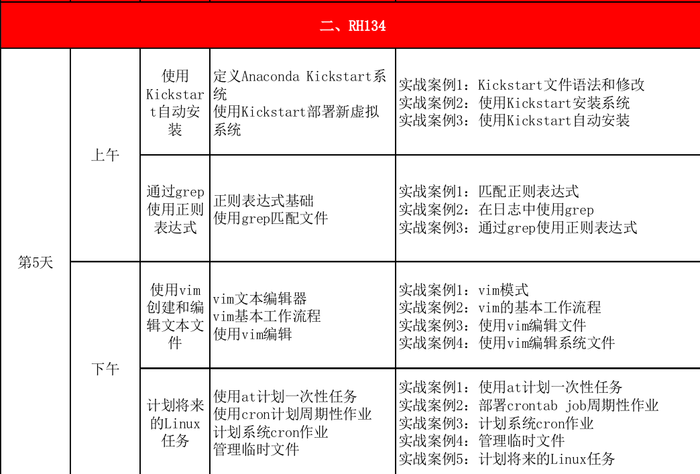
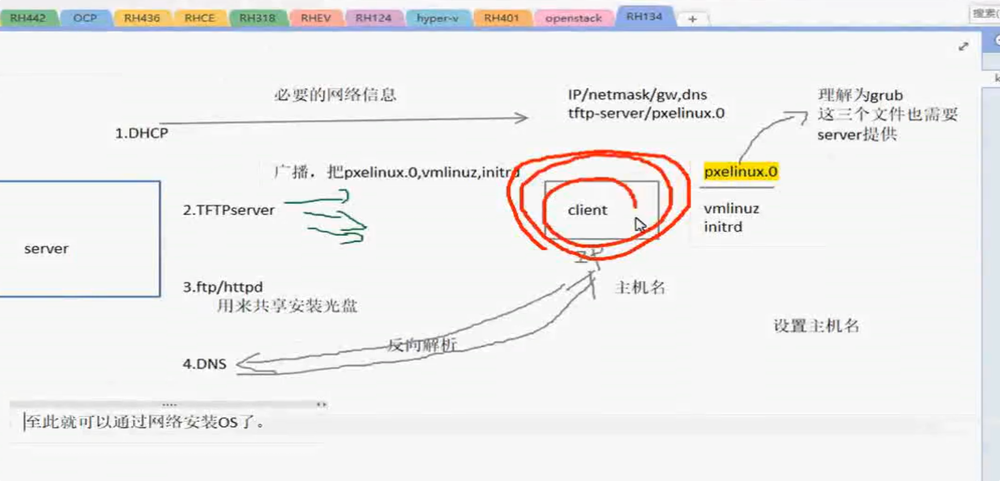
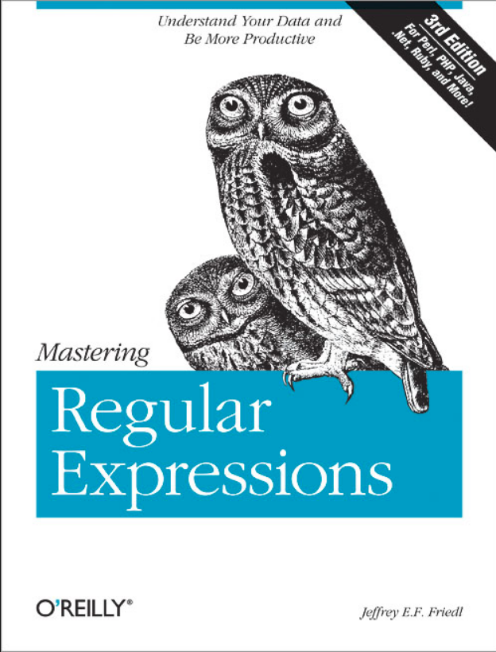

plan


# 0.RH124总复习

# 0.5 day03 day04作业讨论(关于茴香豆的茴字有几种写法)

# 0.9 种草装备升级环节.

# 1. kickstart自动安装
(考试不作要求,因要讲解RH124的总复习,这部分看时间是否充分,再酌情演示)

## 竞品
- jumpstart Oracle Solaris
- unattened installation for Micrsoft Windows
## overview

## step
## 1.1 弄出kickstart配置文件
## 1.2 发布配置文件(http,ftp....)
## 1.3 启动需要安装的机器并指向我们发布的地方


# 2. 正则表达式

注意要与这前bash的通配置的区别

## 2.1 bash 通配符

```
? 表示1个, 不能是0个或多个

[] 表示在里面的都配置
[^] 不配置里面的
[!] 不配置里面的
* 配置任意长度,任意字符

例外: * ? 不能配置隐藏文件的.
```
一般规则
````
[student@desktop0 ~]$ mkdir tmp
[student@desktop0 ~]$ cd tmp
[student@desktop0 tmp]$ touch a a1 a2 b1 b2 b1234 
[student@desktop0 tmp]$ ls a?
a1  a2
[student@desktop0 tmp]$ ls b?
b1  b2
[student@desktop0 tmp]$ ls a*
a  a1  a2
[student@desktop0 tmp]$ ls b??*
b1234
[student@desktop0 tmp]$ ls b*
b1  b1234  b2
[student@desktop0 tmp]$ ls [ab]?
a1  a2  b1  b2
[student@desktop0 tmp]$ ls [ab]*
a  a1  a2  b1  b1234  b2
[student@desktop0 tmp]$ touch c1 c2 c d d1 d12 d123
[student@desktop0 tmp]$ touch da1
[student@desktop0 tmp]$ ls [^ab]?
c1  c2  d1
[student@desktop0 tmp]$ ls [^ab]*
c  c1  c2  d  d1  d12  d123  da1

````

例外: * ? 不能配置隐藏文件的.
```
[student@desktop0 tmp]$ touch .f1 .f2                                                                                                                                                                       
[student@desktop0 tmp]$ ls                                                                                                                                                                                  
a  a1  a2  b1  b1234  b2  c  c1  c2  d  d1  d12  d123  da1                                                                                                                                                  
[student@desktop0 tmp]$ ls -ah                                                                                                                                                                              
.  ..  a  a1  a2  b1  b1234  b2  c  c1  c2  d  d1  d12  d123  da1  .f1  .f2                                                                                                                                 
[student@desktop0 tmp]$ ls -a                                                                                                                                                                               
.  ..  a  a1  a2  b1  b1234  b2  c  c1  c2  d  d1  d12  d123  da1  .f1  .f2                                                                                                                                 
[student@desktop0 tmp]$ ls -a                                                                                                                                                                               
.  ..  a  a1  a2  b1  b1234  b2  c  c1  c2  d  d1  d12  d123  da1  .f1  .f2                                                                                                                                 
[student@desktop0 tmp]$ rm *                                                                                                                                                                                
[student@desktop0 tmp]$ ls                                                                                                                                                                                  
[student@desktop0 tmp]$ ls -a                                                                                                                                                                               
.  ..  .f1  .f2                                                                                                                                                                                             
[student@desktop0 tmp]$ rm .*                                                                                                                                                                               
rm: cannot remove ?.?: Is a directory                                                                                                                                                                       
rm: cannot remove ?..?: Is a directory                                                                                                                                                                      
[student@desktop0 tmp]$ ls -a                                                                                                                                                                               
.  ..                                                                                                                                                                                                       
[student@desktop0 tmp]$ touch .g1 .g2                                                                                                                                                                       
[student@desktop0 tmp]$ rm .[!.]*                                                                                                                                                                           
[student@desktop0 tmp]$ ls -a                                                                                                                                                                               
.  ..                                                                                                                                                                                                       
[student@desktop0 tmp]$ touch .h1 .h2        
[student@desktop0 tmp]$ touch .f1 .f2                                                                                                                                                                       
[student@desktop0 tmp]$ ls                                                                                                                                                                                  
a  a1  a2  b1  b1234  b2  c  c1  c2  d  d1  d12  d123  da1                                                                                                                                                  
[student@desktop0 tmp]$ ls -ah                                                                                                                                                                              
.  ..  a  a1  a2  b1  b1234  b2  c  c1  c2  d  d1  d12  d123  da1  .f1  .f2                                                                                                                                 
[student@desktop0 tmp]$ ls -a                                                                                                                                                                               
.  ..  a  a1  a2  b1  b1234  b2  c  c1  c2  d  d1  d12  d123  da1  .f1  .f2                                                                                                                                 
[student@desktop0 tmp]$ ls -a                                                                                                                                                                               
.  ..  a  a1  a2  b1  b1234  b2  c  c1  c2  d  d1  d12  d123  da1  .f1  .f2                                                                                                                                 
[student@desktop0 tmp]$ rm *                                                                                                                                                                                
[student@desktop0 tmp]$ ls                                                                                                                                                                                  
[student@desktop0 tmp]$ ls -a                                                                                                                                                                               
.  ..  .f1  .f2                                                                                                                                                                                             
[student@desktop0 tmp]$ rm .*                                                                                                                                                                               
rm: cannot remove ?.?: Is a directory                                                                                                                                                                       
rm: cannot remove ?..?: Is a directory                                                                                                                                                                      
[student@desktop0 tmp]$ ls -a                                                                                                                                                                               
.  ..                                                                                                                                                                                                       
[student@desktop0 tmp]$ touch .g1 .g2                                                                                                                                                                       
[student@desktop0 tmp]$ rm .[!.]*                                                                                                                                                                           
[student@desktop0 tmp]$ ls -a                                                                                                                                                                               
.  ..                                                                                                                                                                                                       
[student@desktop0 tmp]$ touch .h1 .h2        
[student@desktop0 tmp]$ touch .f1 .f2                                                                                                                                                                       
[student@desktop0 tmp]$ ls                                                                                                                                                                                  
a  a1  a2  b1  b1234  b2  c  c1  c2  d  d1  d12  d123  da1                                                                                                                                                  
[student@desktop0 tmp]$ ls -ah                                                                                                                                                                              
.  ..  a  a1  a2  b1  b1234  b2  c  c1  c2  d  d1  d12  d123  da1  .f1  .f2                                                                                                                                 
[student@desktop0 tmp]$ ls -a                                                                                                                                                                               
.  ..  a  a1  a2  b1  b1234  b2  c  c1  c2  d  d1  d12  d123  da1  .f1  .f2                                                                                                                                 
[student@desktop0 tmp]$ ls -a                                                                                                                                                                               
.  ..  a  a1  a2  b1  b1234  b2  c  c1  c2  d  d1  d12  d123  da1  .f1  .f2                                                                                                                                 
[student@desktop0 tmp]$ rm *                                                                                                                                                                                
[student@desktop0 tmp]$ ls                                                                                                                                                                                  
[student@desktop0 tmp]$ ls -a                                                                                                                                                                               
.  ..  .f1  .f2                                                                                                                                                                                             
[student@desktop0 tmp]$ rm .*                                                                                                                                                                               
rm: cannot remove ?.?: Is a directory                                                                                                                                                                       
rm: cannot remove ?..?: Is a directory                                                                                                                                                                      
[student@desktop0 tmp]$ ls -a                                                                                                                                                                               
.  ..                                                                                                                                                                                                       
[student@desktop0 tmp]$ touch .g1 .g2                                                                                                                                                                       
[student@desktop0 tmp]$ rm .[!.]*                                                                                                                                                                           
[student@desktop0 tmp]$ ls -a                                                                                                                                                                               
.  ..                                                                                                                                                                                                       
[student@desktop0 tmp]$ touch .h1 .h2        
```

## 2.2 正则表达式(regrex)

```bash

 . 单个字符, 有像之前bash的"?"'
 + [1..无穷大]
 ? [0..1]
 * [0..无穷大] (表前面的字符出现0或多次)与之前shell的通配是不一样的[]
如果要 与shell中的等价那就是 .* 才等于bash的*
正则表达式不是通配符.(或者说与bash不要与regex 弄混了)
^ begin
$ end

get -e 'cat' -e 'dog' file`同时看猫狗

```
例子待被
 grep 相关命令
为什么有颜色,
```bash

[student@server0 ~]$ alias grep
alias grep='grep --color=auto'

```

当然, 还可以扩展讲一下grep的用法, 具体先man grep讲一下,<br>
-F -E -e -G -P <br>
-v<br>
-i<br>
-w<br>
-n<br>
-r<br>
-l<br>
-q -s<br>
-B<br>
-A<br>
-C<br>

当然, 如果大家还学有余力, 想进一步找不痛快, 还有一本关于这方面的书在等着大家<br>




其余部分 
可以整个课本的内容走一下, 都很重要, 需要通通过一篇.

# 3. vim
之前第一本书已说过,这时可以看时间, 及大家的掌握情况,讲一下,
可以按书本, 也可以按vimtutor

主要是要带动大家进行操作.


# 4. 计划任务

## 4.1 at 只干一票的
- atq == at -l
- at -c <number>
- atrm


```bash

[student@desktop0 ~]$ echo "date > ~/myjob" |at  now +1min
job 3 at Fri Mar  1 23:28:00 2019
[student@desktop0 ~]$ atq
2       Fri Mar  1 23:28:00 2019 a student
3       Fri Mar  1 23:28:00 2019 a student
[student@desktop0 ~]$ at -c 3
#!/bin/sh
# atrun uid=1000 gid=1000
# mail student 0
umask 2
XDG_SESSION_ID=2; export XDG_SESSION_ID
HOSTNAME=desktop0.example.com; export HOSTNAME
SELINUX_ROLE_REQUESTED=; export SELINUX_ROLE_REQUESTED
SHELL=/bin/bash; export SHELL
HISTSIZE=1000; export HISTSIZE
SSH_CLIENT=172.25.0.250\ 47079\ 22; export SSH_CLIENT
SELINUX_USE_CURRENT_RANGE=; export SELINUX_USE_CURRENT_RANGE
SSH_TTY=/dev/pts/0; export SSH_TTY
USER=student; export USER
LS_COLORS=rs=0:di=01\;34:ln=01\;36:mh=00:pi=40\;33:so=01\;35:do=01\;35:bd=40\;33\;01:cd=40\;33\;01:or=40\;31\;01:mi=01\;05\;37\;41:su=37\;41:sg=30\;43:ca=30\;41:tw=30\;42:ow=34\;42:st=37\;44:ex=01\;32:\*.tar=01\;31:\*.tgz=01\;31:\*.arc=01\;31:\*.arj=01\;31:\*.taz=01\;31:\*.lha=01\;31:\*.lz4=01\;31:\*.lzh=01\;31:\*.lzma=01\;31:\*.tlz=01\;31:\*.txz=01\;31:\*.tzo=01\;31:\*.t7z=01\;31:\*.zip=01\;31:\*.z=01\;31:\*.Z=01\;31:\*.dz=01\;31:\*.gz=01\;31:\*.lrz=01\;31:\*.lz=01\;31:\*.lzo=01\;31:\*.xz=01\;31:\*.bz2=01\;31:\*.bz=01\;31:\*.tbz=01\;31:\*.tbz2=01\;31:\*.tz=01\;31:\*.deb=01\;31:\*.rpm=01\;31:\*.jar=01\;31:\*.war=01\;31:\*.ear=01\;31:\*.sar=01\;31:\*.rar=01\;31:\*.alz=01\;31:\*.ace=01\;31:\*.zoo=01\;31:\*.cpio=01\;31:\*.7z=01\;31:\*.rz=01\;31:\*.cab=01\;31:\*.jpg=01\;35:\*.jpeg=01\;35:\*.gif=01\;35:\*.bmp=01\;35:\*.pbm=01\;35:\*.pgm=01\;35:\*.ppm=01\;35:\*.tga=01\;35:\*.xbm=01\;35:\*.xpm=01\;35:\*.tif=01\;35:\*.tiff=01\;35:\*.png=01\;35:\*.svg=01\;35:\*.svgz=01\;35:\*.mng=01\;35:\*.pcx=01\;35:\*.mov=01\;35:\*.mpg=01\;35:\*.mpeg=01\;35:\*.m2v=01\;35:\*.mkv=01\;35:\*.webm=01\;35:\*.ogm=01\;35:\*.mp4=01\;35:\*.m4v=01\;35:\*.mp4v=01\;35:\*.vob=01\;35:\*.qt=01\;35:\*.nuv=01\;35:\*.wmv=01\;35:\*.asf=01\;35:\*.rm=01\;35:\*.rmvb=01\;35:\*.flc=01\;35:\*.avi=01\;35:\*.fli=01\;35:\*.flv=01\;35:\*.gl=01\;35:\*.dl=01\;35:\*.xcf=01\;35:\*.xwd=01\;35:\*.yuv=01\;35:\*.cgm=01\;35:\*.emf=01\;35:\*.axv=01\;35:\*.anx=01\;35:\*.ogv=01\;35:\*.ogx=01\;35:\*.aac=01\;36:\*.au=01\;36:\*.flac=01\;36:\*.mid=01\;36:\*.midi=01\;36:\*.mka=01\;36:\*.mp3=01\;36:\*.mpc=01\;36:\*.ogg=01\;36:\*.ra=01\;36:\*.wav=01\;36:\*.axa=01\;36:\*.oga=01\;36:\*.spx=01\;36:\*.xspf=01\;36:; export LS_COLORS
MAIL=/var/spool/mail/student; export MAIL
PATH=/usr/local/bin:/usr/bin:/usr/local/sbin:/usr/sbin:/home/student/.local/bin:/home/student/bin; export PATH
PWD=/home/student; export PWD
LANG=en_US.UTF-8; export LANG
SELINUX_LEVEL_REQUESTED=; export SELINUX_LEVEL_REQUESTED
HISTCONTROL=ignoredups; export HISTCONTROL
SHLVL=1; export SHLVL
HOME=/home/student; export HOME
LOGNAME=student; export LOGNAME
SSH_CONNECTION=172.25.0.250\ 47079\ 172.25.0.10\ 22; export SSH_CONNECTION
LESSOPEN=\|\|/usr/bin/lesspipe.sh\ %s; export LESSOPEN
XDG_RUNTIME_DIR=/run/user/1000; export XDG_RUNTIME_DIR
cd /home/student || {
         echo 'Execution directory inaccessible' >&2
         exit 1
}
${SHELL:-/bin/sh} << 'marcinDELIMITER2f05da49'
date > ~/myjob

marcinDELIMITER2f05da49
[student@desktop0 ~]$
[student@desktop0 ~]$
[student@desktop0 ~]$
[student@desktop0 ~]$ atq
[student@desktop0 ~]$ echo "date > ~/myjob" |at  now +1min

[student@desktop0 ~]$ echo "date > ~/myjob" |at  now +1min
job 5 at Fri Mar  1 23:31:00 2019
[student@desktop0 ~]$ atq
5       Fri Mar  1 23:31:00 2019 a student
[student@desktop0 ~]$ atrm 5
[student@desktop0 ~]$ atq

```
这个时间格式也可以结合一下date去进行讲解.

ctrl+d可以终止某个在线的编辑

```bash
 while [ $(atq|wc -l) -gt 0 ] do  echo "sleep 1s"; done
```

ctrl+c
ctrl+\
ctrl+s ctrl+q
ctrl+z

at 定时任务做一个定线..

#### 利用at命令进行还原操作(以进行保险)

## 4.2 cron周而复始
- crontab -l 列出任务
- crontab -e 编辑任务 
- crontab -r 删除当前所有
- crontab <filename> 以fiename内容替换


### 奇偶分钟开始
### 分钟配成*的话,就会每分钟来一次
### 多个时间段可以用,分开
### 天或周几是或的关系,其余都是和的关系


## 4.3 系统cron作业
- /etc/cron.hourly
- daily
- weekly
- monthly


有时会错过

看这个任务没有启动
```bash
[student@desktop0 ~]$ systemctl status crond
crond.service - Command Scheduler
   Loaded: loaded (/usr/lib/systemd/system/crond.service; enabled)
   Active: active (running) since Fri 2019-03-01 23:12:50 CST; 24min ago
 Main PID: 540 (crond)
   CGroup: /system.slice/crond.service
           └─540 /usr/sbin/crond -n
```

### 4.4 另外的任务
anacron
 `sudo vim /etc/anacrontab`
 
 
### 4.5 管理临时文件

了解几个不同路径的tmpfiles.d/*.conf


systemd定时器单元会固定间隔调用systemd-tmpfiles --clean


#### 文件的三个时间

- atime (访问)
- mtime (修改)
- ctime (创建)

#### 删除临时文件中练习,
 那个sed的匹配中多一个空格也不成功
 
