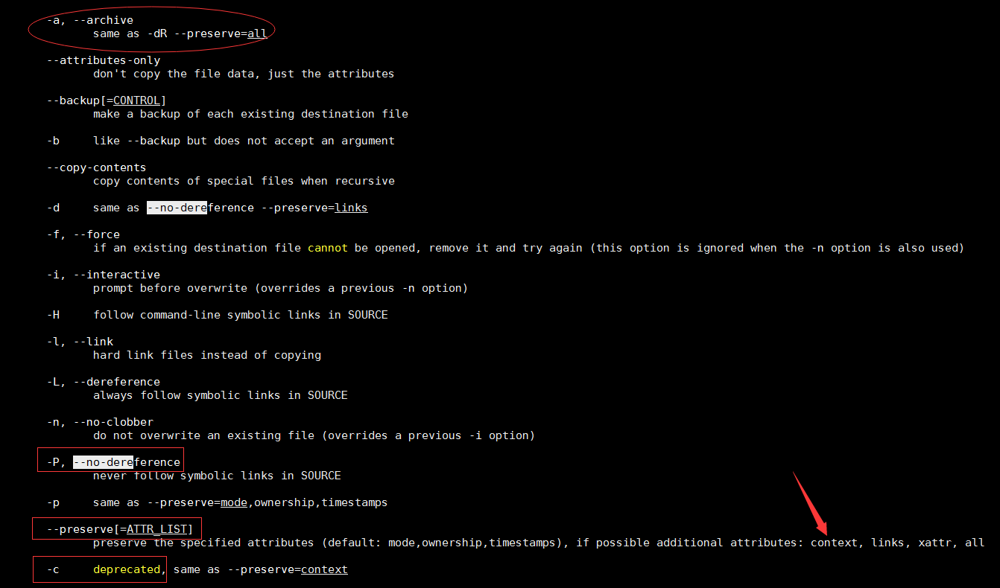

plan


# 1. 管理Linux进程优先级

# 3.管理SELinux安全性

说文解字SELinux(Sercurity Enhanced Linux)
在原来DAC的基础上多加了一层,MAC..sandbox

## 3.1 启用并监控SELinux
- 简单地理解为一个安全层, 在原来的基制被突破后,还有另一道防线.
- 一系列安全规制的集合. 
- 安全上下文(context)
- 安全标签(四类:用户,角色,类型,敏感度)
可从下面的输出看出几个类型
(u,r,t,s)
现在一系列命令的选项中加入大写(有些会小写)Z后查得与SELinux相关的东西
```bash
[kiosk@foundation0 ~]$ ls -Z
drwxrwxr-x. kiosk kiosk unconfined_u:object_r:user_home_t:s0 a
-rw-rw-r--. kiosk kiosk unconfined_u:object_r:user_home_t:s0 ClassPrep.txt
-rw-rw-r--. kiosk kiosk unconfined_u:object_r:user_home_t:s0 ClassroomReset.txt

```

我们把级别改为targeted之后, type(类型)这个应用得最多

### 临时启动或停用SElinux
- setenforce
man setenforce
```bash
setenforce(8)                                                                   SELinux Command Line documentation                                                                  setenforce(8)

NAME
       setenforce - modify the mode SELinux is running in

SYNOPSIS
       setenforce [Enforcing|Permissive|1|0]

DESCRIPTION
       Use Enforcing or 1 to put SELinux in enforcing mode.
       Use Permissive or 0 to put SELinux in permissive mode.

       If SELinux is disabled and you want to enable it, or SELinux is enabled and you want to disable it, please see selinux(8).

AUTHOR
       Dan Walsh, <dwalsh@redhat.com>

SEE ALSO
       selinux(8), getenforce(8), selinuxenabled(8)

dwalsh@redhat.com                                                                          7 April 2004                                                                             setenforce(8)

```
- getenforce
man getenforce是我见过一个相对比较简单的man

### 永久改变SELinux
```bash
[root@server0 ~]# cat /etc/selinux/config

# This file controls the state of SELinux on the system.
# SELINUX= can take one of these three values:
#     enforcing - SELinux security policy is enforced.
#     permissive - SELinux prints warnings instead of enforcing.
#     disabled - No SELinux policy is loaded.
SELINUX=enforcing
# SELINUXTYPE= can take one of these two values:
#     targeted - Targeted processes are protected,
#     minimum - Modification of targeted policy. Only selected processes are protected.
#     mls - Multi Level Security protection.
SELINUXTYPE=targeted

```

```bash
man selinux_config

...
    If the config file is missing or corrupt, then no SELinux policy is loaded (i.e. SELinux is disabled).
....

```

### SELinux 开关
可以查看man,再结合讲解
```bash
 getsebool -a
 setsebool 
```

RH134P128中,,vim /etc/selinux/config中修改为permissive时, 可以用vim的补全技巧,,可以演示一下
其中的grep也可以复习一下grep相应的正则表达式.


## 更改 SELinux上下文

### 初始SELinux上下文

如果 ls /var/www 报错说没有该目录,请安装httpd
```bash
[root@server0 ~]# ls /var/www
ls: cannot access /var/www: No such file or directory

[root@server0 ~]# yum -y install httpd
```

下面的例子可以说明, 上下文一般随着创建时的目录, 但有一些命令在操作的过程中会改变(如mv, cp -a)
<此处可以扩展一下>
man cp 找-a的用法,,,,



原来此部分被隐藏作为作业的一部分

```bash

[root@server0 ~]# ls -Z /var/www
drwxr-xr-x. root root system_u:object_r:httpd_sys_script_exec_t:s0 cgi-bin
drwxr-xr-x. root root system_u:object_r:httpd_sys_content_t:s0 html
[root@server0 ~]# ls -Z ~
-rw-------. root root system_u:object_r:admin_home_t:s0 anaconda-ks.cfg
[root@server0 ~]#
[root@server0 ~]# cd ~
[root@server0 ~]# touch abc
[root@server0 ~]# ls -Z ~
-rw-r--r--. root root unconfined_u:object_r:admin_home_t:s0 abc
-rw-------. root root system_u:object_r:admin_home_t:s0 anaconda-ks.cfg
[root@server0 ~]# cp abc /var/www/abc_cp
[root@server0 ~]# mv abc /var/www/abc_mv
[root@server0 ~]# cd /var/www
[root@server0 www]# touch efg
[root@server0 www]# ls -Z /var/www
-rw-r--r--. root root unconfined_u:object_r:httpd_sys_content_t:s0 abc_cp
-rw-r--r--. root root unconfined_u:object_r:admin_home_t:s0 abc_mv
drwxr-xr-x. root root system_u:object_r:httpd_sys_script_exec_t:s0 cgi-bin
-rw-r--r--. root root unconfined_u:object_r:httpd_sys_content_t:s0 efg
drwxr-xr-x. root root system_u:object_r:httpd_sys_content_t:s0 html

```
### 更改SELinux上下文
- chcon (我们经常加-t)
- restorecon (-v)(-Rv) (推荐用这个)

此时可以安利moba_xterm的透明属性

以下是反面例子
```bash
[root@server0 ~]# mkdir /virtual
[root@server0 ~]# ls -Zd /virtual/
drwxr-xr-x. root root unconfined_u:object_r:default_t:s0 /virtual/
[root@server0 ~]# chcon  -t httpd_sys_content_t /virtual
[root@server0 ~]# ls -Zd /virtual/
drwxr-xr-x. root root unconfined_u:object_r:httpd_sys_content_t:s0 /virtual/
[root@server0 ~]# restorecon -v /virtual/
restorecon reset /virtual context unconfined_u:object_r:httpd_sys_content_t:s0->unconfined_u:object_r:default_t:s0
[root@server0 ~]# ls -Zd /virtual/
drwxr-xr-x. root root unconfined_u:object_r:default_t:s0 /virtual/

```

### 定义SELinux默认上下文规则

- semanage
    - -l
    - -a -t httpd_sys_content_t

其中'(/.*)?'(可选的)匹配/后跟任意数量的字符.
以下是正面例子

```bash
[root@server0 ~]# rmdir -p /virtual
[root@server0 ~]# mkdir -p /virtual
[root@server0 ~]# touch /virtual/index.html
[root@server0 ~]# ls -Zd /virtual/
drwxr-xr-x. root root unconfined_u:object_r:default_t:s0 /virtual/
[root@server0 ~]# ls -Z /virtual/
-rw-r--r--. root root unconfined_u:object_r:default_t:s0 index.html
[root@server0 ~]# semanage fcontext -a -t httpd_sys_content_t '/virtual(/.*)?'
[root@server0 ~]# restorecon -RFvv /virtual
restorecon reset /virtual context unconfined_u:object_r:default_t:s0->system_u:object_r:httpd_sys_content_t:s0
restorecon reset /virtual/index.html context unconfined_u:object_r:default_t:s0->system_u:object_r:httpd_sys_content_t:s0
[root@server0 ~]# ls -Zd /virtual/
drwxr-xr-x. root root system_u:object_r:httpd_sys_content_t:s0 /virtual/
[root@server0 ~]# ls -Z /virtual/
-rw-r--r--. root root system_u:object_r:httpd_sys_content_t:s0 index.html
[root@server0 ~]#

```

### RH134P125 更改SELinux上下文练习
- (输入/custom时可以ctrl+x ctrl+f 补全)
- (该实验中打开server0的firefox需要在foundation中 ssh -X 登陆)
- (如果一时间httpd_sys_content_t这个类型记不住,可以semanage fcontext -l|grep /var/wwww来借以查看类型)
- (如果对httpd.conf相关配置文件的配置完成后,可以用`httpd -t  -f httpd.conf`这个命令对配置文件进行语法检测)
- (另外也可以不用firefox这个图型界面,我们可以用curl <url>得出我们需要请求的文件,如 curl http://localhost/file3.html)


### 更改SELinux的逻辑布尔值

#### getsebool
- getsebool -a (列出所有)
- getsebool httpd_enable_homedirs(只列出其中一个)

#### setsebool

#### semanage boolean -l -C (列出修改过的值(也就是与默认值不同的配置))


## 对SElinux进行故障排查

- 排查的4个步骤,可以参考RH134P136
- 没事可看日志
    - /var/log/audit/audit.log
    - /var/log/messages
    
- sealert -l <UUID> 可查出对应错误所应采取的具体操作措施
    - -l <UUID> 可查出对应错误所应采取的具体操作措施
    - -b 打开浏览器显示
    - -a 分析文件(可能会有点慢)
    - -f (自动修复)(未试过)


# 4. 连接到网络定义的用户和组

## 4.1 使用身份管理服务

###  回顾一下本地登陆的过程

#### /etc/passwd

#### /etc/group

#### /etc/shadow

### 集中式身份管理的需求

- 相同,相似或相似身份的用户, 管理N台机器
(如果是公用的, 是不是N台机器都要建N个用户???还是有其它解决方案)

结合现在desktop server两台机器都有student用户这个例子举例说明

- SSO(Single Sign On单点登录)

### 用authconfig-tui演示

#### 如报libssn_ldap.so不存在


### RH134 P156-157练习由于yum install的包不够老是会做失败

下面给出我在字符界面的做法

先安装比书本写得要多的包
````bash
yum -y install pam_krb5 nss-pam-ldapd sssd authconfig-tui  krb5-workstation.x86_64 nss.i686

````

根据书本信息在tui中进行填写, 并在最后一页时, 会提示您下载证书,


此时切换到另外一个终端,用wget下载证书

(注意,未到最后一步, 这个目录不会被创建)
```bash
cd /etc/openldap/cacerts
wget http://classroom.example.com/pub/example-ca.crt

```

 确认是否创建成功
````bash
getent passwd ldapuser0
````


需要提前创建 
```bash
mkdir -p /home/guests/ldapuser0
chown -R ldapuser0:ldapuser0 /home/guests/ldapuser0

```


此进可运行
```bash
ssh ldapuser0@localhost

密码为
kerberos

```
## 4.2 将系统连接到IPA服务器
IPA(identify, policy, audit) 身份,策略, 审核

主要利用客户端
ipa-client进行安装
(可以按课后的lab进行演示)

RH134P161
--no-ntp这个参数好像没有生效

````bash
 sudo ipa-client-install -N --domain=server0.example.com --mkhomedir
Discovery was successful!
Hostname: desktop0.example.com
Realm: SERVER0.EXAMPLE.COM
DNS Domain: server0.example.com
IPA Server: server0.example.com
BaseDN: dc=server0,dc=example,dc=com

Continue to configure the system with these values? [no]: yes
User authorized to enroll computers: admin
Synchronizing time with KDC...
Unable to sync time with IPA NTP server, assuming the time is in sync. Please check that 123 UDP port is opened.


````

另外初次登陆时也没有提示原密码为password, 要更改密码的说法,与原书有所出入.

## 4.3  加入Active Directory
(加入域后, 可以用域用户进行域登陆)

## 红帽官方参考资料

[SYSTEM-LEVEL AUTHENTICATION GUIDE](https://access.redhat.com/documentation/en-us/red_hat_enterprise_linux/7/html/system-level_authentication_guide/openldap)

[LINUX DOMAIN IDENTITY, AUTHENTICATION, AND POLICY GUIDE](https://access.redhat.com/documentation/en-us/red_hat_enterprise_linux/7/html-single/linux_domain_identity_authentication_and_policy_guide/)

