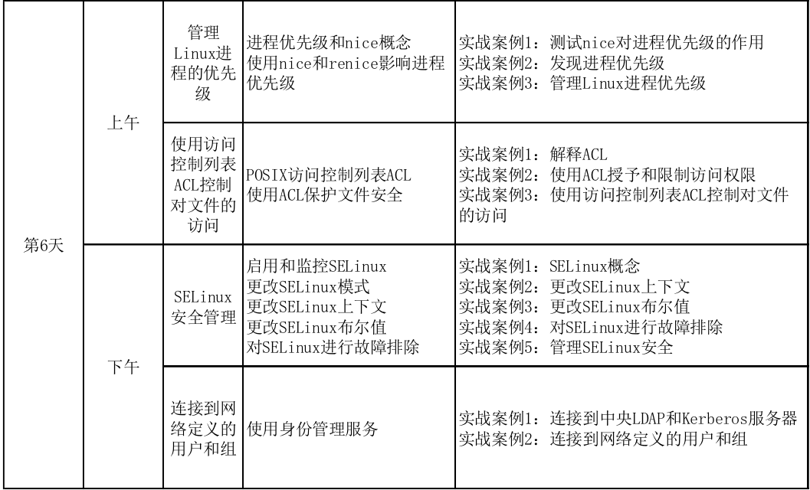
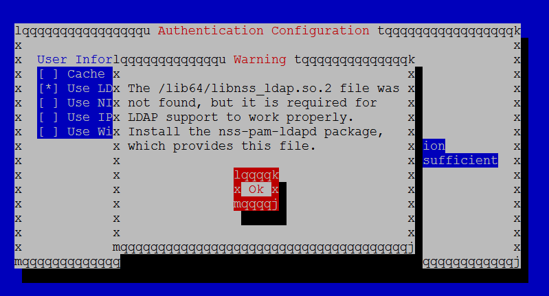
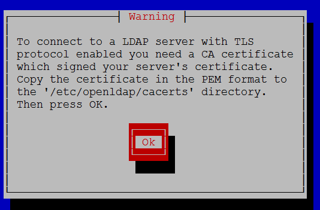

plan


# 1. 管理Linux进程优先级


# 4. 连接到网络定义的用户和组

## 4.1 使用身份管理服务

###  回顾一下本地登陆的过程

#### /etc/passwd

#### /etc/group

#### /etc/shadow

### 集中式身份管理的需求

- 相同,相似或相似身份的用户, 管理N台机器
(如果是公用的, 是不是N台机器都要建N个用户???还是有其它解决方案)

结合现在desktop server两台机器都有student用户这个例子举例说明

- SSO(Single Sign On单点登录)

### 用authconfig-tui演示

#### 如报libssn_ldap.so不存在


### RH134 P156-157练习由于yum install的包不够老是会做失败

下面给出我在字符界面的做法

先安装比书本写得要多的包
````bash
yum -y install pam_krb5 nss-pam-ldapd sssd authconfig-tui  krb5-workstation.x86_64 nss.i686

````

根据书本信息在tui中进行填写, 并在最后一页时, 会提示您下载证书,



此时切换到另外一个终端,用wget下载证书

(注意,未到最后一步, 这个目录不会被创建)
```bash
cd /etc/openldap/cacerts
wget http://classroom.example.com/pub/example-ca.crt

```

 确认是否创建成功
````bash
getent passwd ldapuser0
````


需要提前创建 
```bash
mkdir -p /home/guests/ldapuser0
chown -R ldapuser0:ldapuser0 /home/guests/ldapuser0

```


此进可运行
```bash
ssh ldapuser0@localhost

密码为
kerberos

```
## 4.2 将系统连接到IPA服务器
IPA(identify, policy, audit) 身份,策略, 审核

主要利用客户端
ipa-client进行安装
(可以按课后的lab进行演示)

RH134P161
--no-ntp这个参数好像没有生效

````bash
 sudo ipa-client-install -N --domain=server0.example.com --mkhomedir
Discovery was successful!
Hostname: desktop0.example.com
Realm: SERVER0.EXAMPLE.COM
DNS Domain: server0.example.com
IPA Server: server0.example.com
BaseDN: dc=server0,dc=example,dc=com

Continue to configure the system with these values? [no]: yes
User authorized to enroll computers: admin
Synchronizing time with KDC...
Unable to sync time with IPA NTP server, assuming the time is in sync. Please check that 123 UDP port is opened.


````

另外初次登陆时也没有提示原密码为password, 要更改密码的说法,与原书有所出入.

## 4.3  加入Active Directory
(加入域后, 可以用域用户进行域登陆)

## 红帽官方参考资料

[SYSTEM-LEVEL AUTHENTICATION GUIDE](https://access.redhat.com/documentation/en-us/red_hat_enterprise_linux/7/html/system-level_authentication_guide/openldap)

[LINUX DOMAIN IDENTITY, AUTHENTICATION, AND POLICY GUIDE](https://access.redhat.com/documentation/en-us/red_hat_enterprise_linux/7/html-single/linux_domain_identity_authentication_and_policy_guide/)

