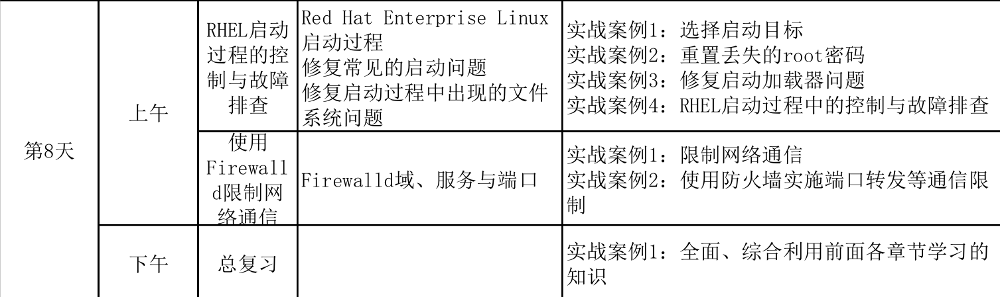
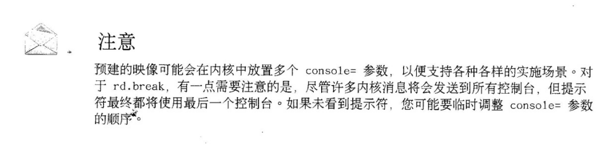

plan


# 1. 启动过程中的故障排查

## 1.1 ???


## 1.2 RHEL7启动过程

- BIOS/UEFI (玩技术也存在站队,,当然,如果把原理给学过去后, 也有会转得比较快, 也弄到一个广度,深度的治学问题的怪圈中)
作为两种技术, 新旧交替, 此时可以发散对于 

- IPv4/ipv6 

- grub/lilo

> [What is the difference between LILO and GRUB?](https://unix.stackexchange.com/questions/6498/what-is-the-difference-between-lilo-and-grub)
>LILO has a simpler interface and is easier to wrap your head around.
>GRUB is more featured and handles odd configurations better.
>The LILO bootstrap process involves locating the kernel by in essence (it's more complicated than this) pointing to the first logical-sector of the Kernel file. The GRUB bootstrap process is more filesystem aware and can locate a kernel file in a filesystem without having to specify a logical-sector.
>There is a reason nearly everyone is using GRUB these days, and that's because it's less fragile and handles edge-cases better.

### 1.2.1 加电自检(POST)

### 1.2.2 搜索启动设备
- (此时可以先给vm做一些镜像, 之后做实验, 让学员们去调整启动顺序等)
- MBR的概念也可以在这里进行介绍
- 对于VMware模拟的bios可以按F2进入bios,也可以用ESC键临时调整启动顺序??
[VMware workstation设置开机引导等待时间的一个小技巧](https://blog.csdn.net/solaraceboy/article/details/80286930)
关闭vmware后, 打开虚拟机的vmx文件在后面加入 bios.bootDelay = "20000" 表示停20秒
<br>
(再次打开,可能这行就不在最后面,需要搜索)

### 1.2.3 系统固件读取磁盘中的boot loader
在RHEL7,bootloader是grub2 

### 1.2.4 grub从磁盘加载其它东西

- /etc/grub.d
- /etc/default/grub
- /boot/grub2/grub.cfg

### 1.2.5 与用户交互(或超时)

- initramfs是经过gzip的cpio归档,其中包含启动时所必要的硬件(内核模块,初始化脚本), 在rhel7中initramfs包含了整个系统.

### 1.2.6 grub把控制权交给了initramfs
配置同1.2.4, 但是不同的阶段

### 1.2.7  initramfs-->systemd
```bash
[kiosk@foundation0 ~]$ ls -lrt /sbin/init
lrwxrwxrwx. 1 root root 22 Jan 23  2016 /sbin/init -> ../lib/systemd/systemd

```

### 1.2.8 initrd.target /sysroot的真正root

`/etc/fstab`

### 1.2.9 root归位

### 1.2.10 根据默认的target选择相应的选项(按需,并行启动)

## 1.3 启动, 重启, 关闭

正确的姿势应是
systemctl reboot 之类,但为了向下兼容, 所以就保留了一部分

`````bash
[kiosk@foundation0 ~]$ ls -l $(which reboot)
lrwxrwxrwx. 1 root root 16 Jan 23  2016 /usr/sbin/reboot -> ../bin/systemctl
[kiosk@foundation0 ~]$ ls -l $(which poweroff)
lrwxrwxrwx. 1 root root 16 Jan 23  2016 /usr/sbin/poweroff -> ../bin/systemctl
[kiosk@foundation0 ~]$ ls -l $(which halt)
lrwxrwxrwx. 1 root root 16 Jan 23  2016 /usr/sbin/halt -> ../bin/systemctl
[kiosk@foundation0 ~]$
`````
note: halt不直接关机,还要手动来一下

## 1.4 各个启动级别

各个级别所依赖是不同的,一般从上到下减下
````bash
[kiosk@foundation0 ~]$ systemctl list-dependencies  graphical.target |grep target
graphical.target
└─multi-user.target
  ├─basic.target
  │ ├─paths.target
  │ ├─slices.target
  │ ├─sockets.target
  │ ├─sysinit.target
  │ │ ├─cryptsetup.target
  │ │ ├─local-fs.target
  │ │ └─swap.target
  │ └─timers.target
  ├─getty.target
  └─remote-fs.target
[kiosk@foundation0 ~]$ systemctl list-dependencies  multi-user.target |grep target
multi-user.target
├─basic.target
│ ├─paths.target
│ ├─slices.target
│ ├─sockets.target
│ ├─sysinit.target
│ │ ├─cryptsetup.target
│ │ ├─local-fs.target
│ │ └─swap.target
│ └─timers.target
├─getty.target
└─remote-fs.target
[kiosk@foundation0 ~]$ systemctl list-dependencies  rescue.target |grep target
rescue.target
└─sysinit.target
  ├─cryptsetup.target
  ├─local-fs.target
  └─swap.target
[kiosk@foundation0 ~]$ systemctl list-dependencies  emergency.target |grep target
emergency.target
[kiosk@foundation0 ~]$
````
通过 `systemctl isolate `进行切换
如在graphic切到multi-user  就可以用`systemctl isolate multi-user`<br>

(这个命令在foundation时灵时不灵, 在server中进行实验倒是挺灵的,,,<br>
其实也与之前的init 5(startx 图型界面), init 4(字符界面) init 6重启, init 0 关闭)

### 1.4.1 默认的启动目标
之前在搭环境时,就列出过相关, 现在正式来讲一下
````bash
#别名了之后不会了补全, 也挺让人心烦的,,不知如何是好
[kiosk@foundation0 ~]$ sctl get-default
multi-user.target
[kiosk@foundation0 ~]$ systemctl get-default
multi-user.target

systemctl set-default XXX.target

````
当然也可能在启动时, 在引导内核所在行(一般以linux16开始),的最后面加上`systemd.unit=rescue.target``去临时改变启动的目标.
其实也可以直接在行未加空格后,写上emergency进入该模式,


另外,由于7有不少常用的系统命令已进行了不少的更改, 下面的网页可以列出修改
[Common administrative commands in Red Hat Enterprise Linux 5, 6, and 7](https://access.redhat.com/articles/1189123)

## 1.5 root密码恢复

### 不能直接进行单用户模式了

之前直接在内核中加空格, 加小写s(或数字1)进行单用户模式那招在rhel7已失效了

可按书本上修改
(如不remount,会发现/sysroot/etc/shado
\w下面是都没有权限的,)

但有一个细节, 如果发现前面有`rhgb quiet` rd.break加入前, 请把上面的字眼删掉,以防万一,
另外如不加入rd.break,那么可以加入 `init=/bin/sh`试一下,如果考试遇上失败的重置场景的话
有时还不行的话再加入`console=tty1`才加上rd.break.<br>

<br>

下面是一系列参考链接
<br>
[RHEL 7 Root Password Recovery](https://access.redhat.com/discussions/1243493?tour=8)<br>
[12 Steps to Password Recovery for RHEL, CentOS 7 Linux](https://spr.com/password-recovery-for-rhel-centos-7-linux/)<br>
[How to recover forgotten root password](https://rhel7tutorial.wordpress.com/how-to-recover-forgotten-root-password/)<br>

### 1.5.2 给grub加密
```bash
在/etc/grub.d/00_header最后加入
        cat << EOF
set superusers="redhat"
password redhat 123
EOF

```

明文不安全??
[grub with protection](https://askubuntu.com/questions/370693/how-to-add-the-grub-password-protection-to-the-os-load-process-instead-of-when-e)

```bash
# grub2-mkpasswd-pbkdf2
Password: ****
Reenter password: ****
PBKDF2 hash of your password is grub.pbkdf2.sha512.10000.9CA4611006FE96BC77A...
```
in the /etc/grub.d/00_header
```bash
set superusers="root"
password_pbkdf2 root grub.pbkdf2.sha512.10000.9CA4611006FE96BC77A...
```

`grub2-mkconfig -o /boot/grub2/grub.cfg`

## 1.6 修复启动时出现的系统文件问题

### 一些常见的问题

#### 损坏的文件系统(一时间未想到怎样模拟)

#### /etc/fstab

##### UUID不存在

##### 挂载点不存在

##### 挂载点错误
(上面这两点我到现在还是分不清)
这里做练习时, 发现进行emergency模式还是可以直接在加载内核那行写emergency,<br>
而不用像书本中那样写systemd.unit=emergency.target这么长 

有时如果server这种机器不受控,可以在终端打开virt-manager再去控制机器

修改内核参数出错后, 可以esc退出本次的修改, 再按e进入重新编辑

## 1.7 修复加载器出问题(bootloader)

## 
pstree可以看到现在各个进程间的关系

```bash
[kiosk@foundation0 ~]$ systemctl list-units --type=target
UNIT                  LOAD   ACTIVE SUB    DESCRIPTION
basic.target          loaded active active Basic System
cryptsetup.target     loaded active active Encrypted Volumes
getty.target          loaded active active Login Prompts
local-fs-pre.target   loaded active active Local File Systems (Pre)
local-fs.target       loaded active active Local File Systems
multi-user.target     loaded active active Multi-User System
network-online.target loaded active active Network is Online
network.target        loaded active active Network
nss-lookup.target     loaded active active Host and Network Name Lookups
paths.target          loaded active active Paths
remote-fs-pre.target  loaded active active Remote File Systems (Pre)
remote-fs.target      loaded active active Remote File Systems
rpcbind.target        loaded active active RPC Port Mapper
slices.target         loaded active active Slices
sockets.target        loaded active active Sockets
sound.target          loaded active active Sound Card
swap.target           loaded active active Swap
sysinit.target        loaded active active System Initialization
timers.target         loaded active active Timers

LOAD   = Reflects whether the unit definition was properly loaded.
ACTIVE = The high-level unit activation state, i.e. generalization of SUB.
SUB    = The low-level unit activation state, values depend on unit type.

19 loaded units listed. Pass --all to see loaded but inactive units, too.
To show all installed unit files use 'systemctl list-unit-files'.

```

## 1.8 再来一点猛的


在server中
```bash
#注意不是/dev/vda1
dd if=/dev/zero bs=1 count=446 of=/dev/vda

```
其实就是把MBR(主引导扇区给干掉)
[MBR主引导扇区解析](https://www.cnblogs.com/CasonChan/p/4546658.html)<br>
[主引导记录_百度百科](https://baike.baidu.com/item/%E4%B8%BB%E5%BC%95%E5%AF%BC%E8%AE%B0%E5%BD%95/7612638)<br>

这样连grub菜单也被我们干掉了,这样开机时就没有选择了..这里我们需要挂载REHL7.0的iso进行troubleshotting中的rescue模式.

可以的话演示一下chroot不然大家可能会有点晕
之后 chroot /mnt/sysimage(注,如没有这步也会失败, 可以演示一下)
grub2-install /dev/vda
之后一直exit到reboot


## 1.9 再点更猛的

rm -rf /boot/*
同上, 只不过要安装内核, grub2, 还要重新生成/boot/grub2/grub.cfg

同时, 收回昨天说的没有直接挂/mnt这种玩法, 一般挂光驱,不挂其它东西时, 特别在rescue mode这种还是挺常有的.


````bash
chroot /mnt/sysimage

mount /dev/cdrom /mnt
rpm -ivh /mnt/Pack*/ker*-3*.rpm --force
#option 也可以 rpm -qp <filename.rpm> --script
grub2-install /dev/vda

grub2-mkconfig -o /boot/grub2/grub.cfg
````
## 1.10 通过1.9,发现前面的都是浮云,只要有rescue盘(我们也可以进去改密码)..............


# 2.firewall 
按书讲即可, 基本上大部分还在RH254才讲
