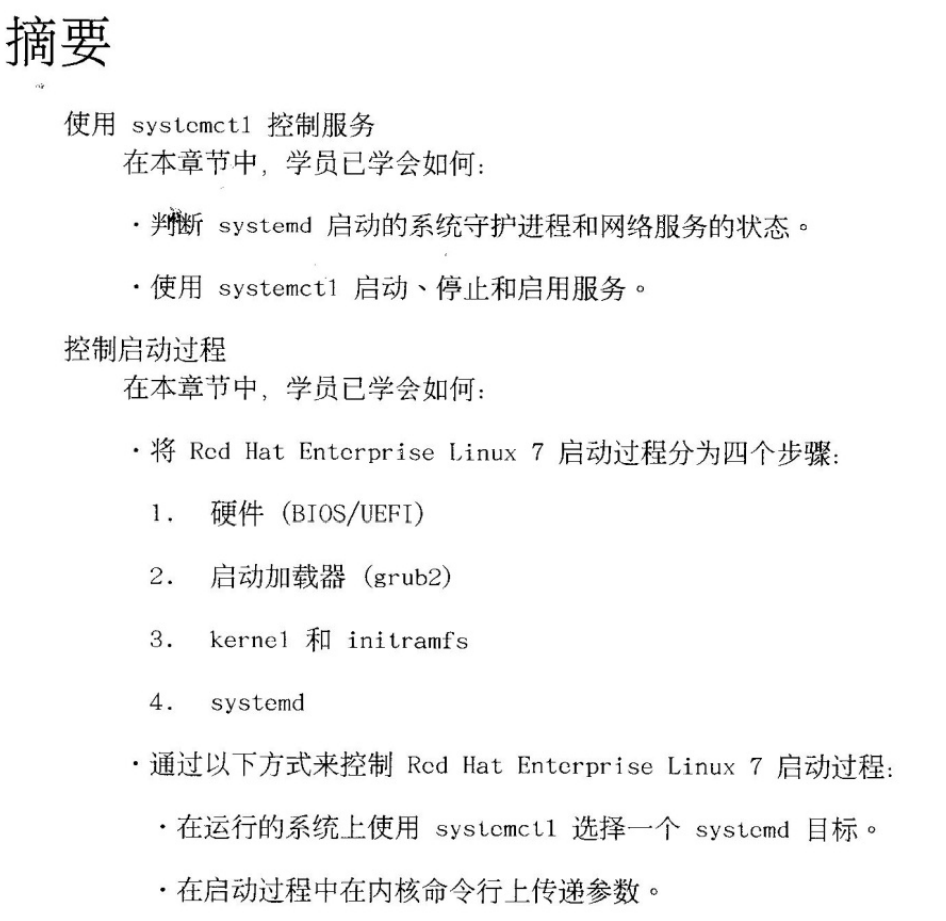
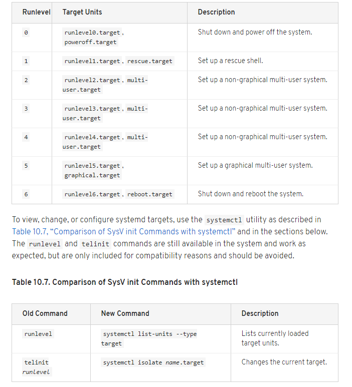
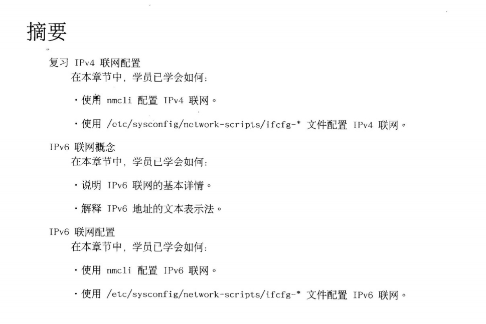

# plan


# 1. 控制服务和守防进程

## 对于内容上稍有重复,进行一定的解释.
这里需要进行一下铺垫,因为事实上, RHCE(EX300) RHCSA(EX200), 是两个独立的课程(虽然我们一般都一起来学,ex 硕士,博士)

## systemd的历史

可参考下面这些链接
[LINUX PID 1 和 SYSTEMD](https://coolshell.cn/articles/17998.html)<br>


## 同时,也讲述一下一般我们遇到一个新事物的一个可能有用到的认知方式

用搜索引擎搜(首选google,bing次之)
如systemd 我们搜 
systemd wiki
之后再找 Official website , Systemd on Github
之类,可以对这事有一个系统的认识.

## 拓展知识汇总
从github过去的(<br>
当然,有空的话也可以介绍一下github这个全球最大的同性交友网友,,也被称为gayhub, <br>
当然, 这里对LGBT没有任何歧视,LGBT是什么,好吧.说好零基础的..)
[systemd官网](https://www.freedesktop.org/wiki/Software/systemd/)<br>
[systemd攻略 ](https://www.jianshu.com/p/8b3fba13fcad)<br>

## 当系统启动完后 echo $$可以看到当前bash进程的pid(遇小代表着从开始到现在这个bash用了多少个进程)

此时, 可以用pstree看一下, 当前进程的复杂情况.(当然可以先用systemctl isolate rescue.target看一下, 这时的pstree的确是精简了, 但pid还是挺高的)

为了方便对比, 我们可以在multi-user这个mode与 rescue 进行对比,对比方法像修改root密码那样,修改内核的启动参数, 加入systemd.unit=rescue.target


## systemctl -t help列出各单元

```bash
[root@desktop0 ~]# systemctl --type help
Available unit types:
service
socket
target
device
mount
automount
snapshot
timer
swap
path
slice
scope

```

## 单元分类列举
`systemctl list-units` 这样去找查(不用加less默认已加入)
- .service 这个是我们见得最多的,经常把最后的.service给省略.
- .socket  延时启动或相对低频服务 (经常会发现有一个同名的service)
`rpcbind.socket                                                    loaded active running   RPCbind Server Activation Socket`
- .path 服务激活在特别的文件系统生生更变之后,如打印相关 
`cups.path                                                         loaded active waiting   CUPS Printer Service Spool`

## 状态


## 查看某一类服务
`systemctl --type=service`
如果用-t请注意不要等号
`systemctl -t service`

## 有时-l并不一定会有更详细的信息
```bash
[root@desktop0 ~]# systemctl status rngd.service
rngd.service - Hardware RNG Entropy Gatherer Daemon
   Loaded: loaded (/usr/lib/systemd/system/rngd.service; enabled)
   Active: failed (Result: exit-code) since Mon 2019-03-11 09:56:50 CST; 33min ago
  Process: 517 ExecStart=/sbin/rngd -f (code=exited, status=1/FAILURE)
 Main PID: 517 (code=exited, status=1/FAILURE)
   CGroup: /system.slice/rngd.service

Mar 11 09:56:49 localhost systemd[1]: Started Hardware RNG Entropy Gatherer Daemon.
Mar 11 09:56:49 localhost rngd[517]: Unable to open file: /dev/tpm0
Mar 11 09:56:49 localhost rngd[517]: can't open any entropy source
Mar 11 09:56:49 localhost rngd[517]: Maybe RNG device modules are not loaded
Mar 11 09:56:50 localhost systemd[1]: rngd.service: main process exited, code=exited, status=1/FAILURE
Mar 11 09:56:50 localhost systemd[1]: Unit rngd.service entered failed state.
[root@desktop0 ~]# systemctl status rngd.service -l
rngd.service - Hardware RNG Entropy Gatherer Daemon
   Loaded: loaded (/usr/lib/systemd/system/rngd.service; enabled)
   Active: failed (Result: exit-code) since Mon 2019-03-11 09:56:50 CST; 33min ago
  Process: 517 ExecStart=/sbin/rngd -f (code=exited, status=1/FAILURE)
 Main PID: 517 (code=exited, status=1/FAILURE)
   CGroup: /system.slice/rngd.service

Mar 11 09:56:49 localhost systemd[1]: Started Hardware RNG Entropy Gatherer Daemon.
Mar 11 09:56:49 localhost rngd[517]: Unable to open file: /dev/tpm0
Mar 11 09:56:49 localhost rngd[517]: can't open any entropy source
Mar 11 09:56:49 localhost rngd[517]: Maybe RNG device modules are not loaded
Mar 11 09:56:50 localhost systemd[1]: rngd.service: main process exited, code=exited, status=1/FAILURE
Mar 11 09:56:50 localhost systemd[1]: Unit rngd.service entered failed state.
```

## 可以用is-enable,is-active查询状态
```bash
[root@desktop0 ~]# systemctl is-active sshd
active
[root@desktop0 ~]# systemctl is-enabled sshd
enabled
```

## systemctl list-units --type=service --all
最终的all能把一些非active的也查出来, 这点与后面我们查询网卡的就有点像了.大家在这里可以先有个大体的印像

## 仅查看失败的
```bash

systemctl --failed --type=service
UNIT                      LOAD   ACTIVE SUB    DESCRIPTION
ovirt-guest-agent.service loaded failed failed oVirt Guest Agent
rc-local.service          loaded failed failed /etc/rc.d/rc.local Compatibility
rhnsd.service             loaded failed failed LSB: Starts the Spacewalk Daemon
rngd.service              loaded failed failed Hardware RNG Entropy Gatherer Daemon

LOAD   = Reflects whether the unit definition was properly loaded.
ACTIVE = The high-level unit activation state, i.e. generalization of SUB.
SUB    = The low-level unit activation state, values depend on unit type.

4 loaded units listed. Pass --all to see loaded but inactive units, too.
To show all installed unit files use 'systemctl list-unit-files'.

```

## 启动和停止运行中的服务,(按书本操作即可)(RH254p4)
其中值得注意的是,mask与unmask 这个命令, 有些服务,天生八字相冲(如iptables 与firewall)不共戴天,,于是就可以手动地把一些服务干掉,留下像用的,
<br>
但怕有时disable,stop之后,哪个家伙给我又给打开了,enable,start,就加了个mask,,,有点像枪械中的保险一说 ,
加了mask的服务必须要unmask才能成功启动.

```bash
[root@desktop0 ~]# systemctl status lvm2-lvmetad
lvm2-lvmetad.service - LVM2 metadata daemon
   Loaded: loaded (/usr/lib/systemd/system/lvm2-lvmetad.service; disabled)
   Active: active (running) since Mon 2019-03-11 10:48:20 CST; 20s ago
     Docs: man:lvmetad(8)
 Main PID: 29901 (lvmetad)
   CGroup: /system.slice/lvm2-lvmetad.service
           └─29901 /usr/sbin/lvmetad -f

Mar 11 10:48:20 desktop0.example.com systemd[1]: Started LVM2 metadata daemon.
[root@desktop0 ~]# systemctl stop lvm2-lvmetad
Warning: Stopping lvm2-lvmetad, but it can still be activated by:
  lvm2-lvmetad.socket
[root@desktop0 ~]# systemctl start lvm2-lvmetad
[root@desktop0 ~]# systemctl status lvm2-lvmetad
lvm2-lvmetad.service - LVM2 metadata daemon
   Loaded: loaded (/usr/lib/systemd/system/lvm2-lvmetad.service; disabled)
   Active: active (running) since Mon 2019-03-11 10:48:54 CST; 2s ago
     Docs: man:lvmetad(8)
 Main PID: 29917 (lvmetad)
   CGroup: /system.slice/lvm2-lvmetad.service
           └─29917 /usr/sbin/lvmetad -f

Mar 11 10:48:54 desktop0.example.com systemd[1]: Starting LVM2 metadata daemon...
Mar 11 10:48:54 desktop0.example.com systemd[1]: Started LVM2 metadata daemon.
[root@desktop0 ~]# systemctl stop lvm2-lvmetad
Warning: Stopping lvm2-lvmetad, but it can still be activated by:
  lvm2-lvmetad.socket
[root@desktop0 ~]# systemctl mask lvm2-lvmetad
ln -s '/dev/null' '/etc/systemd/system/lvm2-lvmetad.service'
[root@desktop0 ~]# systemctl start lvm2-lvmetad
Failed to issue method call: Unit lvm2-lvmetad.service is masked.
[root@desktop0 ~]# systemctl unmask lvm2-lvmetad
rm '/etc/systemd/system/lvm2-lvmetad.service'
[root@desktop0 ~]# systemctl start lvm2-lvmetad
[root@desktop0 ~]# systemctl status lvm2-lvmetad
lvm2-lvmetad.service - LVM2 metadata daemon
   Loaded: loaded (/usr/lib/systemd/system/lvm2-lvmetad.service; disabled)
   Active: active (running) since Mon 2019-03-11 10:49:57 CST; 2s ago
     Docs: man:lvmetad(8)
 Main PID: 30025 (lvmetad)
   CGroup: /system.slice/lvm2-lvmetad.service
           └─30025 /usr/sbin/lvmetad -f

Mar 11 10:49:57 desktop0.example.com systemd[1]: Started LVM2 metadata daemon.

```
### 操作小技巧
此时也可以说一下, 如果平时我们终端软件支持鼠标滚轮缩放,那么如果有时我们复制的东西超过一屏,可以先缩小再复制.

## 一些零碎的小复习
### rescue mode 对应的数字高还是 emergency高
````
      systemctl list-dependencies emergency.target 
      systemctl list-dependencies rescue.target 

````
### systemctl restart 与 try-restart的区别

`````
   systemctl status httpd
   yum install -y httpd
   systemctl status httpd
   systemctl try-restart httpd
   systemctl status httpd
   systemctl restart httpd
   systemctl status httpd
   systemctl stop httpd
   systemctl status httpd
   systemctl try-restart httpd
   systemctl status httpd
   systemctl start httpd
   systemctl status httpd
   systemctl try-restart httpd
   systemctl status httpd
`````
## 我们自己动手写个services

### 例如,据说女人昏了头的时候, 就会要求结婚,我们就先写个结婚service

到`/usr/lib/systemd/system`,看到一系列的服务, 我们就找个老熟人sshd.service来作个模板...<br>
其实这里也可以多个心眼, 现在我们一般需要找一个比较简单的来进行,这时我们可以活学活用<br>
`ls -lS *.services` 这样来列一下,文件比较小的进行copy,<br>
好吧. 还是sshd吧...<br>


`cp sshd.service marryd.service`

``````
#cat marryd.service
[root@server0 system]# cat marryd.service 
[Unit]
Description=get marry server daemon
#After=syslog.target network.target auditd.service

[Service]
#EnvironmentFile=/etc/sysconfig/sshd
#ExecStartPre=/usr/sbin/sshd-keygen
ExecStart=/root/get_marry
#ExecReload=/bin/kill -HUP $MAINPID
#KillMode=process
#Restart=on-failure
#RestartSec=42s

[Install]
#WantedBy=multi-user.target
``````

由于执行需要`/root/get_marry`<br>
于是就自己手动加个脚本, 再为了证明这个脚本曾经,并一直活着.就让其死循环,一直打印点什么到某个文件中去 ..<br>

````
cat /root/get_marry
#[root@server0 system]# cat /root/get_marry 
#!/bin/bash

while true
do
	date >>/root/marry.out;
	echo "yi bai tian di" >> /root/marry.out;
	sleep 5;
done

````

写完后,再测试一波<br>


````
systemctl status marryd
systemctl restart marryd
systemctl status marryd

````

另一个终端介绍下(tailf这个命令, 也就是tail -f少写了两个字符)<br>

````
tailf /root/marry.out
````

至此,,,结婚这个服务就完成了<br>

## 且慢...丈母娘说, 结婚没有房怎么行...我儿女昏了头,我可没有...

于是....我们得出一个结论,,,买房这个service是marryd这个服务的强依赖服务.<br>

所以我们要像之前那样写个housed.services,之后再让marry这个服务作为强依赖拉起.<br>

有时我们改了/usr/lib/systemd/system/里面的文件, 在`sytemctl status XXX`时会提示我们reload,如下面的字眼<br>

`````
....
Warning: Unit file changed on disk, 'systemctl daemon-reload' recommended.
......
`````

之后在marryd.service的[UNIT] 中加入 `Requires=housed.service` 表示结婚前先买房....
修改完之后,`systemctl status housed`确认未拉起, 直接拉起marryd发现会把housed拉起, <br>
当然, 我们也可以从 <br>
`````
[root@server0 system]# systemctl list-dependencies marryd|head -n3
marryd.service
├─housed.service
├─system.slice
`````
这个输出中看到

当然我们也可以一直`tailf /root/marry.out`查看结果也能证实这一点.

## 再慢....老丈人说,,,要有车,男人才有面子....
这时准备去买,结果丈母娘 眉头 动了一下,,,,老丈人就....<br>
看来车子不是必须的..所以我只是在marryd.service [UNIT] 中加入了
`Wants=card.service `
表示弱依赖,,,也就是list-dependencies也能显示marryd 与card有关...<br>
start marryd时,也会把card拉起,但stop card时, marryd也存在;<br>
但是如果stop housed时, marryd也会停止<br>
这时大家就可以看出强依赖与弱依赖的关系.


##  结婚时一般都要早生贵子
所以我们在marryd.service的[UNIT]中加入<br>
`After=baby.service` 但值得注意的, 只有Wants,与 Requires是有依赖关系. 而afters是没有的,只是说明个先后顺序的,,,<br>
现实中也有不少奉子成婚,结婚洒与满月酒一起摆的,,省了不少事..<br>
可以list-dependencies 及只拉起marryd,会发现baby没有运行
而且我们把baby.service弄成个`[Service] Type=oneshot`,只让其运行一次, (也就是计划生育),运行完后, <br>
发现status为 static
```````
[root@server0 system]# systemctl status baby
baby.service - make a baby after marry
   Loaded: loaded (/usr/lib/systemd/system/baby.service; static)
   Active: inactive (dead) since 六 2019-06-15 01:45:45 CST; 2min 51s ago
  Process: 8639 ExecStart=/root/make_baby (code=exited, status=0/SUCCESS)
 Main PID: 8639 (code=exited, status=0/SUCCESS)

6月 15 01:45:45 server0.example.com systemd[1]: Starting make a baby after marry...
6月 15 01:45:45 server0.example.com systemd[1]: Started make a baby after marry.
```````

## summary

### service

`````
[root@server0 system]# cat housed.service  card.service marryd.service baby.service 
[Unit]
Description=my mother in law need a house before get marry
#After=syslog.target network.target auditd.service

[Service]
#EnvironmentFile=/etc/sysconfig/sshd
ExecStartPre=/usr/sbin/sshd-keygen
ExecStart=/root/buy_house
#ExecReload=/bin/kill -HUP $MAINPID
#KillMode=process
#Restart=on-failure
#RestartSec=42s

[Install]
#WantedBy=multi-user.target
[Unit]
Description=my father in law need a house before get marry
#After=syslog.target network.target auditd.service

[Service]
#EnvironmentFile=/etc/sysconfig/sshd
#ExecStartPre=/usr/sbin/sshd-keygen
ExecStart=/root/buy_car
#ExecReload=/bin/kill -HUP $MAINPID
#KillMode=process
#Restart=on-failure
#RestartSec=42s

[Install]
#WantedBy=multi-user.target
[Unit]
Description=get marry server daemon
Requires=housed.service
Wants=card.service
After=baby.service

[Service]
#EnvironmentFile=/etc/sysconfig/sshd
#ExecStartPre=/usr/sbin/sshd-keygen
ExecStart=/root/get_marry
#ExecReload=/bin/kill -HUP $MAINPID
#KillMode=process
#Restart=on-failure
#RestartSec=42s

[Install]
#WantedBy=multi-user.target
[Unit]
Description=make a baby after marry
#After=syslog.target network.target auditd.service

[Service]
Type=oneshot
#EnvironmentFile=/etc/sysconfig/sshd
#ExecStartPre=/usr/sbin/sshd-keygen
ExecStart=/root/make_baby
#ExecReload=/bin/kill -HUP $MAINPID
#KillMode=process
#Restart=on-failure
#RestartSec=42s

[Install]
#WantedBy=multi-user.target


`````

### script
``````
cd /root/
[root@server0 ~]# cat get_marry buy_house buy_car make_baby 
#!/bin/bash

while true
do
	date >>/root/marry.out;
	echo "yi bai tian di" >> /root/marry.out;
	sleep 5;
done
#!/bin/bash

while true
do
	date >>/root/marry.out;
	echo "buy a house" >> /root/marry.out;
	sleep 1;
done
#!/bin/bash

while true
do
	date >>/root/marry.out;
	echo "buy a car" >> /root/marry.out;
	sleep 2;
done
#!/bin/bash

	date >>/root/marry.out;
	echo "make a baby" >> /root/marry.out;


``````

当然. 这边只是举例, 更多的 外遇模式,等各种特殊服务自行脑补,并手动实践一下...


## systemctl命令摘要


### rh254p8 练习可以带大家做一下, 也可以让大家顺便休息一下

### 各target的依赖对比
````bash
[root@desktop0 ~]# systemctl list-dependencies graphical.target |grep target
graphical.target
└─multi-user.target
  ├─basic.target
  │ ├─paths.target
  │ ├─slices.target
  │ ├─sockets.target
  │ ├─sysinit.target
  │ │ ├─cryptsetup.target
  │ │ ├─local-fs.target
  │ │ └─swap.target
  │ └─timers.target
  ├─getty.target
  ├─nfs.target
  └─remote-fs.target
[root@desktop0 ~]# systemctl list-dependencies multi-user.target |grep target
multi-user.target
├─basic.target
│ ├─paths.target
│ ├─slices.target
│ ├─sockets.target
│ ├─sysinit.target
│ │ ├─cryptsetup.target
│ │ ├─local-fs.target
│ │ └─swap.target
│ └─timers.target
├─getty.target
├─nfs.target
└─remote-fs.target
[root@desktop0 ~]# systemctl list-dependencies rescue.target |grep target
rescue.target
└─sysinit.target
  ├─cryptsetup.target
  ├─local-fs.target
  └─swap.target
````

## 利用isolate去切换各等级
但要需要注意, 不是所有 target都可以用isolate 去切换的,如果在文件中没有AllowIsolate=yes,就不行
此时可以讲一下怎样找到AllowIsolate=yes,
```bash
[root@desktop0 system]# cd
[root@desktop0 ~]# cd /etc
[root@desktop0 etc]# cd sys
sysconfig/ sysctl.d/  systemd/
[root@desktop0 etc]# cd sys
sysconfig/ sysctl.d/  systemd/
[root@desktop0 etc]# cd systemd/
[root@desktop0 systemd]# ls
bootchart.conf  journald.conf  logind.conf  system  system.conf  user  user.conf
[root@desktop0 systemd]# cd system/
[root@desktop0 system]# grep -rn AllowIsolate *
default.target:15:AllowIsolate=yes
[root@desktop0 system]# cd ..
[root@desktop0 systemd]# grep -rn AllowIsolate *
[root@desktop0 systemd]# cd system/
[root@desktop0 system]# ll
total 12
drwxr-xr-x. 2 root root   54 Jul 11  2014 basic.target.wants
drwxr-xr-x. 2 root root   30 Jul 11  2014 bluetooth.target.wants
lrwxrwxrwx. 1 root root   41 Jul 11  2014 dbus-org.bluez.service -> /usr/lib/systemd/system/bluetooth.service
lrwxrwxrwx. 1 root root   41 Jul 11  2014 dbus-org.fedoraproject.FirewallD1.service -> /usr/lib/systemd/system/firewalld.service
lrwxrwxrwx. 1 root root   44 May  7  2014 dbus-org.freedesktop.Avahi.service -> /usr/lib/systemd/system/avahi-daemon.service
lrwxrwxrwx. 1 root root   44 Jul 11  2014 dbus-org.freedesktop.ModemManager1.service -> /usr/lib/systemd/system/ModemManager.service
lrwxrwxrwx. 1 root root   46 May  7  2014 dbus-org.freedesktop.NetworkManager.service -> /usr/lib/systemd/system/NetworkManager.service
lrwxrwxrwx. 1 root root   57 May  7  2014 dbus-org.freedesktop.nm-dispatcher.service -> /usr/lib/systemd/system/NetworkManager-dispatcher.service
lrwxrwxrwx. 1 root root   40 Jul 11  2014 default.target -> /usr/lib/systemd/system/graphical.target
drwxr-xr-x. 2 root root   85 May  7  2014 default.target.wants
lrwxrwxrwx. 1 root root   35 Jul 11  2014 display-manager.service -> /usr/lib/systemd/system/gdm.service
drwxr-xr-x. 2 root root   31 May  7  2014 getty.target.wants
drwxr-xr-x. 2 root root   63 Jul 11  2014 graphical.target.wants
drwxr-xr-x. 2 root root 4096 Jul 11  2014 multi-user.target.wants
drwxr-xr-x. 2 root root   29 May  7  2014 nfs.target.wants
drwxr-xr-x. 2 root root   25 Jul 11  2014 printer.target.wants
drwxr-xr-x. 2 root root 4096 Jul 11  2014 sockets.target.wants
drwxr-xr-x. 2 root root   35 Jul 11  2014 spice-vdagentd.target.wants
drwxr-xr-x. 2 root root 4096 Jul 11  2014 sysinit.target.wants
drwxr-xr-x. 2 root root   83 Jul 11  2014 system-update.target.wants
lrwxrwxrwx. 1 root root    9 May  7  2014 tmp.mount -> /dev/null
[root@desktop0 system]# vim /usr/lib/systemd/system/graphical.target


```
### 不死不折腾系列之isolate到reboot.target试试...^_^

## 恢复root密码
重要的事情要说三篇...(现在是第二篇, 总复习还会有第三篇).
如吧,,其实是课程的衔接问题

### 说一个之前比较少去关注的后门
```bash
systemctl start debug-shell 
systemctl enable debug-shell 
```
这样ctrl+alt+F9可以一步跳过密码,直接进入,,,但是,,,如果没开就没戏了...
可以演示一下开了之后当时进入, 及重启后进入都是可以的

其实恢复动作,可以再走一次流程.


<br>


<br>


## rh254p15 的isolate练习也可以做一下
## rh254p17 lab也做一下,


# 2.  IPV6网络管理

## IPV4回顾

### 学员应对应nmcli及 /etc/sysconfig/network-scripts中的文件有所了解
一系列的nmcli con show等命令还是用root去执行吧..不然有可能得不到想要的结果

ip a s 这个命令的name(应为devicea或interface)
```bash
[root@server0 ~]# nmcli con show
NAME         UUID                                  TYPE            DEVICE
System eth0  5fb06bd0-0bb0-7ffb-45f1-d6edd65f3e03  802-3-ethernet  eth0
[root@server0 ~]# ip addr show "System eth0"
Device "System eth0" does not exist.
[root@server0 ~]# ip addr show eth0
2: eth0: <BROADCAST,MULTICAST,UP,LOWER_UP> mtu 1500 qdisc pfifo_fast state UP qlen 1000
    link/ether 52:54:00:00:00:0b brd ff:ff:ff:ff:ff:ff
    inet 172.25.0.11/24 brd 172.25.0.255 scope global dynamic eth0
       valid_lft 11552sec preferred_lft 11552sec
    inet6 fe80::5054:ff:fe00:b/64 scope link
       valid_lft forever preferred_lft forever

```

### 添加网络链接
可以完整演示一次, 当然,如果把kvm这个配置弄挂了, 可以用`rht-vmctl fullreset  <name>`去还原,现场看情况是否允许, 可以进行演示
下面这命令由于/24这里可能会被转义, 所以要加上双引号,注意

`nmcli connection modify myeth1 ipv4.addresses "172.25.0.21/24 "`

也需要说明一下, 停用某个网络要dis dev 而不是 conn down,因为后者不彻底.

有时要modify某一个选项不会写全的话,可以先show一下,再modify
```bash
[root@server0 ~]# nmcli con show myeth1
connection.id:                          myeth1
connection.uuid:                        9fd399b4-238b-4e33-a9d3-163656852b31
connection.interface-name:              eth1
connection.type:                        802-3-ethernet
connection.autoconnect:                 yes
connection.timestamp:                   1521473463
connection.read-only:                   no
connection.permissions:
connection.zone:                        --
connection.master:                      --
connection.slave-type:                  --
connection.secondaries:
connection.gateway-ping-timeout:        0
802-3-ethernet.port:                    --
802-3-ethernet.speed:                   0
802-3-ethernet.duplex:                  --
802-3-ethernet.auto-negotiate:          yes
802-3-ethernet.mac-address:             --
802-3-ethernet.cloned-mac-address:      --
802-3-ethernet.mac-address-blacklist:
802-3-ethernet.mtu:                     auto
802-3-ethernet.s390-subchannels:
802-3-ethernet.s390-nettype:            --
802-3-ethernet.s390-options:
ipv4.method:                            manual
ipv4.dns:
ipv4.dns-search:
ipv4.addresses:                         { ip = 172.25.0.21/24, gw = 0.0.0.0 }
ipv4.routes:
ipv4.ignore-auto-routes:                no
ipv4.ignore-auto-dns:                   no
ipv4.dhcp-client-id:                    --
ipv4.dhcp-send-hostname:                yes
ipv4.dhcp-hostname:                     --
ipv4.never-default:                     no
ipv4.may-fail:                          yes
ipv6.method:                            auto
ipv6.dns:
ipv6.dns-search:
ipv6.addresses:
ipv6.routes:
ipv6.ignore-auto-routes:                no
ipv6.ignore-auto-dns:                   no
ipv6.never-default:                     no
ipv6.may-fail:                          yes
ipv6.ip6-privacy:                       -1 (unknown)
ipv6.dhcp-hostname:                     --
GENERAL.NAME:                           myeth1
GENERAL.UUID:                           9fd399b4-238b-4e33-a9d3-163656852b31
GENERAL.DEVICES:                        eth1
GENERAL.STATE:                          activated
GENERAL.DEFAULT:                        no
GENERAL.DEFAULT6:                       no
GENERAL.VPN:                            no
GENERAL.ZONE:                           --
GENERAL.DBUS-PATH:                      /org/freedesktop/NetworkManager/ActiveConnection/6
GENERAL.CON-PATH:                       /org/freedesktop/NetworkManager/Settings/2
GENERAL.SPEC-OBJECT:                    --
GENERAL.MASTER-PATH:                    --
IP4.ADDRESS[1]:                         ip = 172.25.0.21/24, gw = 0.0.0.0
IP6.ADDRESS[1]:                         ip = fe80::5054:ff:fe80:d1e0/64, gw = ::

```
其余部分按书本上走,
重点讲一下
nmsetting与 ifcfg-*指令的比较这个表


```bash
有时遇到这种两个IP的话, 是因为自动获得一个,你手动又设了一下, 把method设为manual就好了
```

### 删除链接
`nmcli con del <con-name>`

### 修改主机名
- hostname
- hostnamectl

### summary


## ipv6基本概念

### 来由?之前规划不足,等一系列原因
### ipv6的组成
对比ipv4
192.168.11.1/24
点分十进制
而ipv6是冒号分十六进制,
缩写多组0,
讲一下书本上第系列规则
另外由于:与传统上我们ip接端口这个格式一样, 为了区别, 我们需要在ipv6中加上中括号, 后面再加上:及端口号才能避免误解

### ipv6子网
默认掩码是/64,一般来说是够了, 但子网的划分有时是为了隔离, 于是除了一般的/64外, 还有48+16这种玩法.

待确认~~ping6 中ipv6后面加%后接另一个接口如eth1这样相当于ping -i 指定interface~~

### SLAAC DHCPv6

## ipv6 联网配置

像之前的ipv4那样, 这次分别在desktop,server中加入一块网卡(bridege 到br0中)
desktop :2019::10/64
server : 2019::11/64

可以先不输入/64(这样发现是两边通不了,的,,输入/64后即可通)

也需要讲一下nmcli与文本的配置区别

## ipv6排查
排查工作还是那些
ping-->ping6
traceroute -->traceroute6

## summary


## 剩下的练习,实验都可以做一下

 
# 3. 配合链路和桥接

## 3.1 配置网络合作

几种模式
- broadcast
- roundrobin(RH254P59课后的练习可以改成这个试试)
- activebackup
- loadbalance
- lacp

### 重点是下面几句
``````bash
[root@server0 ~]# nmcli con add  type team con-name team0 ifname team0 config '{"runner":{"name":"activebackup"}}'
Connection 'team0' (8412c309-608a-4d05-97bd-a6c89f615685) successfully added.
[root@server0 ~]# nmcli con  mod team0 ipv4.addresses 192.168.0.100/24
[root@server0 ~]# set -o vi
[root@server0 ~]# nmcli con  mod team0 ipv4.method manual
[root@server0 ~]# nmcli con add type team-slave con-name team0-port1 ifname eno1 master team0
Connection 'team0-port1' (84aab5e8-e22c-49b9-a20c-fa46b9239b72) successfully added.
[root@server0 ~]# nmcli con add type  team-slave con-name team0-port2 ifname eno2 master team0
Connection 'team0-port2' (097fd86f-4c83-4081-abfb-4415a2f1c440) successfully added.
[root@server0 ~]# teamdctl team0 state
setup:
  runner: activebackup
ports:
  eno1
    link watches:
      link summary: up
      instance[link_watch_0]:
        name: ethtool
        link: up
  eno2
    link watches:
      link summary: up
      instance[link_watch_0]:
        name: ethtool
        link: up

runner:
  active port: eno1
``````

一定要设个static 的ip才行....所以有人说要1.2.3.4
至少要有一个实际的接口加入才生效(也就是用teamdctl tema0 state 能看到)

## 另外,注意,team0了之后,几个网卡的mac地址是一样的, 如果用vmware会有警告, 请忽略.


### 全程如下
````bash
[root@server0 ~]# nmcli dev
DEVICE  TYPE      STATE         CONNECTION
eth0    ethernet  connected     System eth0
eno1    ethernet  disconnected  --
eno2    ethernet  disconnected  --
ens7    ethernet  disconnected  --
ens8    ethernet  disconnected  --
lo      loopback  unmanaged     --
[root@server0 ~]# nmcli con add  type team con-name team0 ifname team0 config '{"runner":{"name":"activebackup"}}'
Connection 'team0' (8412c309-608a-4d05-97bd-a6c89f615685) successfully added.
[root@server0 ~]# nmcli con  mod team0 ipv4.addresses 192.168.0.100/24
[root@server0 ~]# set -o vi
[root@server0 ~]# nmcli con  mod team0 ipv4.method manual
[root@server0 ~]# nmcli con add type team-slave con-name team0-port1 ifname eno1 master team0
Connection 'team0-port1' (84aab5e8-e22c-49b9-a20c-fa46b9239b72) successfully added.
[root@server0 ~]# nmcli con add type  team-slave con-name team0-port2 ifname eno2 master team0
Connection 'team0-port2' (097fd86f-4c83-4081-abfb-4415a2f1c440) successfully added.
[root@server0 ~]# teamdctl team0 state
setup:
  runner: activebackup
ports:
  eno1
    link watches:
      link summary: up
      instance[link_watch_0]:
        name: ethtool
        link: up
  eno2
    link watches:
      link summary: up
      instance[link_watch_0]:
        name: ethtool
        link: up

runner:
  active port: eno1
[root@server0 ~]# nmcli dev dis eno1
[root@server0 ~]# nmcli dev dis eno2
[root@server0 ~]# nmcli dev conn eno2
Device 'eno2' successfully activated with '097fd86f-4c83-4081-abfb-4415a2f1c440'.
[root@server0 ~]# nmcli dev conn eno1
Device 'eno1' successfully activated with '84aab5e8-e22c-49b9-a20c-fa46b9239b72'.
[root@server0 ~]#
[root@server0 ~]# teamdctl team0 state
setup:
  runner: activebackup
ports:
  eno1
    link watches:
      link summary: up
      instance[link_watch_0]:
        name: ethtool
        link: up
  eno2
    link watches:
      link summary: up
      instance[link_watch_0]:
        name: ethtool
        link: up
runner:
  active port: eno2
[root@server0 ~]#
[root@server0 ~]#
[root@server0 ~]# nmcli dev dis eno2
[root@server0 ~]# teamdctl team0 state
setup:
  runner: activebackup
ports:
  eno1
    link watches:
      link summary: up
      instance[link_watch_0]:
        name: ethtool
        link: up
  eno2
    link watches:
      link summary: up
      instance[link_watch_0]:
        name: ethtool
        link: up
runner:
  active port: eno1

````
### 另外这种接口如果dis之后再打开就没了, 不有像实际的那样
````bash
[root@server0 ~]# nmcli dev dis team0
[root@server0 ~]# nmcli dev conn team0
Error: Device 'team0' not found.
[root@server0 ~]# teamdctl team0 state
Device "team0" does not exist

````

### 相关配置文件
大体与命令行无太大的差异, 
<br>
但是有一个非常不方便的地方就是json的双引号在最外的双引号内需要转义


另外,复杂的配置会放在一个比较长的json中进行配好,再用nmcli con mod team0 team.config <json file>


另外这里也可以分享一下json 与 xml 的体积大小比较,再变到html,再谈到文本与非文本的不安感.


### teamnl,可以干扰已设好的team0

### rh254p66这个练习会比较耗时, 至小要十到二十分钟, 看一下当时情况再安排(主要是输入,,基本不可能完成)


## 3.2 配置软件网桥


windows 相关的桥接


### 往事不堪.......
也可以稍稍展开一下, 一系列的所谓神操作.让同房的入职不久的同事,不明觉厉...深感昨晚打呼噜太响不好...
年年岁岁花相似, 岁岁年年人不同...这时来另一位新入职的同事,,,我也如法操作....结果,,在我沾沾自喜的时候, 他说, 下个360XXX不就可以了吗?.....
我.....

### 注意先team再bridge的话,用nmcli是不行的, 要直接上文件...
可以引申一下不可能的可能

具体操作, 就几张图,就几个命令


<br>


<br>


### brctl show
nmcli 也有一些功能与上面这个命令重合

### 学会桥接之后,我们就可以直接在外面访问server,desktop了
具体做法(方法很多,能通就可以了,)
我自己在vmware中加了一块nat的网卡(用了192.168.8.1)
之后在foundation中加了一个br3,之后把新加入的网卡桥接入br3,
之后再在server中加入新网卡, 选br3的..那么就可用192.168.8  这个网段了.

但是,这个是不是最简单的了?是不是可以不加br??可以想想并试试

### RH254p78的练习要15-30分钟, 可以做一下, 要让学员有心理准备,有点长
总的来说RH254的练习, 实验比起之前的会更长, 更吃力..要好好锻炼一下.

### summary


# 4. 网络端口的安全性

其实最终都是操控 [netfilter](https://www.netfilter.org/)
由于iptables, ip6tables, ebtables与firewalld都是冲突的,所以要先关闭掉一些, 避免冲突

## firewall-cmd 一般操作

对于危险规则的处理 加入--timeout=<TIMEINSECONDS>来规免完全对系统的失控,,

终级大杀招  威力太大, 慎用
`firewall-cmd --panic-on`


## 直接规则
firewall-cmd --direct .....
(感觉, 就是之前iptables那一套)

## rich-rule
当一次想干多件事的时候

也说一下规则排序, 有时很重要
还有就是单单一条富规则内也有排序, (有先后的区别,不然会报错)
 


考试时, 如果一时短路了,写不出富规则, 那么就不要硬着一定用firewall-cmd,可以试一下用图型界面,, <br>
如果非要用也可以从firewalld.richlanguage中找到相应的example

考试时, 很多细节我们是记不信的, 多用man, rpm -ql packagename 找出资料,以作参考.

##伪装和端口转发
前都为作NAT(SNAT)

后都是DNAT???(DNAT)

## 管理selinux端口标记
    
    
```bash

[root@server0 ~]# semanage  port -l
SELinux Port Type              Proto    Port Number

afs3_callback_port_t           tcp      7001
afs3_callback_port_t           udp      7001
afs_bos_port_t                 udp      7007
...

```

### 最后也可以演示一下 
host.allow host.deny这个初级的防火墙

## 把剩下的练习讲一下,一起做一下


