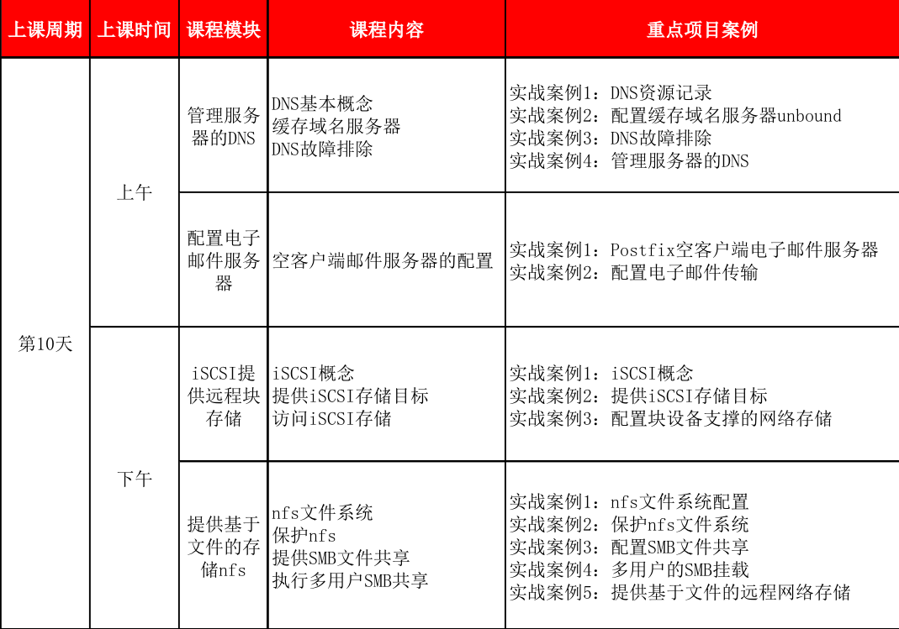

#plan

# 1. 管理服务器的DNS

## 1.1  DNS的一些基本概念
DNS(Domain Name System),世界上本来没有DNS，网站多了，也便有了DNS，

课表外的一些资源

不靠谱的版本(一句话逗比版)
[图解DNS](https://www.jianshu.com/p/43aa206553ab)
巨长版本
[DNS基础知识](https://juejin.im/post/59c6201df265da064428b835)

## 1.2 配置服务器(仅转发类)

## 1.3 故障排查

echo "127.0.0.1" >> /etc/hosts

/etc/nsswitch.conf中的
host: files dns的先后顺序,观察ping classroom的变化

------------- 
用tcpdump抓包排查
on server 
`tcpdump -i eth0  host 172.25.0.11 and host 172.25.0.10` 

再配合 
`dig @server0.example.com A desktop0.example.com`

## 1.4 时间允许的话可以说说DHCP

# 2. 配置电子邮件传输

本章内容不多, 练习, 有实验都做了吧...

# 3. 提供远程块存储
从 HA-->vip->引出存储

DAS
NAS
SAN
    FC iscsi
基本练习, 按书本走一趟,,desktop iscsi这个不用再install了,已装

# 4. mount,
## NFS

## cifs
与之前不同的是支持多用户了, 可以重点看一下

