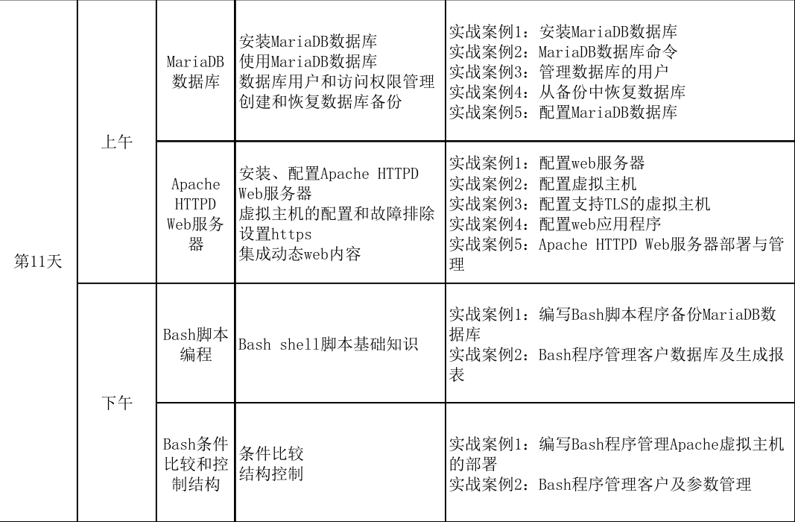

# plan



# 1. MariaDB

## 1.1 安装

### 关系数据库

此处有时间可以简单介绍一下数据库的演进.
从文件到数据库的历程
[数据库概述](https://blog.csdn.net/fly_zhyu/article/details/75336758)<br>
[Database wiki](https://en.wikipedia.org/wiki/Database)

### mariaDB与mysql的口水战


[ranking](https://db-engines.com/en/ranking)<br>

[浅谈MySQL和MariaDB区别?](https://blog.csdn.net/qq_37187976/article/details/79117863)<br>
[为什么 Oracle 收购 MySQL 后仍保证其开源免费？](https://www.zhihu.com/question/49381733)<br>
[兼容性列表](https://mariadb.com/kb/en/library/mariadb-vs-mysql-compatibility/)<br>

### 安装

默认情况下, rhel只提供mariadb, <br>
下面大家可以看到默认情况下两个包还是相差挺多内容的

``````
[root@server0 ~]# yum list mariadb*
Loaded plugins: langpacks
Installed Packages
mariadb-libs.x86_64                                                                                  1:5.5.35-3.el7                                                                                installed
Available Packages
mariadb.x86_64                                                                                       1:5.5.35-3.el7                                                                                rhel_dvd 
mariadb-bench.x86_64                                                                                 1:5.5.35-3.el7                                                                                rhel_dvd 
mariadb-devel.i686                                                                                   1:5.5.35-3.el7                                                                                rhel_dvd 
mariadb-devel.x86_64                                                                                 1:5.5.35-3.el7                                                                                rhel_dvd 
mariadb-libs.i686                                                                                    1:5.5.35-3.el7                                                                                rhel_dvd 
mariadb-server.x86_64                                                                                1:5.5.35-3.el7                                                                                rhel_dvd 
mariadb-test.x86_64                                                                                  1:5.5.35-3.el7                                                                                rhel_dvd 
[root@server0 ~]# yum list mysql*
Loaded plugins: langpacks
Available Packages
MySQL-python.x86_64                                                                                     1.2.3-11.el7                                                                                rhel_dvd
mysql-connector-java.noarch                                                                             1:5.1.25-3.el7                                                                              rhel_dvd
mysql-connector-odbc.x86_64              

``````


````bash
yum -y groups install mariadb mariadb-client

[root@server0 ~]# systemctl start mariadb
[root@server0 ~]# systemctl status mariadb
mariadb.service - MariaDB database server
   Loaded: loaded (/usr/lib/systemd/system/mariadb.service; disabled)
   Active: active (running) since Sun 2019-03-17 00:33:41 CST; 5s ago
  Process: 29711 ExecStartPost=/usr/libexec/mariadb-wait-ready $MAINPID (code=exited, status=0/SUCCESS)
  Process: 29631 ExecStartPre=/usr/libexec/mariadb-prepare-db-dir %n (code=exited, status=0/SUCCESS)
 Main PID: 29710 (mysqld_safe)
   CGroup: /system.slice/mariadb.service
           ├─29710 /bin/sh /usr/bin/mysqld_safe --basedir=/usr
           └─29867 /usr/libexec/mysqld --basedir=/usr --datadir=/var/lib/mysql --plugin-dir=/usr/lib64/mysql/plugin --log-error=/var/log/mariadb/mariadb.log --pid-file=/var/run/mariadb/mariadb.pi...

Mar 17 00:33:38 server0.example.com mariadb-prepare-db-dir[29631]: The latest information about MariaDB is available at http://mariadb.org/.
Mar 17 00:33:38 server0.example.com mariadb-prepare-db-dir[29631]: You can find additional information about the MySQL part at:
Mar 17 00:33:38 server0.example.com mariadb-prepare-db-dir[29631]: http://dev.mysql.com
Mar 17 00:33:38 server0.example.com mariadb-prepare-db-dir[29631]: Support MariaDB development by buying support/new features from
Mar 17 00:33:38 server0.example.com mariadb-prepare-db-dir[29631]: SkySQL Ab. You can contact us about this at sales@skysql.com.
Mar 17 00:33:38 server0.example.com mariadb-prepare-db-dir[29631]: Alternatively consider joining our community based development effort:
Mar 17 00:33:38 server0.example.com mariadb-prepare-db-dir[29631]: http://mariadb.com/kb/en/contributing-to-the-mariadb-project/
Mar 17 00:33:38 server0.example.com mysqld_safe[29710]: 190317 00:33:38 mysqld_safe Logging to '/var/log/mariadb/mariadb.log'.
Mar 17 00:33:38 server0.example.com mysqld_safe[29710]: 190317 00:33:38 mysqld_safe Starting mysqld daemon with databases from /var/lib/mysql
Mar 17 00:33:41 server0.example.com systemd[1]: Started MariaDB database server.


````

并查看侦听<br>

`````
[root@server0 ~]# ss -tnlp|grep 3306
LISTEN     0      50                        *:3306                     *:*      users:(("mysqld",30262,13))
`````
### 根据不同的情况讲述一下,本地访问及远程访问两种模式的差别,及各自的应用场景
其实也可能 补充一下replication/cluster等不同的场景


### 由于只是mysql的龙套, 所以现在我们防火墙开的service还是mysql
````bash
[root@server0 ~]# firewall-cmd --permanent --add-service=mysql
success
[root@server0 ~]# firewall-cmd  --add-service=mysql
success
````


### 演于RH254P234的练习

#### 随着4.1 中的mysqld 节这个概念,说一下配置的
```bash
[sessionName]
key=value
```
这种形式

#### 未安全加固前,是可以随便就进入,并进行查询
```bash
[root@server0 etc]# mysql
Welcome to the MariaDB monitor.  Commands end with ; or \g.
Your MariaDB connection id is 3
Server version: 5.5.35-MariaDB MariaDB Server

Copyright (c) 2000, 2013, Oracle, Monty Program Ab and others.

Type 'help;' or '\h' for help. Type '\c' to clear the current input statement.

MariaDB [(none)]> show databases;
+--------------------+
| Database           |
+--------------------+
| information_schema |
| mysql              |
| performance_schema |
| test               |
+--------------------+
4 rows in set (0.00 sec)

MariaDB [(none)]> exit
Bye

```

练习7.3中 
`mysql -uroot -predhat`中的-p与密码是不能有空格的, 书中印得不太严格...


## 1.2 使用mariaDB

书本上就一些增删的语句,
<br>应带领学生去体会一下
[SQL Statements](https://mariadb.com/kb/en/library/sql-statements/)
<br>
[data-types](https://mariadb.com/kb/en/library/data-types/)
也可以引入弱类型语言中的一些说法

其中需要强调一下 delete 语句一定要带where子句, 不然如果你真的要清全表的话, 一般用 truncate算了(虽然这个不写日志, 不能rollback)


## 1.3 管理数据库用户及其访问权限
user_name@host_name

为某个用户授权及撤消授权
精度可以从大于小不同

全局, 库,表,列,其它


另外, 改完一定要记得<br>
FLUSH PRIVILEGES(是不是有点像写完分区表后要 partprobe通知内核分区表已修改了)<br>
这里好像只有大写才会有补全...小写补不了..<br>
当然, 我们要连到某个库才有相应的补全, (也就是我们要use 某个database,之后才可能补全表名及相应的命令)<br>
不然好像没有...<br>


[grant](https://mariadb.com/kb/en/library/grant/)

### 做一下252的练习


## 重点讲一下P262的实验, 这个比较踪合性好一点.

### 有空可以扩展讲一下连接查询(join,考试也是可以用到的)


# 2.httpd

[Apache vs Nginx ](http://www.differencebetween.net/technology/difference-between-apache-and-nginx/)

## 2.1 配置httpd

此处可以列举一下低于1024的端口是需要root才能listen的,可以用nc -l去演示

```bash
[root@server0 etc]# semanage port -l|grep '^http'
http_cache_port_t              tcp      8080, 8118, 8123, 10001-10010
http_cache_port_t              udp      3130
http_port_t                    tcp      80, 81, 443, 488, 8008, 8009, 8443, 9000

```


````bash
yum install selinux-policy-devel
....

[root@server0 etc]# semanage port -l|grep '^http'
http_cache_port_t              tcp      8080, 8118, 8123, 10001-10010
http_cache_port_t              udp      3130
http_port_t                    tcp      80, 81, 443, 488, 8008, 8009, 8443, 9000

````


### RH254 p275的练习要带大家一起做一下

注意, 测试的时候
`curl http://server0.example.com/manual` 与`curl http://server0.example.com/manual/`的返回是不同的,
平时我们在firefox是由于浏览器给自动补全了.

## 2.2 虚拟主机的配置及故障排查

背景,很多站点的流量不高, 可以合并, ,,,当然,,另一个方面有些站点的流量过大,需要几个一个负载均衡.


### 练习中可以先启3.1,再启4.1 这样一步步来做..遇到错误可以及早发现

可以用httpd -t 去进行语法检查

```bash
[root@server0 conf.d]# httpd -t
AH00526: Syntax error on line 23 of /etc/httpd/conf.d/01-www0.example.com-vhost.com.conf:
The address or port is invalid
[root@server0 conf.d]# httpd -t
Syntax OK

```


## 2.3 配置https

### 继续说一下对称加密(aes,des), 非对称加密(RSA,DSA, DH), 数据摘要(md5,sha1) 这里可以浪费不少口水
CA,数字签名
[SSL/TLS协议运行机制的概述](http://www.ruanyifeng.com/blog/2014/02/ssl_tls.html)


[ssllab最佳实践](https://www.ssllabs.com/projects/best-practices/)

今后还会见到一系列的XX最佳实践


## 2.4 动态web内容
现在大部分都不是静态的, 只要能写出动态拼出html,就算cgi接口

做一下lab( 其中 lab phpdb setup这个有点无喱头)


# 3. bash脚本

## 3.1 脚本基础
这里可以讲一下编译,与传统解释的差别,(gcc bash )

及bash不一定是最好的选择..(心态转变, 手中有锤子, 满眼是钉子,;学医三日,尽觉能治天下病, 学医三年, 尽觉翻尽天下经方而无方可开)
#!/bin/bash  sharp-bang


四种执行shell的方式
- chmod +x执行
- bash(sh) 接脚本名执行
- source 脚本名
- . 脚本名


## 3.2 书本中终于有环境变量的定义了  rh256 p346
## 3.3 算术计算

## 3.4 排错


# 4. 条件与控制语句

## 对之前退出码的判断
## if
## case


