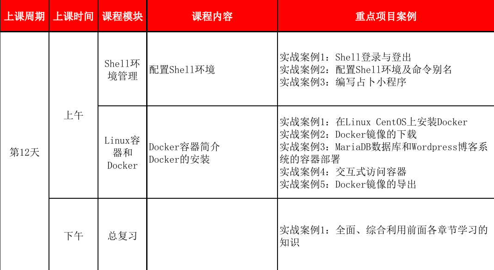
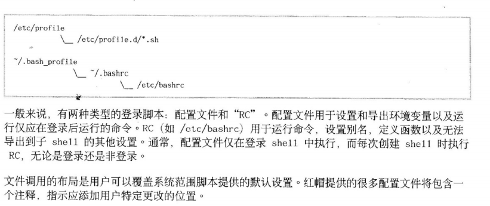

# plan


# 0. 教了这么多天的linux,居然还在用win7在上课,,真是罪过...试图用ubuntu去上课

结果cisco这个webex的软件[linux的支持是非官居方的](https://help.webex.com/en-us/WBX47298/Does-Webex-Support-64-bit-Ubuntu)
<br>再看了一下[系统要求](https://help.webex.com/en-us/nki3xrq/Webex-Meetings-Suite-System-Requirements)

我决定明天试一下.如果可以的话, 那么明天在ubuntu上面就只剩一个录屏软件了...


# 1. 视步处理
# 1.1 我这边特意转成mp4
(而不是exe 或lxe之类这个要下载播放器, avi的话也要专门的解码器, mp4大家可以用手机看..<br>
觉得我语速太慢的话,可以用一些支持加速的播放器,放到1.5或2倍速播放...)
# 2. wsgi 补充,(用shell写出一个cgi出来)

一些动态网页的例子
[qqmail](https://mail.qq.com/cgi-bin/loginpage)


## 2.1 讲述一下动态页而与静态页面的区别.
- (一个静静地躺在服务器中,,直到海枯时烂,矢志不渝,
- (而动态页面则,有一个脚本放在那边, 脚本的内容是不变的, 但是web 服务器会调用相应的脚本,生成网页,这时的网页内容是可变的,因此动态的来由就在这里)


## 2.2 给大家演示如何如何加入t.sh作为动态脚本调入

- 先在server install httpd
- systemctl start httpd
- curl --head server0.example 得出最后一句作为head作用
- 在/var/www/cgi-bin/中加入t.sh (记得如果是root的话,把x给apache用户 是怎样查出来的? systemctl status 得出pid,之后可以看
<br> /etc/passwd中的apache,再看apache的group, 这个也可以顺带说一下如何把一个user的login shell弄成nologin或者 false之类使其不能登陆)
<br>
此时的错误日志可以在上面看到
```bash
[root@server0 httpd]# tail -f error_log
```

- t.sh的内容
可以试一下不给echo参数会怎样?
```bash
#!/bin/sh
echo  -en "Content-Type: text/html; charset=UTF-8\n\n"
date
```
另外,由于这个是动态的,每次修改我们是不需要重启服务的, 这个也与之前的不太一样的.

同样,发现用python  也是可以的 t.py
```python
#!/usr/bin/python
import datetime
print "Content-Type: text/html; charset=UTF-8\n"
print  datetime.datetime.now()

```
同时也可以演示一下vim在
写sharp-bang的时候,可以执行外部命令
````bash
#!
:r !which python
````


学完脚本之后,可以再看lab-webapp 这个脚本


# 2.2 补一下,非对称加密,对方用公钥加密, 我方用私钥解密.(可以的话也列举一下)
# 2.3 只要 <Directory "/var/www/html"> 中 有    Options Indexes那么应可以浏览文件内容, 很多国外的网站懒得搭ftp服务直接这样就上了
再在/var/www/html/下面建个testIndex目录,里面放些文件,再在浏览器中访问 server0.example.com/testIndex这样就可以看到相应的目录有的文件了.
<br>这时再用curl 就能发现 浏览器是会自动补全的,
<br>
因为curl http://server0.example.com/testIndex 与 curl http://server0.example.com/testIndex/ 是不同的,可以试一下
# 3. shell 写出一个猜数的代码

怎么可以居然不用到case: 加入case,,可以用到如果5次都猜不到,就给一个提示...之类
[guess_number](https://github.com/brendangregg/GuessingGame/blob/master/src/guess.bash)
````bash
    
#!/usr/bin/bash
#
# guess.bash - guessing game in BASH (Bourne Again Shell)
#
# This is written to demonstrate this language versus the same program 
# written in other languages.
#
# 17-Oct-2004	Brendan Gregg	Created this.

scorefile="highscores_bash"
guess=-1
typeset -i num=0

echo -e "guess.bash - Guess a number between 1 and 100\n"

### Generate random number
(( answer = RANDOM % 100 + 1 ))

### Play game
while (( guess != answer )); do
	num=num+1
	read -p "Enter guess $num: " guess
	if (( guess < answer )); then
		echo "Higher..."
	elif (( guess > answer )); then
		echo "Lower..."
	fi
done
echo -e "Correct! That took $num guesses.\n"

### Save high score
read -p "Please enter your name: " name
echo $name $num >> $scorefile

### Print high scores
echo -e "\nPrevious high scores," 
cat $scorefile
````

# 4. shell 环境

以此图进行多个去跟踪

```bash
[root@server0 tmp]# su - student
Last login: Mon Mar 18 07:45:55 CST 2019 on pts/1
in_bash_profile
in_bashrc
[student@server0 ~]$ bash
in_bashrc
[student@server0 ~]$ cat .
./             ../            .bash_logout   .bash_profile  .bashrc        .bashrc.swp    .cache/        .config/       .ssh/          .vim/          .viminfo
[student@server0 ~]$ cat .bash_profile
# .bash_profile

echo "in_bash_profile"
# Get the aliases and functions
if [ -f ~/.bashrc ]; then
        . ~/.bashrc
fi

# User specific environment and startup programs

PATH=$PATH:$HOME/.local/bin:$HOME/bin

export PATH
[student@server0 ~]$ cat .bashrc
# .bashrc

echo "in_bashrc"
# Source global definitions
if [ -f /etc/bashrc ]; then
        . /etc/bashrc
fi

# Uncomment the following line if you don't like systemctl's auto-paging feature:
# export SYSTEMD_PAGER=

# User specific aliases and functions


```
# 5. docker机器联网, 不然不能进行演示

红帽这边成书为2014年,到现在为止, 这个技术日新月异,,,所以基本上可以说书本上不少东西是过时的..
因此除了书本的东西外,我还要进行下面的补充
[docker_官网](https://www.docker.com/get-started)
[play_with_docker_classroom](https://training.play-with-docker.com/ops-stage1/)
[docker wiki](https://en.wikipedia.org/wiki/Docker_(software))

这本是入门
[docker 从入门到实践](https://yeasy.gitbooks.io/docker_practice/content/)


k8s???

由于没有把foundation的外网打通..暂时不能真正演示,有点不好意思,,,如果能在ubntu讲课就好了
