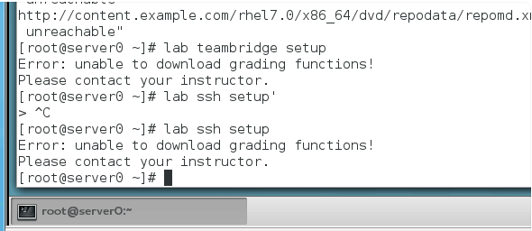
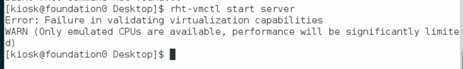
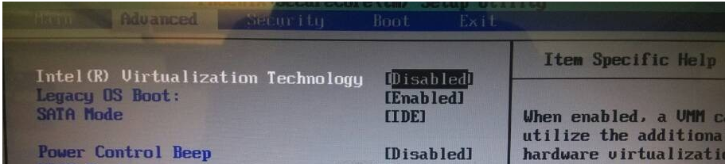
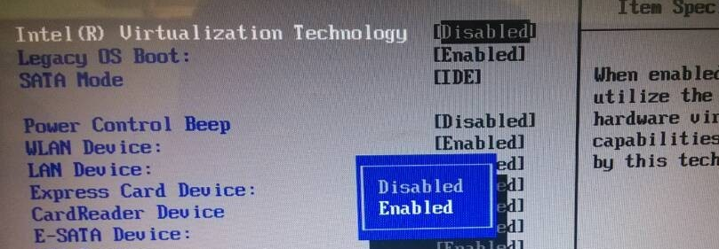
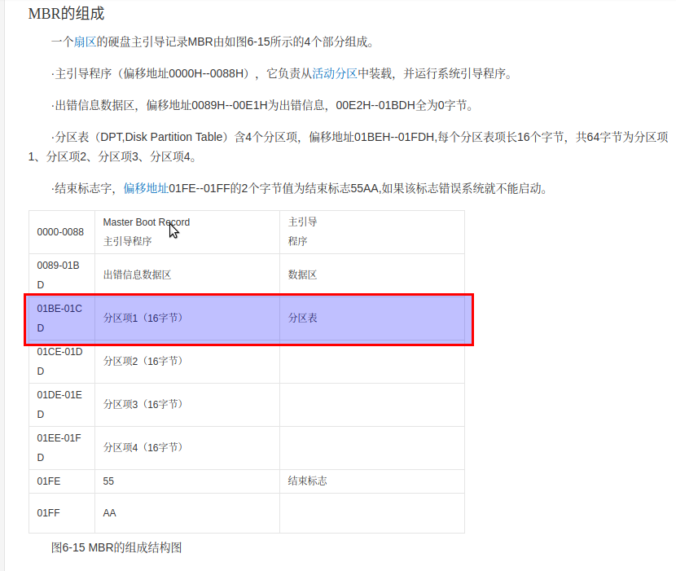
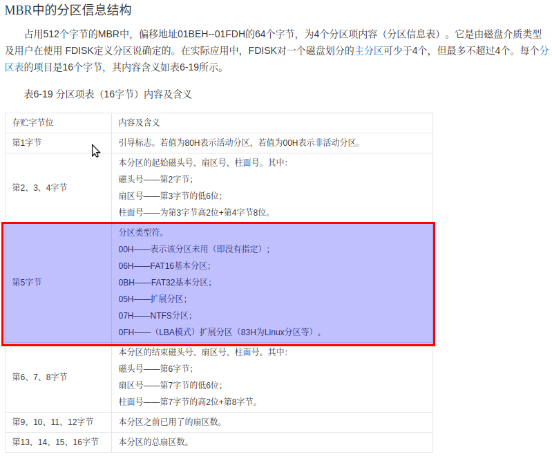
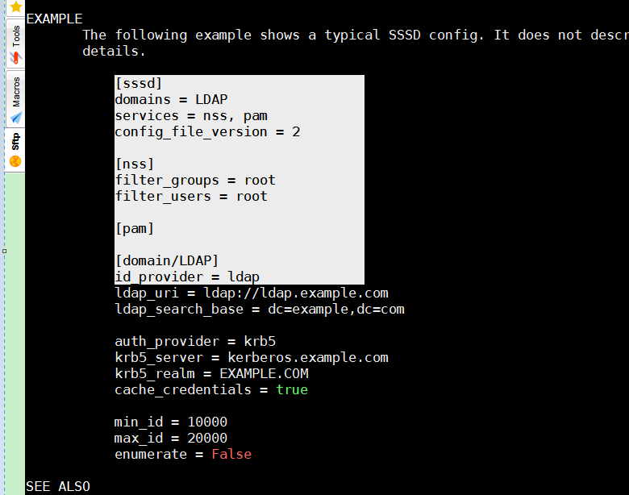

# 环境类
## 在desktop server中运行lab相关命令报`unable to download``





如上图,这种情况请检查classroom是不是没有启动.
<br>
可用此命令
```bash
rht-vmctl status classroom
```

>你可以看一下classroom是不是正常的,(用以下命令)
>在foundation0中打开个终端输入
>
`rht-vmctl status classroom`
>
>  2019/3/1 21:59:32
>如果未启动可以用下面的命令启动(报missing)
>rht-vmctl start classroom
>
>  2019/3/1 22:00:59
>如果已启动, 那么可能出了点小问题,建议重置desktop server
<br>
`rht-vmctl reset desktop`
<br>
`rht-vmctl reset server`
>
>如果还是不行把classroom也重置了,
>
<br>
`rht-vmctl reset classroom`
<br>

>
>  2019/3/1 22:01:07
>如果还不行,,那我再想想其它办法

## 有学员反馈desktop连接不上
ssh student@172.25.0.10
报not rounter之后连接不上desktop
这种情况往往发生在刚启动foundation,这时desktop server是没有自动启动,我们就直接连接导致的, 需要用
`rht-vmctl start desktop`命令把desktop启动,等启动完后(往往是可以ping通172.25.0.10),再ssh连接

### 20190521更新
```
对于这种情况还是比较复杂的,
正同一一列举
1. 只是没有rht-vmctl start desktop,就直接想上人家.....就.脆了..............

2. rht-vmctl start desktop了,但等了老半天还是上不了...这个要一直ping,,,,之前就有一学员的电脑有点慢真的等了好像两三分钟才启动完..................
(这种情况可以双击foundation.kiosk用户的桌面那个desktop 图标,又或者rht-vmctl start desktop进去看一下是不是卡住了, 还真的是慢

3. 第三种情况是用上面说的方法进到了desktop 的图型界面,发现desktop已进入桌面了, 但IP没有,
(或者不是172.25.0.10)这种情况可能需要手动设置一下, 如果设置一下好了(就是在foundation可以访问了)那么,请在foundation中运行以下命令

rht-vmctl save desktop
这样把现在OK的状态保存一下, 以后再运行reset就是从现在这个可以连接的状态为起点的了(当然以后想还原可以用rht-vmctl fullreset desktop来还原)

4.这个比较麻烦,进去也设置不了(这时要确认foundationk  br0 br1是不是已打开,如果没有请手动点开, 如果点开后,重启destkop还是不行,那么请运行
rht-vmctl fullreset desktop
全量重置

如果还是不行,那么请重新把环增装一次, 
如果重新装把环境装一次还是不行,,,那么请换一个台机器
如果换一台机器也不行, 那么请换一个老朱..
那么换一个老朱还不行........

```

## desktop启动失败
如图,

由于windows宿主机没有打开VT导致foundation可以启动, 但desktop这种虚拟机套虚拟机不能正常启动
在bios把相关的vt开关打开即可,
具体操作如下
(这边只是举例,不同的bios可能大同小异)

重启机器，在出现操作系统界面前，按F2(根据不同电脑进入bios方法大致相同，我的笔记本为联想E46A),进入BIOS系统设置界面，选择“intel(R) Virtualization Technology” 这一项，默认为“Disabled”,禁用的，选择“Enabled”启用，选择F10保存，之后选择“YES”启动系统即可进行安装了。如下图
<br>



## 为什么desktop,server都是dhcp过去,但ip却一直不变.

在我们现在这个环境里面,dhcp服务是由classroom提供的,<br>
我们到classroom中的 /etc/dhcp/dhcpd.conf中
通过 下面语句引用到另一个脚本,
````
    # Include the individual VM numbers - added by rpm script    
    include "/etc/dhcp/dhcpd-vm0.conf";                          
````
打开这个vm0号的脚本, 
其中有下面片断
````
  host vm0-10 {
      hardware ethernet 52:54:00:00:00:0A;
      fixed-address 172.25.0.10;
      option routers 172.25.0.254;
      next-server 172.25.0.254;
  }
````
其含义是把MAC地址为52:54:00:00:00:0A的机器固定分配
172.25.0.10
登陆到desktop0中

ipconfig -a得出下面的
````
[root@desktop0 ~]# ifconfig -a
eth0: flags=4163<UP,BROADCAST,RUNNING,MULTICAST>  mtu 1500
        inet 172.25.0.10  netmask 255.255.255.0  broadcast 172.25.0.255
        inet6 fe80::5054:ff:fe00:a  prefixlen 64  scopeid 0x20<link>
        ether 52:54:00:00:00:0a  txqueuelen 1000  (Ethernet)
        RX packets 462  bytes 60661 (59.2 KiB)
        RX errors 0  dropped 0  overruns 0  frame 0
        TX packets 344  bytes 43219 (42.2 KiB)
        TX errors 0  dropped 0 overruns 0  carrier 0  collisions 0

lo: flags=73<UP,LOOPBACK,RUNNING>  mtu 65536
        inet 127.0.0.1  netmask 255.0.0.0
        inet6 ::1  prefixlen 128  scopeid 0x10<host>
        loop  txqueuelen 0  (Local Loopback)
        RX packets 581  bytes 53392 (52.1 KiB)
        RX errors 0  dropped 0  overruns 0  frame 0
        TX packets 581  bytes 53392 (52.1 KiB)
        TX errors 0  dropped 0 overruns 0  carrier 0  collisions 0

````
其中 `ether 52:54:00:00:00:0a  txqueuelen 1000  (Ethernet)`就是eth0的mac
上面就是desktop为什么一直为172.25.0.10 的原因, server 同理)

## 为什么在按书本中执行了下面命令,hostname就改变了,
```
在中文片124的252页
nmcli con add con-name "default" type ethernet ifname eth0
nmcli con add con-name "static" ifname eth0  autoconnect no type ethernet ip4 172.25.0.10/24 gw4 172.25.0.254
nmcli con up "static"
```
执行完上面三条命令后运行<br>

```
[root@desktop0 ~]# hostnamectl
   Static hostname: n/a
Transient hostname: localhost.localdomain
         Icon name: computer
           Chassis: n/a
        Machine ID: 946cb0e817ea4adb916183df8c4fc817
           Boot ID: 2ccd61567e5c4eac9c7a85e0f6238ffd
    Virtualization: kvm
  Operating System: Red Hat Enterprise Linux Server 7.0 (Maipo)
       CPE OS Name: cpe:/o:redhat:enterprise_linux:7.0:GA:server
            Kernel: Linux 3.10.0-123.el7.x86_64
      Architecture: x86_64

```
发现主机名被修改<br>

原因: dhcp去修改的或dns都有可能修改,<br>

验证:<br>
其实只要执行第二条,第三条指令就会出现这个效果(也就是与第一条default那个没有直接关系)<br>
把desktop重置后, <br>
直接运行<br>
`nmcli con add con-name "static" ifname eth0  autoconnect no type ethernet ip4 172.25.0.10/24 gw4 172.25.0.254 `
此时在foundation登陆classroom<br>
ssh root@classroom<br>
密码:Asimov<br>

之后停止dhcp服务及dns服务<br>
```
 systemctl stop named.service
 systemctl stop dhcpd.service
```
之后再执行<br>
```
nmcli con up "static"
```
并用下面命令一直观察<br>
`while true; do hostnamectl;sleep 1 ;done
`
发现一直未变化.<br>

当然,如果在up前<br>
用hostnamectl set-hostname设了名字也能避免<br>

有下面的链接作为参考<br>
[ Using Hostnamectl](https://docs.fedoraproject.org/en-US/Fedora/18/html/System_Administrators_Guide/s1_Using_Hostnamectl.html)<br>
[[Solved] Hostname automatic set when using dhcp](https://centos.org/forums/viewtopic.php?t=62502)


但由于共用了网卡eth0,估计除了static这个con-name外, default,"System eth0",同时也会被up触发, 
如何验证:
在up前运行下面三个语句把他们去dhcp设置主机名的选项改成no,就不会发生
```
[root@desktop0 ~]# nmcli con modify "System eth0" ipv4.dhcp-send-hostname no
[root@desktop0 ~]# nmcli con modify "static" ipv4.dhcp-send-hostname no
[root@desktop0 ~]# nmcli con modify "default" ipv4.dhcp-send-hostname no
```

## 如何把server的eth0-->eth1
ip link set eth0 name eth1 <br>
但重启失效


# 练习,实验类
## 总复习的字母不清
ch16   的总复习键入的是
`lab sa1-review setup`  注意是数字1而不是字母l

## wget -O 是大写的字母O而不是小写的,也不是字母0

## 在server或desktop中运行rht-vmctl命令
这两个命令是在foundation0中运行的, 在这两个机器中运行会无效的.

## RH124P129页,某同学在实验时, bboop账户误写成了bbop,但为什么grade时,还显示bboop用户
误把bboop写成bbop,但
lab localusers grade时, 还是看到下面语句了
```
The account for bboop is not set to expire in 90 days.

```
学员疑问是为什么还看到这个账户, 我明明没有创建<br>

简单回答是因为这个用户名固定写在了评估脚本了,不管你有没有创建.

通过下面命令可以发现我们评估脚本其实具体在哪里
````
[root@server0 bin]# which lab
/usr/local/bin/lab
[root@server0 bin]# cd /usr/local/bin
[root@server0 bin]# ls
lab  lab-localusers  labtool.shlib

````
用vim打开`lab-localusers`,发现<br>
46行<br>
`46 USERS="sspade dtracy bboop" `<br>
及106行<br>
`106         echo "The account for $U is not set to expire in $ACCOUNT_EXPIRE_REQ days."`

其中$U 从91行 `91 for U in $USERS `得知就是46行中固定写的那个bboop那个值,<br>

因此我们没有创建也看到这个用户名.<br>


从这个例子中我们学会如何进一步分析我们评估脚本的报错.

 

## RH124P136 ricky可以删除lfile1 lfile2
有同学对此条有疑问, 理论上只要他对这个目录有w权限,他就可以删掉
<br>
下面的例子进行说明

```bash
 for USER in user{1..4}; do useradd ${USER};done
[root@server0 ~]# mkdir testGroupOwner
[root@server0 ~]# ls
a  anaconda-ks.cfg  b  testGroupOwner  testUGO
[root@server0 ~]# groupadd group1
[root@server0 ~]# usermod -aG group1 user1
[root@server0 ~]# usermod -aG group1 user3
[root@server0 ~]# chown user1:group1 testGroupOwner/
[root@server0 ~]# chmod 775 testGroupOwner/
[root@server0 ~]# cd testGroupOwner/
[root@server0 testGroupOwner]# touch lfile1
[root@server0 testGroupOwner]# chown user2:user2 lfile1
[root@server0 testGroupOwner]# touch lfile2
[root@server0 testGroupOwner]# chown user2:group1 lfile2
[root@server0 testGroupOwner]# ll
total 0
-rw-r--r--. 1 user2 user2  0 Mar  3 12:34 lfile1
-rw-r--r--. 1 user2 group1 0 Mar  3 12:34 lfile2
[root@server0 testGroupOwner]# chmod g+w lfile1
[root@server0 testGroupOwner]# chmod o+w lfile2
[root@server0 testGroupOwner]# ll
total 0
-rw-rw-r--. 1 user2 user2  0 Mar  3 12:34 lfile1
-rw-r--rw-. 1 user2 group1 0 Mar  3 12:34 lfile2
[root@server0 ~]# mv testGroupOwner /tmp
[root@server0 testGroupOwner]# sudo -i -u user1
[user1@server0 ~]$ id
uid=1008(user1) gid=1008(user1) groups=1008(user1),10502(group1) context=unconfined_u:unconfined_r:unconfined_t:s0-s0:c0.c1023
[user1@server0 ~]$ cd /tmp
[user1@server0 tmp]$ ls -lrt testGroupOwner/
total 0
-rw-rw-r--. 1 user2 user2  0 Mar  3 12:34 lfile1
-rw-r--rw-. 1 user2 group1 0 Mar  3 12:34 lfile2
[user1@server0 tmp]$ ls -lrtd testGroupOwner/
drwxrwxr-x. 2 user1 group1 32 Mar  3 12:34 testGroupOwner/
[user1@server0 tmp]$ cd testGroupOwner/
[user1@server0 testGroupOwner]$ rm lfile1 lfile2
rm: remove write-protected regular empty file ‘lfile1’? y
rm: remove write-protected regular empty file ‘lfile2’? y
[user1@server0 testGroupOwner]$ ls
[user1@server0 testGroupOwner]$

```

## 有同学问到, 用fdisk进行分区时, 不设置分区类型,也能正常地进行,这个是为什么?
如下图,这个设置的类型对应MBR中的分区信息的分区类型, 
<br>
<br>

如果我们不认真设置该分区类型有些场景上是可以的, 如用83(linux)进行lvm的pvcreate也不会报错.
但有些场景这个值是有用的..
具体可以看下面的链接, 说明了lvm是不管这个的, 但内核某些场景还是有用的.<br>
[Is the fdisk partition type important when using lvm](https://serverfault.com/questions/306419/is-the-fdisk-partition-type-important-when-using-lvm)


## RH134总复习中, 第4步的第4个小点(mount -a后报错问题解决方法)

### 问题描述 
在中文书本中p302,4.5 mount -a后会报
````bash
[root@desktop0 ~]# mount -a
mount.nfs: access denied by server while mounting server0.example.com:/essos
````

### 解决方法
由于这个是我们desktop默认安装sssd后,相应的配置文件没有正常地生成,<br>
导致sssd服务没有正常启动,导致kerber认证不通过(ssh ldapuser0@localhost不成功为佐证).
因此我们需要要在课后题答案中,
<br>1.1 (yum install -y sssd authconfig-gtk krb5-workstation )
<br>1.2 authconfig-gtk之间多加一几步这个问题是可以解决的.
#### 具体操作如下:
- 1.1.3 从sssd.conf中找到相应的配置文件示例,并复制, 放到/etc/sssd/sssd.conf中
具体操作如下:
```bash
man sssd.conf
#得么手册类容,请到最后
#找到这么一段

EXAMPLE
       The following example shows a typical SSSD config. It does not describe configuration of the domains themselves - refer to documentation on configuring domains for more
       details.

           [sssd]
           domains = LDAP
           services = nss, pam
           config_file_version = 2

           [nss]
           filter_groups = root
           filter_users = root

           [pam]

           [domain/LDAP]
           id_provider = ldap
           ldap_uri = ldap://ldap.example.com
           ldap_search_base = dc=example,dc=com

           auth_provider = krb5
           krb5_server = kerberos.example.com
           krb5_realm = EXAMPLE.COM
           cache_credentials = true

           min_id = 10000
           max_id = 20000
           enumerate = False

#此时我们用鼠标"列模式选择"(此点南要注意,因为配置中太多的空格会识别不到报错)
#此时我们按着alt键,进行列选模式,把光标移到[sssd]中的左边中括号,之后往下一直拖动鼠标到 ld_provider= ldap 这一行,
#也就是最终会选择了这段内容
```


之后把这段内容放到新建的/etc/sssd/sssd.conf中去(也就是vim /etc/sssd/sssd.conf,之后按i进入插入模式之后再粘贴进去,保存后退出)

- 1.1.4 限制该文件权限(由于该配置比较敏感,所以要改一下权限, 不然sssd服务会报错) `chmod 06000 /etc/sssd/sssd.conf`

- 1.1.5 `systemctl start sssd` 启动该服务, 一般来说,应没有输出(no news is good news).之后就可以继续书本上的操作了.


### 总结
这种可能是由于我们的desktop环境问题也可能是红帽课本的问题,现在还不能统一下个结论. 其它能做的同学欢迎也加入讨论
