# 由于课程的操作性较强,有必要搭建实验环境
由于RHCE这门课程比较强调上机操作, 基本上不可能出现我在这边动动嘴皮子, 你们就秒懂;<br>
我再实际演示一下, 你们脑补通过了这门课程.<br>
因此我们每个人都至少搭建一个虚拟环境, 为什么说这个是虚拟的呢?<br>
因为大家真下考试的时候, 环境是你们面前的物理机`foundation0`(装红帽7), 上面再装上`desktop`,`server`等虚拟机(当然也是红帽7).来构成一个考试环境.<br>
可平时我们为了自己方便, 一般都是在我们的windows上面,把之前我们说的这个物理机`foundation0`虚拟化,接着虚拟机里面再跑虚拟机这种玩法.
所以这台虚拟机一般都比较吃资源.拿我这边的16G的笔记本为例, 一般我都分6个CPU,8G内存给他才能跑得比较流畅.
当然,如果大家手上的笔记本资源的确比较吃紧,那么,也可以把这虚拟机器的默认跑字符界面,需要时,再启动相应的图型界面.

## 安装VMWare12需要检查的事项

- CPU必须是64位(已有同学证实32位装vmware10也是可行的)
- BIOS里面开启虚拟化
- 装64位WINDOWS操作系统

## 安装VMWare12
基本上就是点击安装, 确认,下一步...完成...

## 设置VMWare网络

### 设置子网
在VMware菜单找到虚拟网络编辑器<br>
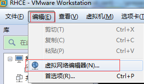
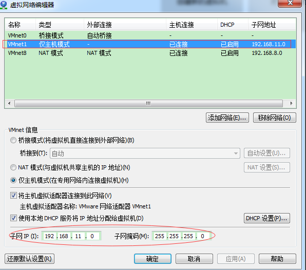
<br>
打开后先编辑
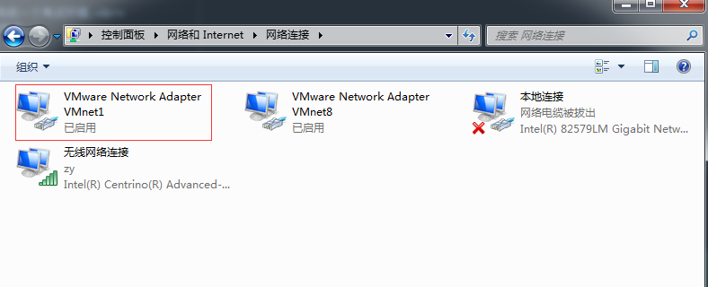

### 给vmnet1设置192.168.11.1
不用192.168.1.1 是怕与某些路由器默认的冲突
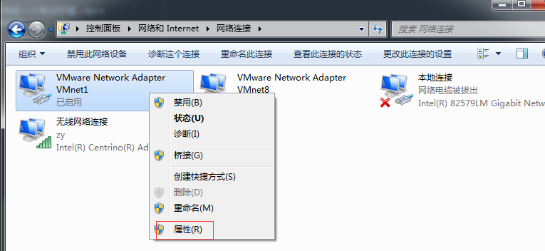
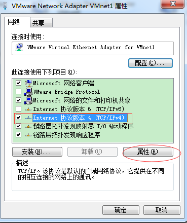
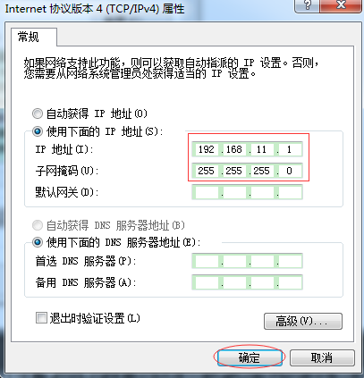
安装完成VMWare后, 会在系统中多生成几张虚拟网卡.<br>
其中我们会用到VMnet1, 这个网卡应用的基本场景是虚拟机只与宿主机通性(host-only),我们就来只修改这网卡.
<br>

## 打开虚拟机
虚拟机可从班主任提供的云盘中提供,下载完成后, 
把虚拟机解压到硬盘中, 建议路径中不要带中文,空格及其它特殊字符,以英文及数字命名即可.
<br>
之后打开虚拟机文件
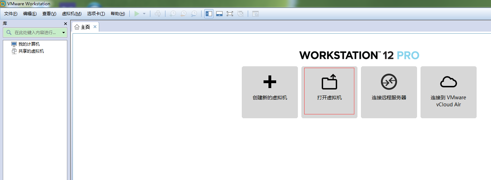
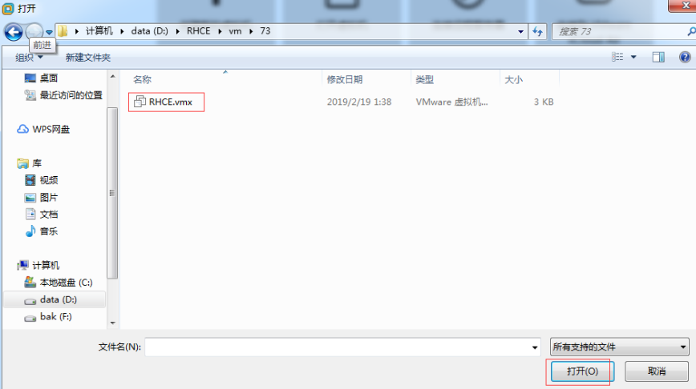
根据实际情况修改虚拟机的cpu及内存
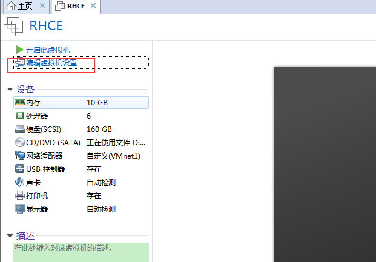
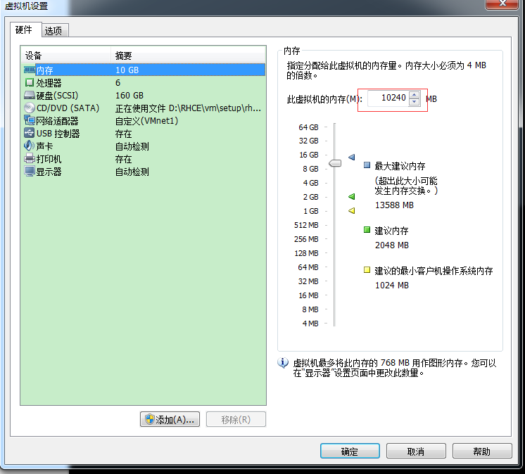
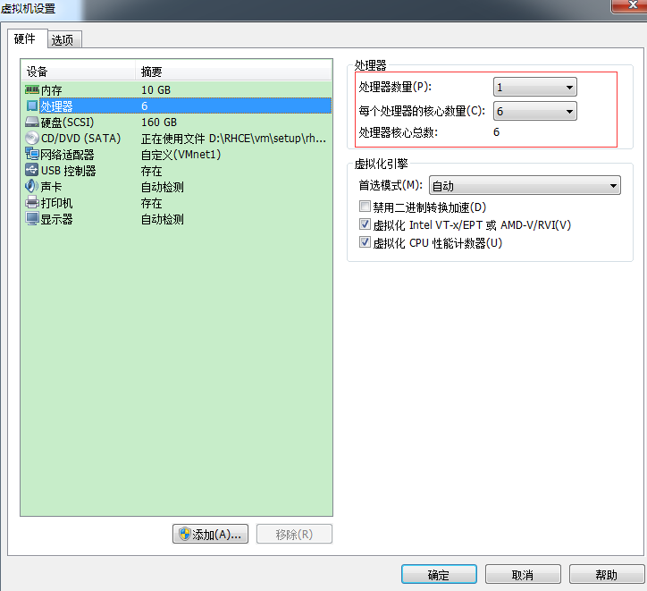
<br>
对于光驱的话, 如后面要用到yum可能还需要另外下载iso文件, 头一两天课这个可以先不关心, 打开虚拟机时忽略报错即可
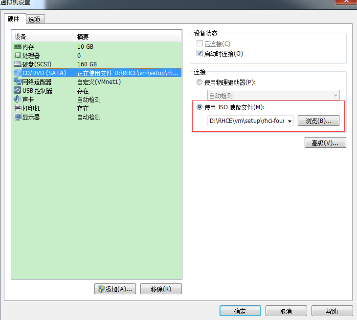
<br>
确认虚拟机的网络选择了之前我们配置过了的vmnet1
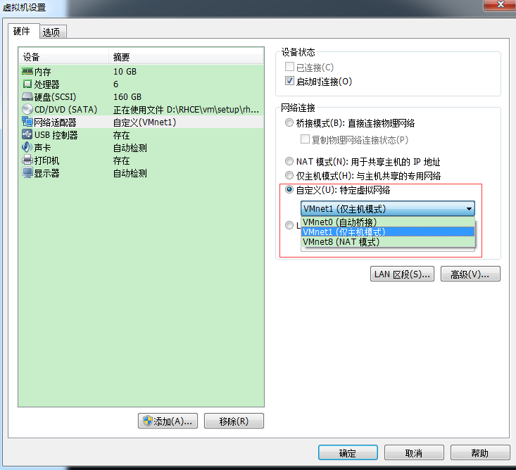
<br>
点击启动虚拟机,如提示移动还是复制虚拟机, 一般来说我们选择复制即可.
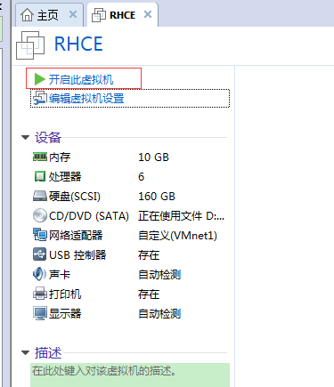
<br>
稍等机器启动, 最后出现了桌面表明启动完成(默认用户kiosk不用输入密码也可登陆)
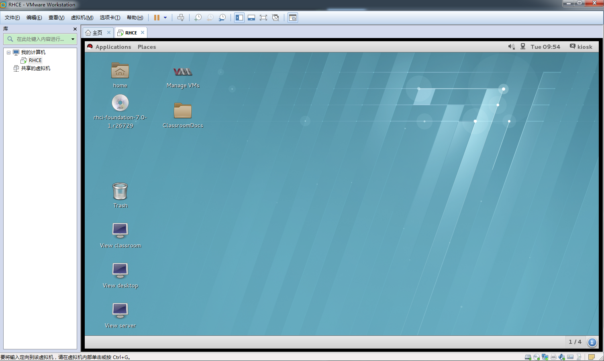
<br>
可以通过点击桌面中的两个图标去启动desktop,server两台虚拟机.(后面会介绍通过命令启动)
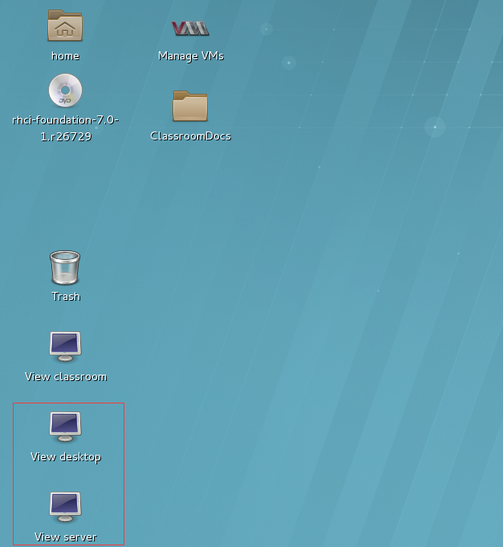
### 设置虚拟机与宿主机网络连接
由于之前我们把vmnet1设为192.168.11/25 这种网络, 宿主机设为了192.168.11.1
<br>
此处准备把虚拟机的IP设为192.168.11.2,
<br>
由于我们刚刚开始,还是先展示用图型界面(GUI)实现设置IP的方法.后面的章节我们会用到命令行解决问题.
<br>
点击右上角时间旁边的图标
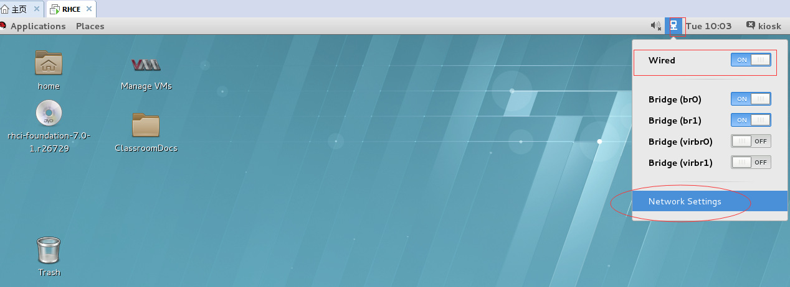
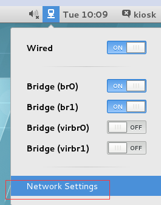
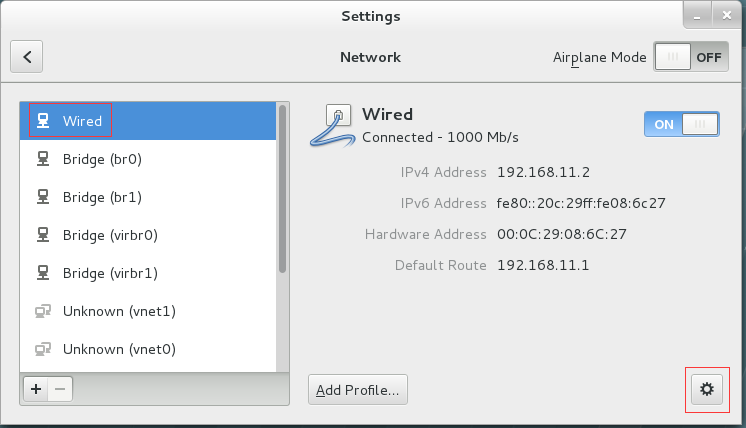
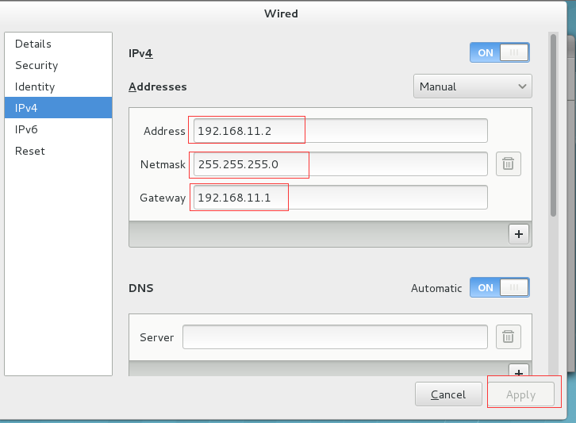
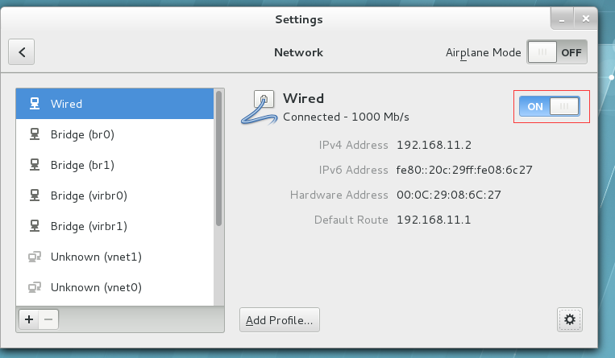

## 验证网络配置
- `guest-->host`
完成上面的IP设置并让其生效后, 在桌面空折处点击`Open in Terminal``
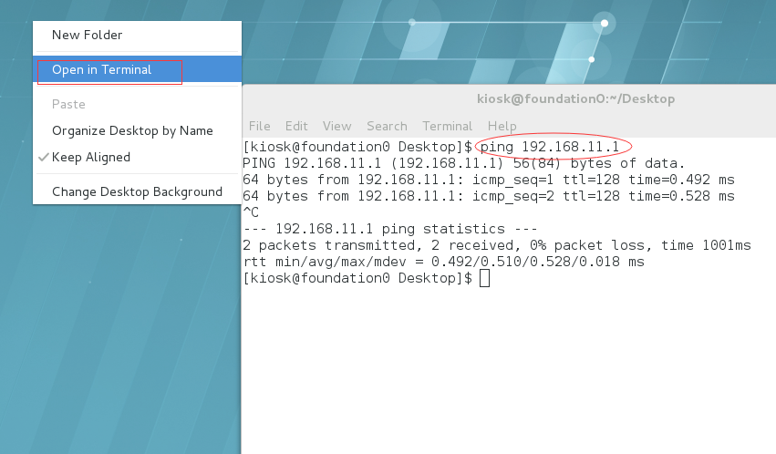
```bash
[kiosk@foundation0 ~]$ ping 192.168.11.1
PING 192.168.11.1 (192.168.11.1) 56(84) bytes of data.
64 bytes from 192.168.11.1: icmp_seq=1 ttl=128 time=0.378 ms
64 bytes from 192.168.11.1: icmp_seq=2 ttl=128 time=0.538 ms
64 bytes from 192.168.11.1: icmp_seq=3 ttl=128 time=0.535 ms
^C
--- 192.168.11.1 ping statistics ---
3 packets transmitted, 3 received, 0% packet loss, time 2001ms
rtt min/avg/max/mdev = 0.378/0.483/0.538/0.078 ms
[kiosk@foundation0 ~]$
```

- host-->guest 在运行中(win+r)键入cmd回车,打开windows的dos命令行界面,也用ping这个命令进行测试
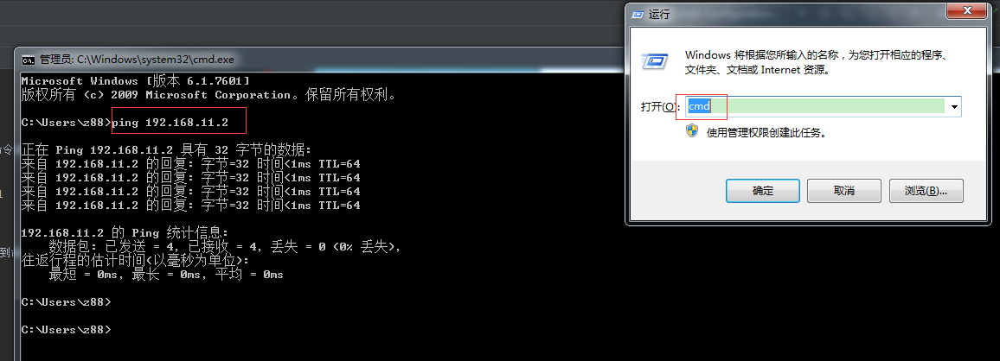

如果都能ping通,就像上面两图一样,那么刚才配置的网络是成功的, 下一步就是找个登陆到后面的工具.

# ssh登陆软件的安装配置(putty)
这里为了演示的方面, 选择了绿色版的putty, 当然大家可能还有更多选择, 始Xshell,SercureCrt等, 只要能以SSH登到后台linux即可.
[在putty官网的下载页](https://the.earth.li/~sgtatham/putty/latest/w64/putty.zip),
<br>
 下载并解压到硬盘某个目录,还是哪个原则,no中文空格等..
 之后,双击putty
 如下图1-5分别按要求输入(ip等)
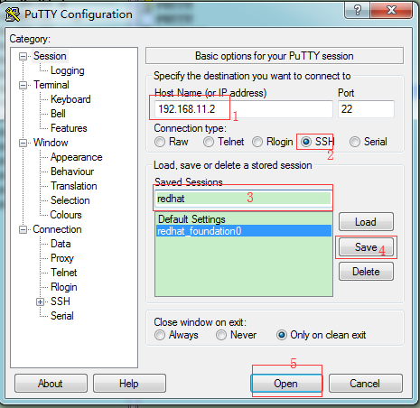
 <br>
 如觉得10号的字体太小了, 那么可以设成12号或更大
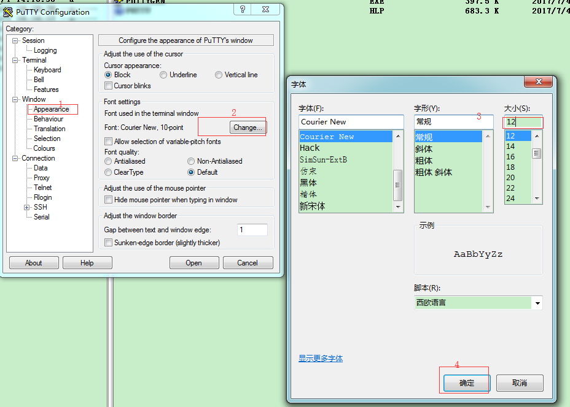
<br>
在点击open后,按要求输入用户名及密码
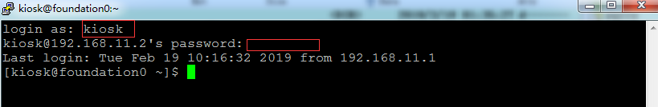

此至就已成功登陆后台.

环境搭建完成.

## 其它软件(VNC待补)

## 常见问题(FAQ)

### 把RHEL7的默认登陆模式改为字符界面以降低虚拟机的性能要求

```bash
[root@desktop0 ~]# systemctl get-default
graphical.target
[root@desktop0 ~]# systemctl set-default multi-user.target
rm '/etc/systemd/system/default.target'
ln -s '/usr/lib/systemd/system/multi-user.target' '/etc/systemd/system/default.target'
[root@desktop0 ~]# reboot
Connection to 172.25.0.10 closed by remote host.
Connection to 172.25.0.10 closed.
```
这时点击看到的是字符界面
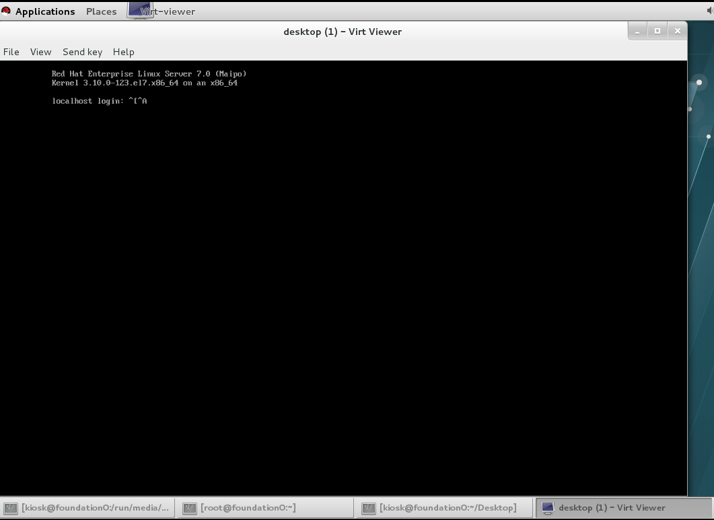
如果后期需要一开始就从字符界面切换回图型界面, 我们可以这样操作.

```bash
[root@desktop0 ~]# systemctl get-default
multi-user.target
[root@desktop0 ~]# systemctl set-default graphical.target
rm '/etc/systemd/system/default.target'
ln -s '/usr/lib/systemd/system/graphical.target' '/etc/systemd/system/default.target'
```
重启后是图型界面
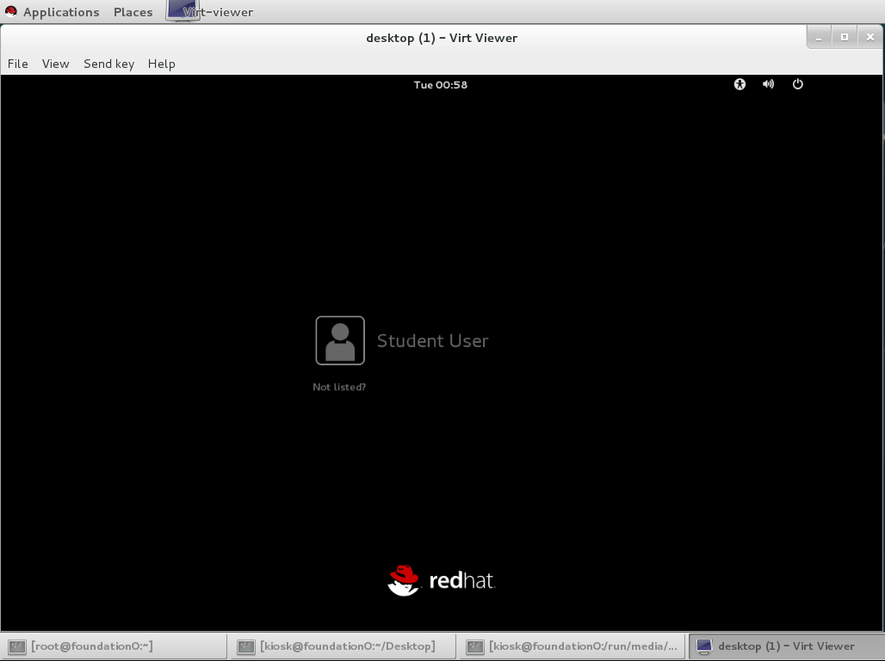


#### 如果只是偶尔使用图型界面
[20190925更新] 如果平时还是用字符界面,只是偶尔用到图型界面, 那么我们可以默认用字符界面,<br>
 当我们需要用到图型界面的时候,可以用`startx`这个命令去在字符界面中启动图型界面.

# 教学环境介绍
(看是否需要先略过, 暂时先略过)
- desktop
- server
- classroom

下面的X,对于统一提供的虚拟机为0,即IP为172.25.0.10

|Machine name|IP addresses|Role|
|:---|:---|:---|
|desktopX.example.com|172.25.X.10| Student "client" computer|
|serverX.example.com|172.25.X.11| Student "server" computer|
|classroom.example.com|172.25.254.254 |Classroom utility server|

<br>

|机器|用户名|密码|
|:---:|:---:|:----:|
|foundation0|root|Asimov|
|foundation0|kiosk|redhat|
|desktop|root|redhat|
|desktop|student|student|
|server|root|redhat|
|server|student|student|

rht-vmctl Commands

|Action|Command|
|---|----|
|Start server machine |rht-vmctl start server|
|View " physical console" to login and work with server machine |rht-vmctl view server|
|Reset server machine to its previous state and restart virtual machine| rht-vmctl reset server|

rht-vmctl view 这个有点慢,, 真正考试的话, 可以用`ssh -X student@172.25.0.10`登陆后直接把需要的图型界面弄出来, 理论上会快一点点.

- 考试可选中文或英文,当然, 大部分人都是选中文的.
- 考试作答时都是系列命令操作, 不需要输入中文.

# 除了教材之外的补充读物

## administrator guide
rhel7有自己的产品文档,如有时看考试教材真是看不下去可以看看官方的`系统管理员指南`作为补充
- [网页版](https://access.redhat.com/documentation/en-us/red_hat_enterprise_linux/7/html/system_administrators_guide/index)
- [pdf](https://access.redhat.com/documentation/en-us/red_hat_enterprise_linux/7/pdf/system_administrators_guide/Red_Hat_Enterprise_Linux-7-System_Administrators_Guide-en-US.pdf)

## [其它](https://access.redhat.com/documentation/en-us/red_hat_enterprise_linux/7/)
这个链接是一个总的索引, 如系统管理看完后,仍有余力, 可从
- `Networking Guide`, 
- `Kernel Administration Guide`,
- `Performance Tuning Guide`
- ...
各方面都有,估计一时看不完(反正我是没看完), 倒是可以在日常工作中可以作为资料查阅一下

